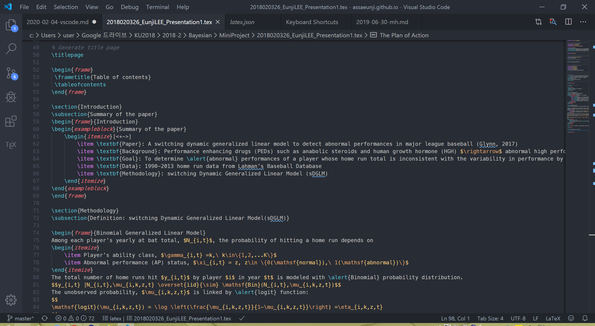

* 텍스트 에디터인 Visual Studio Code (줄여서 VS Code)에 대한 리뷰입니다.
* 특히 TeX 및 Markdown 문서를 작성하시는 분들에게 추천합니다!

***

사람들이 많이 쓰는 *범용* 텍스트 에디터를 들자면 Atom (아톰), Notepad++(노트패드), Sublime text (서브라임 텍스트), VS Code (비주얼 스튜디오 코드)가 있습니다.
*범용*이라 표현한 건 에디터 안에서 $$\TeX$$, Python, Julia, R, Markdown 등을 사용할 수 있기 때문입니다. 특히 저는 VS Code를 LaTeX으로 pdf를 조판할 때, Markdown문서를 GitHub page에 올릴 때 주로 사용합니다.

제가 사용해본 에디터는 Atom과 Sublime text, VS code인데 이러한 이유로 VS code에 정착하게 되었습니다.

***

### 1. 스니펫과 단축키가 직관적이다.
 * 스니펫이란 명령이나 수식기호에 대한 단축어입니다. 
 특히 VS code의 확장프로그램인 `latex-workshop`에서 스니펫이 유용하게 쓰입니다. 예를 들어, 수식을 작성할 때 `\begin{equation}, \end{equation}` (`\begin{equation*}, \end{equation*}`)을 써줘야 하는데 이를 `BEQ`, `BSEQ`로 줄여 쓸 수 있습니다.
 * 또한, 이러한 스니펫을 사용자 입맛에 맞게 추가할 수 있습니다. 자주 사용하는 명령어 및 기호가 있다면 VScode의 좌측 하단의 톱니바퀴 모양을 눌러 User Snippets클릭하고 `latex.json`파일을 선택해 추가하면 됩니다. 
 예를 들어, 문서를 끝내는 명령어인 `\end{document}` `edoc`로 를 다음과 같이 사용자 지정 스니펫을 쓸 수 있습니다. `json`문서라 `body`부분에서 `\`하나만 쓰게 되면 주석처리되어 대신에 `\\`로 써줘야 합니다.
 ~~~json
 "edoc":{
  "prefix": "edoc",
  "body":[
  	"\\end{document}"
  ],
  "description": "end document"
  }
 ~~~
 더 많은 스니펫은 [James-Yu/LaTex-Workshop GitHub](https://github.com/James-Yu/LaTeX-Workshop/wiki/Snippets)에서 확인할 수 있습니다.
 * 단축키의 경우 다른 에디터와 비슷한 게 많지만 VS Code가 가진 단축키가 유용한게 많아 마음에 들었습니다.
   * `Ctrl+D`(다음 선택 찾기): 바꾸고 싶은 단어를 드래그한 후 `Ctrl+D`를 누르면 똑같은 단어를 찾아주면서 커서를 다중으로 놓을 수 있는 효과를 냅니다. 따라서 반복되는 단어를 눈으로 보면서 수정하고 싶을 때 아주 편리합니다. 
   * `Alt+ ↑/↓`(행을 위/아래로 이동): 이는 에디터 내에서 행의 위치를 쉽게 바꿀 수 있어 편리합니다. 
   * `Alt+Click`(커서 삽입): 다중 커서를 사용할 때, `Alt`를 누르면서 마우스로 원하는 위치에 클릭하면 클릭한 위치마다 커서가 생깁니다. 
   * `Shift+Alt+Drag`(열 선택): 이건 해봐야 딱 감이 옵니다. 똑같은 열 위치에 있는 문자들을 다중 선택해주는 단축키입니다.
   * `Shift`+`Alt`+↑/↓(위/아래의 행 복사): 복사하고자 하는 행을 선택하고 `Ctrl+C`를 누르고 다음 행에서 `Ctrl+V`를 누르는 대신에 한 키로 위, 아래의 행을 복붙할 수 있는 단축키입니다.

***
    
### 2. 프로그램이 무겁지 않다.

제 컴퓨터가 오래되다보니 뭐하나 돌리는데 항상 오래 걸리는 데 주관적으로 Atom에 비해 VS Code가 훨씬 가볍다는 느낌을 받았습니다. 

***

### 3. 한글 지원이 잘 된다.

  LaTeX을 쓸 때 아주 공감이 많이 되는 부분인데요. 특히 LaTeX만을 위한 에디터인 TeXStudio는 한글을 쓸 때 갑자기 커서가 앞으로 가는 등의 오류가 나는 경우가 많습니다. 이에 비해 VS code는 그러한 오류가 일절 없고, 한글 글씨체도 굴림이 아닌 맑은 고딕입니다. (디테일에 신경쓰는 편..)

***

### 4. 별별 확장 프로그램(Extension)이 많다.
 * 프로그램 별 확장 프로그램
    * LaTeX: `LaTeX Workshop`
    * Markdown: `Markdown All in One`, `Markdown Preview Enhancer`
    * Python: `Python`
    * 그 외 `R, Julia` 도 VS code 내에서 실행가능
 * 그 외 유용한 확장 프로그램
   * `Diff`: 2개의 코드를 비교하고 싶을 때 쓰는 확장프로그램
   * `Code Spell Checker`: 영어 스펠링 체크용

***

### 5. 예쁘다! ~~(간지가 난다)~~

Atom 만큼이나 많은 테마를 가지고 있고 아이콘을 위한 테마도 있습니다. 제가 사용하고 있는 테마는 `One Dark Theme`으로, 이런 느낌입니다 :)

***

그 외에도 VS code와 Git이 연동되기 때문에 쉽게 GitHub에 commit하고 pull할 수 있다는 장점도 있습니다. 