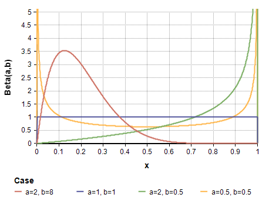

# Bayesian A/B Testing

## **Contents**
{:.no_toc}
0. this unordered seed list will be replaced by toc as unordered list
{:toc}

---
## **Terminology**
* A/B Testing
* Counterfactual
* Conversion rate

---
## **Summary**
* 왜 A/B testing을 사용할까?
* Bayesian A/B testing은 무엇이 다를까?
---

## **Conversion Testing**

출처: https://www.optimizely.com/ab-testing/
{:.figure}

어떤 웹사이트에서 A와 B 디자인 중 어느 쪽이 구매로 전환되는 비율이 높은 지 알아본다고 가정합시다. 즉, 웹사이트에 방문한 사람들이 A와 B 디자인 중 어느 디자인에 더 현혹되어 구매하게 되는 지를 알아보는 것이죠. 이를 위해 방문자에게 랜덤하게 A와 B 디자인 중 하나를 보여주고 구매 여부를 체크합니다. 이러한 과정을 **Conversion Testing**이라 합니다. 여기서 가설은 "A보다 B가 구매로의 전환율이 높을 것이다"와 같은 내용이 됩니다. 

선택지가 2개이면 베이지안 AB test는 가능도 (Likelihood)로 이항 분포 (Binomial Distribution)를, 사전 분포 (Prior)로 베타분포 (Beta Distribution)를 선정합니다. 그 이유는 무엇일까요?

### **가능도: 이항 분포**
가능도는 우리가 관측하는 데이터의 함수를 의미합니다. 우리가 관측하는 데이터는 각 방문자마다 A나 B를 통해 구매를 했는 지의 여부입니다.

이항 분포를 따르는 확률 변수는 **$$n$$명의 사람 중 어떤 event를 성공한 사람 수**를 의미하기 때문에 우리의 데이터도 이항 분포를 따른다 가정할 수 있습니다. $$n$$명의 사람 중 성공한 사람 수를 $$X$$라 하고 그 성공 확률을 $$p$$라 할 때, 이항 분포는 다음과 같이 정의됩니다.

$$
\begin{aligned}
X&\sim \text{Binomial}(n,p)\\
p_X(x) &= \binom{n}{p} p^x (1-p)^{n-x} 
\end{aligned}
$$

예를 들어, A디자인을 본 방문자는 1,300명이고 그 중 120명이 구매를 했고, B디자인을 본 방문자는 1,270명이고 그 중 125명이 구매했다 상상해봅시다. 이 때 **구매** 행위가 어떤 event를 성공했다 보고 각 사람들의 구매 행위가 독립적이라고 가정하면, A디자인을 보고 구매한 사람 수와 B 디자인을 보고 구매한 사람 수는 각각 이항 분포를 따릅니다.

$$
\begin{aligned}
[\text{A사이트}]\ p(\text{Data}|p_A) &= \binom{1300}{p_A} p_A^{120} (1-p_A)^{1300-120}\\
[\text{B사이트}]\  p(\text{Data}|p_B) &= \binom{1270}{p_B} p_B^{125} (1-p_B)^{1270-125}
\end{aligned}
$$

여기서 $$p_{A}, p_{B}$$는 각 A, B 디자인을 통해 구매로 전환한 확률인 **전환율**로, 이항 분포의 관심사인 모수 (parameter)입니다. 

### **사전 분포: 베타 분포**
베이지안은 모수에 사전 분포 (Prior distribution)를 가정해 모수의 실제 값이 하나가 아니라, 사람들의 믿음 (belief)에 따라 달라지는 분포 형태를 띠고 있다 생각합니다. 여기서 관심 모수는 $$p_A, p_B$$인 전환율이기 때문에 이에 잘 맞는 사전 분포를 가정하는 것이 중요합니다. 

이를 위해 사전 분포로 베타 분포 (Beta Distribution)을 가정합니다. 베타 분포를 따르는 확률 변수는 항상 $$(0,1)$$사이의 값이기 때문에, 성공 확률 분포의 자연스러운 가정이 됩니다. 베타 분포는 다음과 같이 정의됩니다.

$$
\begin{aligned}
p_A,p_B &\sim \text{Beta}(\alpha,\beta)\\
f_{p_A\ or\ p_B}(p) &= \frac{\Gamma(\alpha)\Gamma(\beta)}{\Gamma(\alpha+\beta)} p^{\alpha-1}(1-p)^{\beta-1},\ x \in (0,1)
\end{aligned}
$$

베타 분포의 모수인 $$\alpha,\beta$$의 값에 따라 확률이 '어느 값에 밀집되어 있을 것이다'에 대한 사전적인 지식을 부여할 수 있습니다. 
예를 들어, 아래의 그림 중  주황색 선인 Beta(2,8)의 경우 $$p=0.12$$부근에서 확률밀도함수가 가장 높기 때문에 전환율이 0.12 부근이라는 배경 지식이 있다면 Beta(2,8)를 사전 분포로 사용할 수 있을 것입니다.

{: width="100" height="100"}
모수 $$\alpha,\beta$$에 따른 베타 분포
{:.figure}

그러나, 특별한 사전 지식이 없을 경우 무정보 사전 분포 (Non-informative prior)를 주는 것이 일반적입니다. 무정보 사전 분포는 말 그대로 **정보가 없는 사전 분포**로, 베타 분포의 경우 Beta(1,1)에 해당합니다. Beta(1,1)은 위의 정의에서 $$\alpha=1,\beta=1$$을 대입하면 $$f_p(p) = 1/2$$로, 균등 분포인 Uniform (0,1)과 같습니다. 즉, 전환율에 대한 어떠한 지식도 없다면 전환율이 **"$$(0,1)$$ 사이 어딘가에 랜덤하게 있을 것이다"**는 정보 없는 내용을 사전 분포로 가정할 수 있는 것입니다. 

이러한 무정보 사전 분포를 쓰는 경우는 
  * 전환율에 대해 사전 지식이 없을 경우
  * Frequentist가 추정하는 값과 같은 결과를 내고 싶을 경우 (데이터만으로 모수를 추정하고 싶을 경우)
로 생각보다 많이 쓰입니다. 저희도 $$A$$와 $$B$$ 디자인의 전환율에 대한 사전 지식이 없다 가정하고 Beta(1,1)을 사전 분포로 사용하겠습니다.

$$
f_{p_A}(p)=1/2,\ f_{p_B}(p) = 1/2
$$

### **사후 분포: 베타 분포**
이제 A, B 방법의 전환율을 구하는 데 있어서 사전 분포는 베타 분포, 가능도는 이항 분포로 두는 것에 대해 자연스러우셔야 합니다. 사전 분포와 가능도를 각각 베타와 이항분포로 설정하는 것의 또 하나의 장점은 **켤레성**(Conjugacy)를 이용할 수 있다는 점입니다. 사후 분포(Posterior Distribution)를 구했을 때, 그 형태가 사전 분포와 같은 분포일 때 **켤레성**을 띤다고 말합니다. 

사후 분포를 구하기 위해선 고등학교 때 배운 **조건부 정리**를 이용합니다. 모수인 $$p$$와 관련있는 항만 남기고 정리하면 결국 사후 분포는 **(가능도)$$\times$$ (사전 분포)**에 비례합니다.

$$
\begin{aligned}
P(p|\text{Data})&= \frac{P(\text{Data}|p) \times P(p)}{P(\text{Data})} \\
&\propto P(\text{Data}|p) \times P(p)
\end{aligned}
$$

따라서, 가능도가 이항 분포 Binomial($$n,p$$)고 사전 분포가 Beta($$\alpha,\beta$$)일 경우, 사후 분포는 Beta($$x+\alpha, n-x+\beta$$)를 따르게 됩니다. 즉 사후 분포의 첫번째 모수는 사전 분포의 첫번째 모수인 $$\alpha$$ +성공 횟수($$x$$), 두번째 모수는 사전 분포의 두번째 모수인 $$\beta$$ + 실패 횟수 ($$n-x$$)가 됩니다.

$$
\begin{aligned}
&P(p|\text{Data})\\
&\propto \binom{n}{p} p^x (1-p)^{n-x}  \times  \frac{\Gamma(\alpha)\Gamma(\beta)}{\Gamma(\alpha+\beta)} p^{\alpha-1}(1-p)^{\beta-1}\\
& \propto \underbrace{ p^{x+\alpha-1} (1-p)^{n-x+\beta-1}}_{\text{Beta}(\alpha+x, \beta+(n-x))\text{꼴}}
\end{aligned}
$$

따라서 무정보 사전 분포인 Beta(1,1)를 가정했을 때, A 디자인에 따른 전환율의 사후 분포는 $$\text{Beta}(1+120, 1+1300-120)$$, B 디자인에 따른 전환율의 사후 분포는 $$\text{Beta}(1+125, 1+1275-125)$$를 따릅니다.

사후 분포에서 난수를 생성한 후 평균을 구하면 각 전환율의 추정치를 구할 수 있습니다. 이를 파이썬으로 구현하면 다음과 같습니다.

안녕