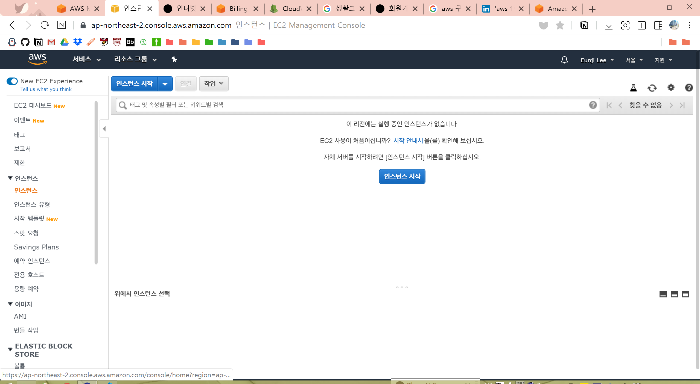
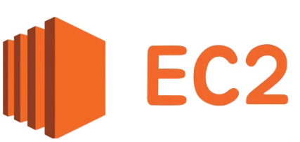
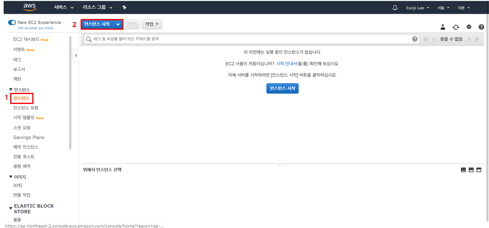
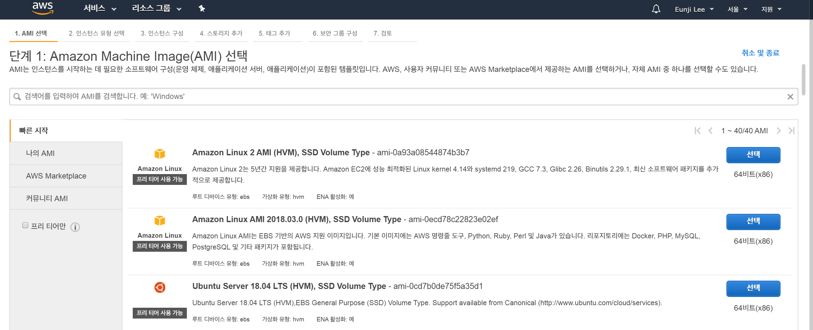
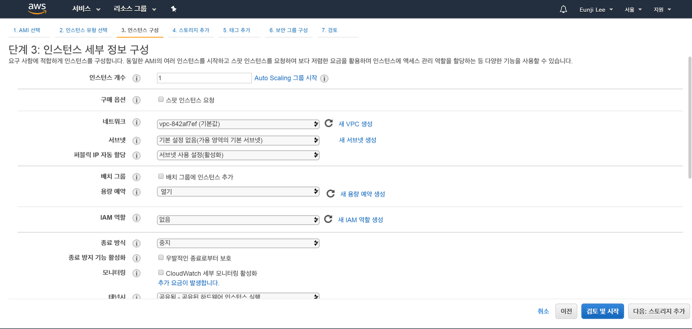

# AWS EC2 이해하기

---
## **Contents**
{:.no_toc}
0. this unordered seed list will be replaced by toc as unordered list
{:toc}

---
## **What is AWS (Amazon Web Service)?**

:deciduous_tree: **클라우딩 컴퓨팅?**
* 인터넷을 통해 **IT 리소스**(ex. 물리적 서버, 네트워크)와 **애플리케이션**(ex. 데이터분석)을 원할 때 언제든지 사용한 만큼만 요금을 내는 서비스
* 인터넷에 연결되어 있는 거대한 컴퓨터를 사용한다!

:deciduous_tree: **인스턴스?**

인스턴스 하나 당 컴퓨터 하나를 임대한 꼴과 같습니다.

---
## **Why AWS?**

최근 가고 싶은 회사들을 알아보던 중 "Data Scientist"에 대한 공고 설명에 AWS (Amazon Web Service) 나 GCP (Google Cloud Platform)과 같은 클라우드 사용 경험, Spark 혹은 Hadoop, SQL 사용 경험에 대한 경력을 우대한다는 것을 느꼈습니다. 

저는 이러한 경험이 일절 없었고 실제로 데이터가 어떻게 수집되어서 tabular한 형태로 저장되는 지 몰랐기 때문에 이를 실제로 알아보는 게 중요하다 생각이 들었습니다.

---
## **AWS EC2**

EC2는 독립된 컴퓨터를 임대하는 서비스입니다.
가장 먼저 해야하는 일은 "가용지역" (Available Zone)을 설정하는 것입니다. 이를 Seoul로 지정합니다.

### **Instances**

임대한 컴퓨터의 현황을 보여주는 페이지입니다. 인스턴스는 컴퓨터 1대를 의미합니다. 
인스턴스 생성을 통해 가상 서버를 만드는 방법을 알아봅시다.

:deciduous_tree: **인스턴스 생성**

Step0. 먼저 인스턴스 생성을 위해 대시보드 화면에서 인스턴스 메뉴를 클릭하고 인스턴스 시작 버튼을 누릅니다.

**Step 1. AMI (Amazon Machine Image) 선택하기**

Amazon Linux는 아마존이 리눅스를 수정해서 AWS에 최적화된 리눅스 사용합니다. 
아래로 내리다 보면 Windows Server가 있는데 이는 SQL Server가 포함되어 있어서 Free tier에서는 무료가 아닙니다. 

따라서 저희는 AMI 중 Ubuntu Server를 선택합니다!

**Step 2. 인스턴스 유형 선택**

가장 저렴하고 성능이 낮은 Type은 nano이지만 저희는 `t2.micro`를 사용합니다.

* vCPUs: CPU 개수, `v`는 `virtual` (가상) CPU라는 뜻
* 메모리: 몇 GB의 메모리를 가지고 있는 지!
* 네트워크 성능: 가격과 스펙에 따라 차등이 있음

>**NOTE** 
* AWS 프리티어 EC2의 가격정책은 EC2 t2.micro 750시간으로 되어 있음 -> 한 대의 인스턴스를 한 번도 끄지 않고 쭉 써도 1년 간 무료!  
* 임대하는 인스턴스에 SSD 30GB까지 + 200만건 이상이면 과금
* **온 디맨드 인스턴스**: 필요할 때는 컴퓨터를 키고, 없을 때는 꺼서 가격을 절감하도록 해야 함
* **예약 인스턴스**: 할인권을 구매하는 것, 서버를 운영할 때 1년 365일 

**Step 3. 인스턴스 세부 정보 구성**

Default값으로 하고 다음: Add storage를 클릭합니다.
* 종료 방식을 "중지"로 되면 저장 비용만 과금됩니다.

**Step 4: 스토리지 추가**

프리티어에서 30GB까지는 무료이지만 리눅스 형식 상 8GB를 
* 볼륨 유형: 장착하는 저장장치의 형식을 지정
* 종료시 삭제: 컴퓨터를 종료할 때 저장 장치가 같이 삭제되길 원하면 체크, 체크를 하지 않으면 과금될 수 도 있음

**Step 5: 태그 추가**

인스턴스에 대한 설명을 붙이는 부분입니다.

**Step 6. 보안 그룹 구성**

보안 그룹은 인터넷을 접속할 수 있는 걸 허용하고 막는 역할을 합니다. 즉, 제한된 방법 (Type) 을 통해서 우리의 인스턴스에 접속할 수 있도록 보안 그룹을 구성하는 것입니다.

`SSH`는 SecureShell을 의미하고, 리눅스/유닉스 계열의 원격 제어 방법이 SSH입니다! 소스를 "내 IP"로 지정합니다.

만약 인스턴스를 통해 웹서버를 구축하고자 한다면 `HTTP`를 사용합니다. 주의할 점은 소스를 "내 IP"로 한다면 우리 집에서만 웹서버가 구동되는 것이기 때문에 "위치 무관"으로 선택합니다.

* 유형: 보안 그룹에 대한 정책들을 고르는 사항, 만든 인스턴스에 접속하는 여러 가지 방법 ex. 원격제어를 위해서, ftp로 파일을 인스턴스로 업로드, 웹서버에 접속하기 위해 브라우저를 통해 접속...

**Step 7. 인스턴스 시작 검토**

인스턴스를 생성한 정보를 검토하는 화면입니다. 인스턴스를 생성하면 다음과 같이 키 페어를 선택하는 화면이 뜹니다.
"새 키 페어를 생성"해 키 페어 이름을 만들고 `키 페어 다운로드`를 클릭합니다. 
다운로드 받은 파일을 안전한 곳에 저장해야 합니다!

---
### **Windows에서 리눅스 인스턴스로 접속**

리눅스 인스턴스에 SSH 방식으로 원격제어를 하려면 Windows에서 SSH로 접속할 수 있는 "원격제어"프로그램이 필요합니다.

이를 위해 Xshell

