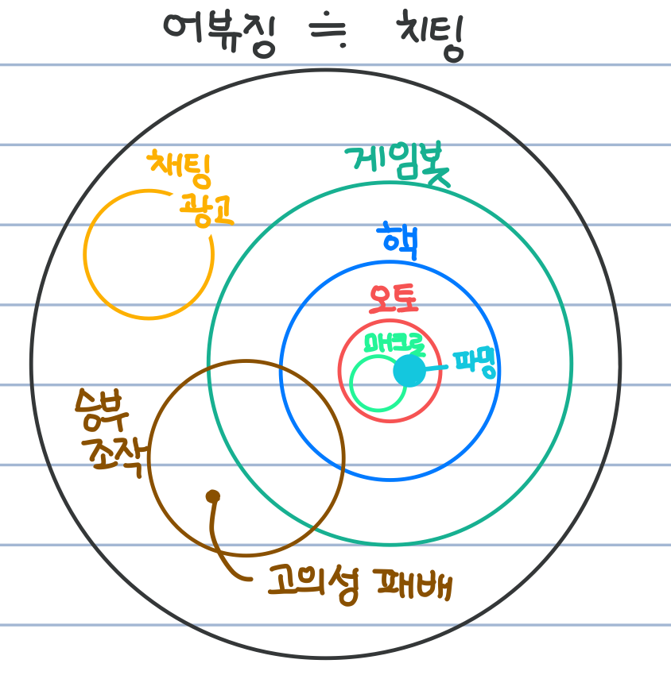

# Abusing Detection in Online Games [1] - Game Bot Detection

* 이 글은 게임 상의 어뷰징 탐지 중 게임 봇을 탐지하는 방법에 대해 다룬 글입니다.
* 게임 봇을 탐지하는 분야에서 이상치 탐지 방법 또한 쓰입니다!

---
## **Contents**
{:.no_toc}
0. this unordered seed list will be replaced by toc as unordered list
{:toc}

---
## **What is Abusing?**

이 분야를 공부할 때 가장 궁금했던 것은 게임 내의 어뷰징 (Abusing)이 어느 범위까지의 부정 행위를 말하는 지였습니다.
**어뷰징 (Abusing)** 이란 남용, 오용을 뜻하는 "abuse"에서 파생된 단어로, 게임 시스템의 허점을 악용해 이득을 취하는 행위를 뜻합니다.

* 게임 기획 의도와는 다르게 게임 정보를 대량 획득하거나 도움을 주는 행위
* 게임 자체의 버그
* 허용되지 않은 외부 프로그램 (Hack)
* 복수 계정 
* 전체 채팅창에 도배로 광고하는 행위

등 서비스 구현 상의 헛점을 이용한 플레이, 고의로 져주는 승부 조작 모두 어뷰징에 속합니다.

제가 직접 경험한 어뷰징의 사례를 가져와봤습니다. 저는 근 1년 간 모바일 게임인 브롤 스타즈 (Brawl Stars)를 참 열심히 해왔는데요. 여러 게임 모드 중 "젬그램"은 3 대 3으로 팀을 이루어 보석을 10개 모으면 이기는 모바일 슈팅 게임입니다. 혼자 플레이를 하면 랜덤으로 나머지 두 명과 팀을 이루기 때문에 이 두 명과 팀플레이가 좋아야 젬그램에서 우승할 수 있습니다.

그러나 위 사진을 보면 회색 곰 (저)을 제외하고 저희 팀인 보라색 머리와 빨간 머리 움직임이 매우 적음을 알 수 있습니다. 저는 화면 바깥에서 상대팀과 싸우고 있는데, 나머지 두 명은 바깥으로 나가지도 않죠... :cry: 브롤 스타즈에서 사용자가 일정 시간 움직이지 않으면 이를 감지하고 자동으로 플레이가 되는데요. 그러한 자동 플레이와는 또 다르게 일부로 기차에 다가가서 죽는 점, 움직임이 거의 없는 점을 고려했을 때 시스템 상의 자동 플레이는 아니라 생각이 들었습니다. 이들이 만약 "승부 조작"을 목적으로 상대편에게 일부러 져주는 고의성이 있었다면 이 또한 어뷰징에 해당합니다. 

어뷰징과 비슷한 의미로 **치팅 (Cheating)**이라는 말을 쓰기도 합니다. [Dinh & Nguyen (2016)](https://www.researchgate.net/publication/309159777_An_Empirical_Study_of_Anomaly_Detection_in_Online_Games?_sg=7-Jt9zdR8-pI7GOAnPMFWoztGn_-KnP1g2gX0Fv_wyO6ELrdUbo8qYwSQ7fgNQQRN9r_O2aHiEtkKBo)에 따르면 온라인 게임에서의 치팅은 "다른 사용자에 비해 이득을 취하기 위해 게임 경험을 수정하는 일련의 행동"으로 정의되어 있습니다.  이 글에서는 "어뷰징"으로 단어를 통일하겠습니다.

제가 살펴볼 어뷰징 탐지 방법은 

1. 게임 봇 탐지
2. 부적절한 도배 광고 등의 채팅 탐지

로, 먼저 이 글에서는 게임 봇을 탐지하는 방법에 대해 알아보고자 합니다.

---
## What is Game Bot?

그럼 게임 봇은 무슨 의미일까요? 게임 봇과 연관이 있는 단어로 **핵 (Hack), 매크로 (Macro), 오토프로그램 (Auto program), 게임 봇(Game Bot), 파밍(Farming)** 등이 있는데, 제가 생각하기에 이들의 벤 다이어그램은 다음과 같습니다. 치팅과 어뷰징은 비슷하게 포괄적인 의미이고, 채팅을 통한 광고, 승부조작, 핵, 파밍, 오토 및 게임봇은 구체적인 불법 행위와 방법에 해당합니다.

{: width="150" height="150"}

먼저 **핵**은 게임 콘텐츠 내 중요 수치를 임의적으로 변경하여 게임 플레이를 사용자 자신에게 유리하게 이끄는 프로그램 종류를 일컫는 말로, 프로그램을 해킹해 수정하여 원래 동작과 다른 동작을 유도하는 용도로 사용합니다. 핵의 종류는 게임의 종류만큼 매우 다양합니다. 대표적인 핵의 예는 다음과 같습니다.

* 맵핵 (Map Hack): 아직 탐험하지 않아 볼 수 없는 영역이나 상대방 영역을 볼 수 있게 해주는 치팅 프로그램, 스타크래프트, 디아블로2와 같은 RTS (Real-Time Strategy) 게임에서 쓰임
* 에임핵 (Aim Hack): 적 출현 시 자동으로 타겟팅을 해주는 치팅 프로그램, 배틀그라운드나 오버워치와 같은 FPS (First Person Shooter) 게임에서 쓰임
* 월핵 (Wall Hack): 벽 너머에 있는 상대방을 벽을 통과해서 사격할 수 있도록 해주는 치팅 프로그램, 마찬가지로 FPS 게임에서 자주 쓰임
* 스피드핵 (Speed Hack): 서버와 클라이언트 간의 통신 속도를 조작해 빠른 속도로 이동하거나 같은 시간에 보다 많은 명령어를 수행할 수 있도록 하는 치팅 프로그램, 카트라이더와 같은 레이싱 게임이나 메이플스토리, 리니지와 같은 MMORPG (Massively Multi-Player Online Role-Playing Games)에서 쓰임

게임 내의 **오토 프로그램**은 게임 핵의 한 종류로서 온라인 게임을 하는 과정에서 게임 이용자가 직접 마우스를 움직이지 않더라도 자동으로 캐릭터를 조종해 줌으로써 아이템이나 경험치 등을 손쉽게 얻을 수 있도록 해주는 프로그램입니다. 대표적인 오토 프로그램의 예는 MMORPG에서의 **자동 사냥**으로, 마우스나 키보드를 조작하지 않고 자동으로 몬스터를 선택하거나 공격할 방법을 선택함으로써 하루 24시간 지속적으로 사냥할 수 있도록 조작합니다. 

**게임 봇**은 유저 대신 게임을 하도록 만들어진 자동화 프로그램을 뜻하기 때문에 **오토 프로그램**과 비슷한 의미입니다. 주로 회사로부터 소스 코드를 해킹하거나 게임 클라이언트 프로그램과 게임 클라이언트와 서버 간의 네트워크 트래픽을 분석하는 소프트웨어를 개발해 게임 봇으로 사용합니다. 

또한 **매크로**는 오토 프로그램을 실행하는 하나의 방법으로, 이용자가 미리 정해진 키보드 입력과 마우스 동작을 반복적으로 수행하는 프로그램을 의미합니다.

**이렇게 지속적으로 사냥해서 무엇을 얻을까요?**

**파밍**을 쉽게 할 수 있게 합니다. **파밍**이란 쉬운 말로 하면 노가다로, 농부처럼 몬스터를 잡으면서 돈, 경험치, 아이템을 모으는 반복적인 행동을 의미합니다. 
특히 **골드 파밍 집단** (GFG; Gold Farming Group) 유저들은 오토 프로그램을 이용해서 온라인 게임 내의 화폐를 손쉽게 모은 후 실제 돈으로 환전하는 
RMT (Real Money Trading) 시스템을 목적으로 활동합니다. 대량의 사이버 머니를 오토 프로그램으로 손쉽게 모아 현금으로 환전하고 탈세를 위한 목적으로 쓰기도 하기 때문에 명백한 위법 행위에 해당합니다.

**그럼 왜 게임 봇이 문제가 될까요?**

게임 회사 입장에서는 게임 봇 차단을 위해 많은 비용과 노력을 들여야 하고, 게임 내 컨텐츠 소모가 빨라져서 (만렙이 순식간에 속속 출현한다거나, 고렙용 레어 아이템이 지천에 넘쳐난다거나…) 게임 운영이 어려워지는 문제가 발생할 수 있습니다.

선량한 게임 유저 입장에서는 게임 봇 유저들이 월등히 빠른 속도로 레벨업을 해서 게임 내 부를 축적하게 되므로, 일반적으로 게임을 플레이하는 유저들이 상대적인 박탈감을 느끼게 됩니다. 

---
## **Studies on Game Bot Detection**

특히 게임 내 캐릭터를 육성하고, 아이템이 중요한 MMORPG 게임에서 게임 봇의 존재는 매우 위협적입니다.
1. Feature Engineering을 통한 지도학습 - 일반적인 Machine Learning 방법론 사용

**NDC 2017**
게임봇 - 제재 정책의 변화
* 2010년까지: 게임봇, 작업장은 **악의 축** - Client side detection (게임봇을 사용하는 유저 계정 제재) - 계정 도용의 문제
* 2012년까지: 게임봇 유저를 제거하되 적정 수준의 제거 - Server side detection, data mining - 원하는 만큼 제재 (매출이 떨어지면 제재를 덜 하고)
* 2014년까지: 모바일 게임 시대, PC기반의 MMO 쇠락. 봇을 잡는 것에 관심이 없음, 어떻게 하면 돈을 더 벌 수 있나요?에 더 관심
* 2016년 이후: Monetization! 게임 계정 거래, 현금 유입되어 아이템을 구매하는 인정하는 분위기, 어떻게 돈을 많이 받을 수가 있죠?
붙잡기보단 돈을 더 뽑자
* 2017년: 모바일 게임들 자동 전투를 제공해주는데 게임봇과 뭐가 달라? 왜 제재를 해야하는가에 대한 새로운 윤리와 철학이 필요

=> **모바일 기반의 봇의 치팅, 작업장 탐지**

게임봇 - 영원한 난제

Q1. 서비스 초기부터 강력하게 잡는 것이 좋을까요? 어느 정도 초반에는 두었다가 잡는 것이 좋을까요?
Q2. 기업형 작업장만 타게팅해 잡는 것이 공정할까요? 고렙 유저이고 VIP 개인 유저라 하더라도 일단 한 번 쓰면 강력하게 제재해야하는가?
Q3. 게임봇을 강력히 제재했더니, 매출의 타격 -> 월정액제일 때 타격이 큼, 어떻게 극복?
Q4. 전담 보안 조직에서 게임 봇 탐지와 대응 전담? 각 개발 스튜디오마다 대응 하는 것이 좋을까요?
Q5. PC기반이면 MMORPG라면 로그가 풍부하게 남고 분석도 어떻게 해보겠지만 **모바일 게임은 어떻게 하나요?**
Q6. 가성비가 가장 좋은 탐지 알고리즘은 어떤 것이 있을까요? - 랜덤 포레스트, Decision Tree, **콜센터 대응**때문에 딥러닝이 어려움... 

PC기반의 봇 탐지는 유저의 특성을 micro level에서 볼 수도 있었지만 macro하게는 소셜 활동이 낮다는 큰 특징
그러나 모바일 게임은 원래 소셜 기능이 낮기 때문에 애매

게임봇
- MMORPG 리니지 1 자동 사냥 프로그램
- FPS 서든어택 오토샷 핵 프로그램: 월 핵 -> 집중력을 요하는 게임이기 때문에 비정상적 행동을 하면 더 큰 스트레스와 이탈율

모바일은 로그가 낮음, 핵, 매크로를 잡기가 어려움 
- 단순한 게임 내 이벤트

게임봇, 게임 핵 거래 방식 및 비용
1. 개인 거래 방식: 유투브 등 동영상에 불법 프로그램 사용법 및 실행 화면 홍보 후 네이트온, 카카오톡 ID 등의 개인 연락처를 통해 프로그램 판매 
2. 거래 사이트를 이용한 거래 방식: 불법 프로그램 거래 사이트 제작

유저들의 인식

- 게임 봇이 저렇게 많은데, 쉽게 구할 수 있는데 왜 막지 않는가?
- 신고시스템을 통해 신고해도 왜 대응이 안되는가?
- 아이템 거래사이트만 모니터링해도 아이템 거래 규모를 누구나 추정할 수 있는데, 왜 대응을 하지 않는가?

**게임회사의 변명**

- 현실적인 한계: 오탐 문제, 봇 유저들의 법적 대응 -> 어떻게든 우겨서 우회할 방법
- GM 조직 위축
- 기술적으로 막기 어려움
- 소모전이어서 개발자로서는 맡고 싶지 않음

전통적인 과금 모델 MMORPG - 시간을 많이 들이면 가상 세계에서 성취, 
온라인 가상세계는 시간이라는 공평한 한계를 가졌으나 게임 봇은 돈으로 시간을 살 수 있게 해줌!

모바일 게임 기반 작업장 탐지

---

Server side bot detection

- 원할 때 원하는 만큼 제재 가는ㅇ
- 작업장 및 BOT 제작자에게 탐지 기법 노출을 최소화
- usability
- action behavior + bigdata

게임 액션 로그를 기반으로 데이터 마이닝을 해 BOT과 작업장을 탐지
- 이동 패턴, 채팅 패턴, 거래 패턴, 전투/사냥패턴, 로그인 패턴, action sequence 패턴
- 사람과 BOT의 행위의 차이점을 구분 
가장 robust: Uncovering game bots in MMORPGs via Self-similarity

가장 유용하게 쓰는 SNA

social behavior - trading, message, shop 을 열 때 다름
거상, 작업장

계정 공급조, BOT조, 현금 환전조

교차 분석 - IP, 기업형 사업장?

일반 유저와 작업 채팅패턴 시각화

좌표 - ㅇㅇ 리턴
시각화 tool

2. 액션 시퀀스 분석
게임의 액션을 문자로 mapping
로그인할 때 똑같은 시퀀스가 나온다면 봇일 가능성

Blade and soul

봇탐지 외에도 고객 경험 분석, 이탈 분석에도 다양하게 활용됨
- 이탈한 고객이 이탈 직전에 공통을 경험한 action sequence? 
- 결제를 한 고객들이 결제 직전에 공통으로 경험한 action 

LCS, LCCS 등의 알고리즘 사용 - 알고리즘 복잡도가 높아서 
모든 이가 할 수 밖에 없는 퀘스트, 액션
로그인 내의 30초 의 시퀀스
등 범위를 제한

시퀀스 -> ClustalX2 (유전자 분석)

게임 디자인 대로 조화롭게 

Black Money Trail analysis

Crime scene reconstruction: Online gold farming network analysis

게임 전체 적으로 threshold를 정하기 위해
평균거래횟수, 평균거래금액 기초 통계 확인
금액 증가량, 로그에 년원일시분초, 좌표, 아이템/머니 잔액을 foot print로 넣어주는 것이 분석에 상당한 도움을 줌
제로 베이스 - 시드가 되는 ID -> 확장 (직관)

---
## **Anomalies in Online Games**

온라인 게임에서의 Anomaly는 주로 사기 행각 (cheating behaviors)를 하는 유저들의 데이터입니다. 
사기 행각들은 어떤 프로그램을 

  
### **Abusing Detection with Machine Learning**

* 라이브 게임에서 각종 해킹 툴을 사용해서 **어뷰징 (파밍) 플레이**를 하는 상황
파밍: 아이템을 얻기 위한 부정 플레이
* 봇의 특성을 하나 둘로 특정하기 어려움 $$\rightarrow$$ 기계학습 필요!
* 지도 학습이 가능해서 딥러닝으로 하지 않음

:deciduous_tree: **준비 사항**

* 로그 수집 확인: 가장 오래 걸리고 어려운 작업
* 로그의 의미 / 구조 파악
* 학습을 위한 피처 (Feature) 추출

:deciduous_tree: **로그 수집**

* 게임 서버는 대부분 윈도우 기반
* 리눅스 툴(fluentd, logstash, nxlog 등)을 검토했으나 윈도우 서버에 설치가 쉽지 않거나 SQL Server 관련 기능이 부족 -> 
자체 개발을 통해 로그 파일 및 SQLServer 동기, 파일 tailing 후 fluend 포워딩

:deciduous_tree: **피처 개발 (Feature Engineering)**

* 3개월 분량의 로그에서 하둡을 통해 피처 생성
* AWS의 EMR (AWS에서 사용하는 Hadoop 서비스) 사용
* Hadoop을 위한 로그 가공: 하둡은 작은 파일들이 많은 것에 취약해 이를 병합, 소팅, 압축할 필요가 있었음
* Hadoop MapReduce 코딩: `mrjob`
  * Yelp 에서 만든 Python 패키지
  * 하둡 스트림을 이용해 파이썬으로 MR 코딩
  * 로컬에서 샘플 데이터로 개발한 후 EMR에 올림
* GM이 제재하는 근거 (피처)와 제재된 리스트 구함
* 로그에서 "캐릭터" 기준으로 구함
* 정교한 피처보다는 다양한 피처를!
* 초기에 뽑아본 피처들: 로그인 횟수, 플레이 시간, 아이템/머니 습득 수, 퀘스트 종료수, NPC/ PC간 전투 수
플레이 시간은 로그 아웃 시간이 불분명했기 때문에 세션아웃 시간 (활동 로그가 5분 간 기록이 남았을 때)를 기준으로 플레이 시간 구함
* Boolean은 0,1로, 카테고리 타입은 OneHotEncoding을 통해 실수형으로 만듬

:deciduous_tree: **학습 진행: Decision Tree**

* 정작 기계학습 수행은 가벼우나 학습 모델의 하이퍼 파라미터를 최적화하는 과정이 좀 무거웠음 -> Spark와 같은 분산 시스템을 사용하는 경우도
* Decision Tree 사용: 파이썬의 Scikit-learn 패키지 사용
* 초기 결과로 평균 정확도 80% 정도

:deciduous_tree: **정확도 향상**

* 교차 검증 & GridSearch로 최적의 하이퍼 파라미터 찾음
* 평균 정확도 91%로 향상
* 새로운 피처 추가: 동시에 얻은 아이템/머니 수, 맵 반복 횟수, 특정 클래스만 선택, 캐릭터 이름의 랜덤 생성 여부, 움직이지 않고 아이템을 얻은 수
    * ex. 캐릭터 이름의 랜덤성 판단: 자/모의 출현 패턴
* 새로운 피처 추가로 평균 정확도로 96% 향상, but 오탐이 꽤 나옴
* 따라서 **Random Forest**로 교체

:deciduous_tree: **Random Forest**

* 정확도 95%
* 부당하게 징계를 받는 사례가 없도록 예측 확률이 높은 (>70%) 경우만 포함
* 재현율 (Recall): 전체 어뷰저 중 얼마나 찾았는가? 10 % 하락
* 정밀도 (Precision): 찾은 것 중 얼마나 진짜 어뷰저인가? 정밀도 100% 달성

:deciduous_tree: **만약 학습 데이터가 없으면?**

어뷰징을 군집으로 찾아보자

KMeans: 봇의 특성을 갖는 클러스터를 발견했으나 Random Forest보다 정확도는 떨어짐

학습 데이터가 없을 때 초기 데이터를 얻는 용도로!

---
### **이상 탐지**

* 비지도 학습이 적절함: 예외적인 것은 어렵고 자주 나타나지 않기 때문에
* **게임 머니** 이상치 검출: Scikit-Learn의 EllipticEnvelope로 학습 후 레벨, 변동원인, 변량의 그래프
  * 대부분의 유저는 $10^8$ $$\pm 1$$억 변량 내에 있었으나, 그것을 뛰어넘는 경우가 많았음
* 정상범위 밖의 값들을 검출하기는 했으나 이들이 부정 플레이를 했다는 증거가 없음 -> 모니터링 정도

AWS Kinesis로 App 로그 수집
Fluentd / Elasticsearch - 실시간 로그 모니터링

---

1. Hadoop -> Spark로
2. 수작업된 특성에서 데이터에서 학습된 특성으로
3. 수동 제재 -> 자동 제재로

사용 중인 어뷰징 검출 특성들: 초록색 (Feature engineering), 핑크색 (딥러닝 - 데이터에서 학습된 특성) 

PyTorch - 간결함 + 디버깅 용이 -> 연구에 적합

https://engineering.linecorp.com/ko/blog/monitoring-to-prevent-game-cheating/

---
## **References**

* [NC Soft 블로그: 게임 봇의 두 얼굴](https://blog.ncsoft.com/%EA%B2%8C%EC%9E%84%EA%B3%BC-%EB%B3%B4%EC%95%88-1-%EA%B2%8C%EC%9E%84%EB%B4%87%EC%9D%98-%EB%91%90-%EC%96%BC%EA%B5%B4/)
* [최연준, 장성준, 김용준 & 이현주. (2014). 멀티 플레이어를 위한 온라인게임에서의 게임봇 대응 기술동향.](https://ettrends.etri.re.kr/ettrends/145/0905001932/29-1_83-92.pdf)
* [나무위키](https://namu.wiki/w/%EA%B2%8C%EC%9E%84%20%ED%95%B4%ED%82%B9%20%ED%94%84%EB%A1%9C%EA%B7%B8%EB%9E%A8)
* [최호진 & 한다빈 (2016). 게임 내 오토프로그램 제작, 배포, 사용행위에 대한 가벌성 검토.](http://125.61.91.238:8080/SynapDocViewServer/viewer/doc.html?key=000000007061314801711b6ca3000e6f&convType=img&convLocale=ko_KR&contextPath=/SynapDocViewServer)
