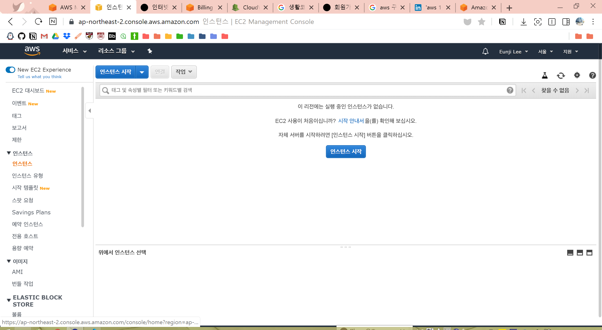

# GCP (Google Cloud Platform) 이해하기

---
## **Contents**
{:.no_toc}
0. this unordered seed list will be replaced by toc as unordered list
{:toc}

---
## **What is GCP (Google Cloud Platform)?**

:deciduous_tree: **클라우딩 컴퓨팅?**
* 인터넷을 통해 **IT 리소스**(ex. 물리적 서버, 네트워크)와 **애플리케이션**(ex. 데이터분석)을 원할 때 언제든지 사용한 만큼만 요금을 내는 서비스
* 인터넷에 연결되어 있는 거대한 컴퓨터를 사용한다!

:deciduous_tree: **인스턴스?**

인스턴스 하나 당 컴퓨터 하나를 임대한 꼴과 같습니다.

---
## **Why GCP?**

최근 가고 싶은 회사들을 알아보던 중 "Data Scientist"에 대한 공고 설명에 AWS (Amazon Web Service) 나 GCP (Google Cloud Platform)과 같은 클라우드 사용 경험, Spark 혹은 Hadoop, SQL 사용 경험에 대한 경력을 우대한다는 것을 느꼈습니다. 

저는 이러한 경험이 일절 없었고 실제로 데이터가 어떻게 수집되어서 tabular한 형태로 저장되는 지 몰랐기 때문에 이를 실제로 알아보는 게 중요하다 생각이 들었습니다. 특히, 브롤스타즈 로그 데이터를 분석하는 것을 목표로 가상 머신 (VM; Virtual Machine)을 사용해서 

