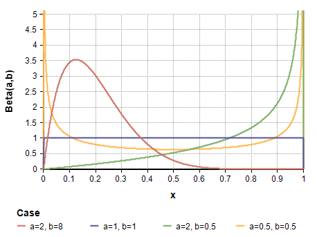
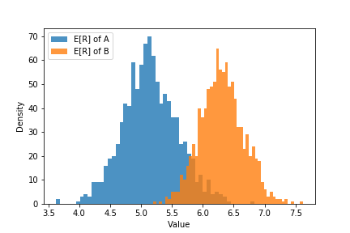

# Bayesian A/B Testing

* 베이지안 관점에서 A/B Testing을 하는 방법에 대해 간단히 적어놓았습니다.
* 전체 코드는 [여기](https://github.com/assaeunji/bayes-ABtest)에서 확인할 수 있습니다. 
---

## **Contents**
{:.no_toc}
0. this unordered seed list will be replaced by toc as unordered list
{:toc}

---
## **Terminology**
* <mark style='background-color: #fff5b1'> A/B Testing </mark>: A와 B 대안이 있을 때 어떤 대안이 더 효과적인 지를 알아보기 위해 대상자를 임의로 절반으로 나누어 그 인과적 관계를 살펴보는 방법  
* Conversion rate
* <mark style='background-color: #fff5b1'>CTR (Click-Through Rate)</mark>: 클릭 수
* <mark style='background-color: #fff5b1'>인과 관계 (Causal Relationship)</mark>: 설명 변수가 원인, 반응 변수가 결과가 되어 그 원인으로 결과가 얼마나 바뀌는 지를 추정
* <mark style='background-color: #fff5b1'>연관 관계 (Association Relationship)</mark>: 주로 회귀 분석에서 쓰이는 용어로,  설명 변수와 반응 변수의 연관이 있을 때 연관 관계가 있다고 말함. 즉, 단순히 설명 변수가 한 단위 증가했을 때, 결과가 얼마나 어떻게 바뀌는 지를 추정
* <mark style='background-color: #fff5b1'>가상적 대응치 (Counterfactual)</mark>: 각 개체 별 처리 여부에 반대되는 결과. 예를 들어 처리를 받은 사람이 **처리를 받지 않았을 때 일어날 가상적 결과**가 가상적 대응치에 해당함

---
## **Summary**
* 왜 A/B testing을 사용할까?
* Bayesian A/B testing은 무엇이 다를까?
---

## **What is A/B Testing?**

출처: https://www.optimizely.com/ab-testing/
{:.figure}

[권정민님의 실무에서 활용하는 A/B 테스트 발표자료](https://www.slideshare.net/cojette/ab-150118831)에 따르면 A/B Testing은 사용자를 대상으로 한 **실제 환경**에서의 실험으로, A와 B에 따라 관심 있는 지표가 어떻게 바뀌는 지를 판단하는 방법입니다. 여기서 관심있는 지표는 양적으로 확인할 수 있는 지표들로, 클릭율(CTR), 전환율(Conversion Rate)등이 있습니다. 예를 들어, A와 B 디자인의 광고 중 B 광고의 클릭율 (= 디자인 클릭 수 / 디자인 노출 수)이 높기 때문에 B 디자인이 더 효과적이다 예상할 수 있죠. 

그럼 A보다 B가 낫다고 말하기 위해서는 얼마나 더 지표들의 값이 높아야할까요? 이를 판단하기 위해 고안된 방법이 바로 A/B Testing입니다. 그러나, **실제 환경**에서의 테스팅은 관심 밖의 요인들을 통제할 수 있는 실험 환경처럼 구성할 수 없습니다. 다른 요인들이 순수 효과를 방해하기도, 혹은 촉진해서 A / B 디자인으로 CTR이 얼마나 높아졌는 지 정확히 추정하기 어렵기 때문입니다. 

따라서, A/B test는 A와 B로 인한 순수 효과 (인과 관계)를 보는 것이 목적이기 때문에 **유사 실험 환경**을 구축합니다. 이를 위해 A/B Test 설계 과정은 다음과 같습니다.

권정민님의 발표 자료 발췌
{:.figure}

---
## **Conversion Testing**

어떤 웹사이트에서 A와 B 디자인 중 어느 쪽이 구매로 전환되는 비율이 높은 지 알아본다고 가정합시다. 즉, 웹사이트에 방문한 사람들이 A와 B 디자인 중 어느 디자인에 더 현혹되어 구매하게 되는 지를 알아보는 것이죠. 이를 위해 방문자에게 랜덤하게 A와 B 디자인 중 하나를 보여주고 구매 여부를 체크합니다. 이러한 과정을 **Conversion Testing**이라 합니다. 여기서 가설은 "A보다 B가 구매로의 전환율이 높을 것이다"와 같은 내용이 됩니다. 

선택지가 2개이면 베이지안 AB test는 가능도 (Likelihood)로 이항 분포 (Binomial Distribution)를, 사전 분포 (Prior)로 베타분포 (Beta Distribution)를 선정합니다. 그 이유는 무엇일까요?

### **가능도: 이항 분포**
가능도는 우리가 관측하는 데이터의 함수를 의미합니다. 우리가 관측하는 데이터는 각 방문자마다 A나 B를 통해 구매를 했는 지의 여부입니다.

이항 분포를 따르는 확률 변수는 **$$n$$명의 사람 중 어떤 event를 성공한 사람 수**를 의미하기 때문에 우리의 데이터도 이항 분포를 따른다 가정할 수 있습니다. $$n$$명의 사람 중 성공한 사람 수를 $$X$$라 하고 그 성공 확률을 $$p$$라 할 때, 이항 분포는 다음과 같이 정의됩니다.

$$
\begin{aligned}
X&\sim \text{Binomial}(n,p)\\
p_X(x) &= \binom{n}{p} p^x (1-p)^{n-x} 
\end{aligned}
$$

예를 들어, A디자인을 본 방문자는 1,300명이고 그 중 120명이 구매를 했고, B디자인을 본 방문자는 1,270명이고 그 중 125명이 구매했다 상상해봅시다. 이 때 **구매** 행위가 어떤 event를 성공했다 보고 각 사람들의 구매 행위가 독립적이라고 가정하면, A디자인을 보고 구매한 사람 수와 B 디자인을 보고 구매한 사람 수는 각각 이항 분포를 따릅니다.

$$
\begin{aligned}
[\text{A사이트}]\ p(\text{Data}|p_A) &= \binom{1300}{p_A} p_A^{120} (1-p_A)^{1300-120}\\
[\text{B사이트}]\  p(\text{Data}|p_B) &= \binom{1270}{p_B} p_B^{125} (1-p_B)^{1270-125}
\end{aligned}
$$

여기서 $$p_{A}, p_{B}$$는 각 A, B 디자인을 통해 구매로 전환한 확률인 **전환율**로, 이항 분포의 관심사인 모수 (parameter)입니다. 

### **사전 분포: 베타 분포**
베이지안은 모수에 사전 분포 (Prior distribution)를 가정해 모수의 실제 값이 하나가 아니라, 사람들의 믿음 (belief)에 따라 달라지는 분포 형태를 띠고 있다 생각합니다. 여기서 관심 모수는 $$p_A, p_B$$인 전환율이기 때문에 이에 잘 맞는 사전 분포를 가정하는 것이 중요합니다. 

이를 위해 사전 분포로 베타 분포 (Beta Distribution)을 가정합니다. 베타 분포를 따르는 확률 변수는 항상 $$(0,1)$$사이의 값이기 때문에, 성공 확률 분포의 자연스러운 가정이 됩니다. 베타 분포는 다음과 같이 정의됩니다.

$$
\begin{aligned}
p_A,p_B &\sim \text{Beta}(\alpha,\beta)\\
f_{p_A\ or\ p_B}(p) &= \frac{\Gamma(\alpha)\Gamma(\beta)}{\Gamma(\alpha+\beta)} p^{\alpha-1}(1-p)^{\beta-1},\ x \in (0,1)
\end{aligned}
$$

베타 분포의 모수인 $$\alpha,\beta$$의 값에 따라 확률이 '어느 값에 밀집되어 있을 것이다'에 대한 사전적인 지식을 부여할 수 있습니다. 
예를 들어, 아래의 그림 중  주황색 선인 Beta(2,8)의 경우 $$p=0.12$$부근에서 확률밀도함수가 가장 높기 때문에 전환율이 0.12 부근이라는 배경 지식이 있다면 Beta(2,8)를 사전 분포로 사용할 수 있을 것입니다.

{: width="100" height="100"}
모수 $$\alpha,\beta$$에 따른 베타 분포
{:.figure}

그러나, 특별한 사전 지식이 없을 경우 무정보 사전 분포 (Non-informative prior)를 주는 것이 일반적입니다. 무정보 사전 분포는 말 그대로 **정보가 없는 사전 분포**로, 베타 분포의 경우 Beta(1,1)에 해당합니다. Beta(1,1)은 위의 정의에서 $$\alpha=1,\beta=1$$을 대입하면 $$f_p(p) = 1/2$$로, 균등 분포인 Uniform (0,1)과 같습니다. 즉, 전환율에 대한 어떠한 지식도 없다면 전환율이 **"$$(0,1)$$ 사이 어딘가에 랜덤하게 있을 것이다"**는 정보 없는 내용을 사전 분포로 가정할 수 있는 것입니다. 

이러한 무정보 사전 분포를 쓰는 경우는 
  * 전환율에 대해 사전 지식이 없을 경우
  * Frequentist가 추정하는 값과 같은 결과를 내고 싶을 경우 (데이터만으로 모수를 추정하고 싶을 경우)
로 생각보다 많이 쓰입니다. 저희도 $$A$$와 $$B$$ 디자인의 전환율에 대한 사전 지식이 없다 가정하고 Beta(1,1)을 사전 분포로 사용하겠습니다.

$$
f_{p_A}(p)=1/2,\ f_{p_B}(p) = 1/2
$$

### **사후 분포: 베타 분포**
이제 A, B 방법의 전환율을 구하는 데 있어서 사전 분포는 베타 분포, 가능도는 이항 분포로 두는 것에 대해 자연스러우셔야 합니다. 사전 분포와 가능도를 각각 베타와 이항분포로 설정하는 것의 또 하나의 장점은 **켤레성**(Conjugacy)를 이용할 수 있다는 점입니다. 사후 분포(Posterior Distribution)를 구했을 때, 그 형태가 사전 분포와 같은 분포일 때 **켤레성**을 띤다고 말합니다. 

사후 분포를 구하기 위해선 고등학교 때 배운 **조건부 정리**를 이용합니다. 모수인 $$p$$와 관련있는 항만 남기고 정리하면 결국 사후 분포는 **(가능도)$$\times$$ (사전 분포)**에 비례합니다.

$$
\begin{aligned}
P(p|\text{Data})&= \frac{P(\text{Data}|p) \times P(p)}{P(\text{Data})} \\
&\propto P(\text{Data}|p) \times P(p)
\end{aligned}
$$

따라서, 가능도가 이항 분포 Binomial($$n,p$$)고 사전 분포가 Beta($$\alpha,\beta$$)일 경우, 사후 분포는 Beta($$x+\alpha, n-x+\beta$$)를 따르게 됩니다. 즉 사후 분포의 첫번째 모수는 사전 분포의 첫번째 모수인 $$\alpha$$ +성공 횟수($$x$$), 두번째 모수는 사전 분포의 두번째 모수인 $$\beta$$ + 실패 횟수 ($$n-x$$)가 됩니다.

$$
\begin{aligned}
&P(p|\text{Data})\\
&\propto \binom{n}{p} p^x (1-p)^{n-x}  \times  \frac{\Gamma(\alpha)\Gamma(\beta)}{\Gamma(\alpha+\beta)} p^{\alpha-1}(1-p)^{\beta-1}\\
& \propto \underbrace{ p^{x+\alpha-1} (1-p)^{n-x+\beta-1}}_{\text{Beta}(\alpha+x, \beta+(n-x))\text{꼴}}
\end{aligned}
$$

따라서 무정보 사전 분포인 Beta(1,1)를 가정했을 때, A 디자인에 따른 전환율의 사후 분포는 $$\text{Beta}(1+120, 1+1300-120) = \text{Beta}(121, 1181)$$, B 디자인에 따른 전환율의 사후 분포는 $$\text{Beta}(1+125, 1+1275-125)=\text{Beta}(126,1151)$$를 따릅니다.

사후 분포에서 난수를 생성한 후 평균을 구하면 각 전환율의 추정치를 구할 수 있습니다. 이를 파이썬으로 구현하면 다음과 같습니다.

~~~python
from IPython.core.pylabtools import figsize
from matplotlib import pyplot as plt
from scipy import stats as st 
import numpy as np

visit_A = 1300
visit_B = 1275

conversion_A = 120
conversion_B = 125

alpha = 1
beta  = 1
n_samples = 1000
print(alpha)

posterior_A = st.beta(alpha+conversion_A,beta+visit_A-conversion_A)
posterior_B = st.beta(alpha+conversion_B,beta+visit_B-conversion_B)
posterior_samples_A = st.beta(alpha+conversion_A,beta+visit_A-conversion_A).rvs(n_samples)
posterior_samples_B = st.beta(alpha+conversion_B,beta+visit_B-conversion_B).rvs(n_samples)

# posterior mean 
print((posterior_samples_A > posterior_samples_B).mean())
~~~
~~~
[Output] 0.31355
~~~

결과값인 0.31355은 A 디자인의 전환율이 B 디자인의 전환율보다 높을 확률이 31.36%정도밖에 되지 않음을 의미합니다. 다시 말하면, B 디자인 전환율이 A의 전환율보다 높을 확률이 68.64%이죠.

A 디자인의 전환율과 B 디자인의 전환율의 사후분포는 다음과 같이 그릴 수 있습니다. 오른쪽 그림은 단순히 왼쪽 그림을 확대한 그림입니다.

~~~python
#------------------------------------------------------------------
# Posterior Dist of A and B
fig,axes = plt.subplots(1,2,figsize=(10,4))
x = np.linspace(0,1,1000)
i=0
for ax in axes:
    ax.plot(x, posterior_A.pdf(x), label = "posterior of A: Beta(121,1181)")
    ax.plot(x, posterior_B.pdf(x), label = "posterior of B: Beta(126,1151)")
    ax.set_xlabel("Value")
    ax.set_ylabel("Density")
    if i==1:
        ax.set_xlim(0.05, 0.15)
    i+=1
axes[0].legend()
~~~

그림에서 보듯이, B 디자인의 전환율의 사후분포가 A보다 오른쪽에 위치함을 알 수 있습니다. 이를 통해 B 전환율이 A보다 어느 정도 높음을 확인할 수 있습니다 (앞에서 사후분포의 샘플 중 68.64% 정도는 A보다 B를 통한 전환율이 높음을 학인하였습니다).

---

## **Expected Revenue Analysis**

AB test를 더 자세하게 알아보기 전 기대 수익 (Expected Revenue)을 베이지안 관점에서 보는 방법에 대해 알아봅시다. 만약 어떤 웹사이트의 기대 수익이 

$$
E[R] = 79 p_1 + 49 p_2 + 25 p_3 + 0\cdot p_4
$$

로 정의가 되고, $$p_1,\ p_2,\ p_3$$은 각각 $79, $49, $25 가격 플랜을 선택할 확률이고 $$p_4$$는 아무 플랜을 선택하지 않을 확률이라 가정합시다. 이 확률들은 더하면 1이 된다는 제약조건을 가지고 있습니다.

$$
p_1+p_2+p_3+p_4=1
$$

이 때의 가능도 함수, 사전 분포는 어떻게 될까요? 
정답은 이항 분포와 베타 분포의 확장판인 **다항 분포 (Multinomial Distribution)**와 **디리클레 분포 (Dirichlet Distribution)**입니다.

이에 대한 자세한 정의는 [이 포스트](../_posts/2019-01-05-dirichlet.md)에서 확인할 수 있습니다. 

### **가능도: 다항 분포**

만약 $$n$$명의 사람이 $79, $49, $25 가격 플랜 중 하나를 선택할 때 각 플랜 별 사람수를 $$x_1, x_2, x_3$$라 하고 선택하지 않은 사람 수를 $$x_4$$라 하면 가능도는 다항 분포를 따르고 다음과 같이 주어집니다.

$$
f(\text{Data}|p_1, \cdots, p_4) = \binom{n}{x_1,\ldots, x_4} p_1^{x_1} \cdots p_4^{x_4},\ \sum_{j=1}^{4}p_j=1
$$

### **사전 분포: 디리클레 분포**

디리클레 분포는 베타 분포의 확장판으로 다음과 같이 모수 $$\alpha_1,\ldots,\alpha_4$$를 가집니다.

$$
\begin{aligned}
P\left(p_1, \cdots, p_4\right)&=\frac{1}{\mathrm{B}(\alpha)} p_1^{\alpha_{1}-1} p_2^{\alpha_{2}-1} p_3^{\alpha_{3}-1} p_4^{\alpha_{4}-1} \\
\mathrm{B}(\alpha)&=\frac{\prod_{i=1}^{k} \Gamma\left(\alpha_{i}\right)}{\Gamma\left(\sum_{i=1}^{k} \alpha_{i}\right)}(\Gamma \text { is gamma function })
\end{aligned}
$$

베타 분포와 마찬가지로 Dirichlet (1,1,1,1)도 무정보 사전 분포입니다.

### **사후 분포: 디리클레 분포**
사전 분포로 Dirichlet(1,1,1,1)을, 가능도로 $$(x_{1},\ldots,x_4)$$를 관측한 다항 분포를 따른다할 때, 사후 분포는 켤레성으로 인해 다시 디리클레 분포인 Dirichlet ($$1+x_1, 1+x_2,1+x_3,1+x_4$$)를 따릅니다.

$$
\begin{aligned}
P(p_1,\ldots,p_0 |\text{Data}) &\propto f(\text{Data}|p_1,\ldots,p_0) \times P(p_1,\ldots,p_0)\\
&=\binom{n}{x_1,\ldots, x_4} p_1^{x_1} \cdots p_4^{x_0} \times \frac{1}{\mathrm{B}(1)} p_1^{0} p_2^{0} p_3^{0} p_4^{0}\\
&\underbrace{\propto p_1^{x_1+1-1}p_2^{x_2+1-1}p_3^{x_3+1-1}p_4^{x_4+1-1}}_{\text{Dirichlet}(1+x_1,1+x_2,1+x_3,1+x_4)\text{꼴}}
\end{aligned}
$$

---
## **Extension to an A/B Test**

이제 앞에서 배운 내용들을 합쳐봅시다. A 디자인과 B 디자인이 있고, 이 디자인에 따른 기대 수익에 관심이 있습니다. 가격 플랜은 마찬가지로 월 $79, $49, $25의 세 개의 플랜이 있다 가정합시다. 관측된 데이터는 다음과 같습니다.

| 디자인 | 총 사람 수 | $79 선택 | $49 선택 | $25 선택 | 선택 X |
|:-----:|:----------:|:-----:|:-----:|:-----:|:-----:| 
|A|1000|10|49|80|864|
|B|2000|45|84|200|1671|
|합계|3000|55|133|280|2535|

우리의 관심사는 
 * A와 B 중 어떤 디자인이 기대 수익을 더 많이 가져오는 지
 * 기대 수익이 어느 정도로 더 많은 지
입니다. 

### **A와 B 중 어떤 디자인이 기대 수익이 많을까?**

이제 A 디자인과 B 디자인을 통해 $79, $49, $25의 세 가격 플랜을 선택하거나 아무 플랜도 선택하지 않을 확률을 각 디자인마다 디리클레 사전 분포를 가정합니다. 이 확률에 대해 사전 지식이 없으므로 두 디자인의 확률들의 분포 모두 Dirichlet (1,1,1,1)로 가정합니다.

또한, A 디자인과 B 디자인의 가격 플랜 별 사람 수는 다항 분포의 가능도를 가지게 됩니다. A 디자인에 노출된 사람수는 $$n_A=1000$$, A 디자인에 노출된 사람 중 $75, $49, $25 가격 플랜을 선택한 사람 수를 각각 $$x_{1A}=10, x_{2A}=49,x_{3A}=80$$, 아무 플랜도 선택하지 않은 사람 수를 $$x_{4A}=864$$라 합시다. 
B 디자인도 마찬가지로 생각하면 $$n_B = 2000, x_{1B}=45,x_{2B}=84, x_{3B}=200, x_{4B}=1671$$입니다.

따라서, A 디자인과 B 디자인의 선택지별 확률의 사후 분포는 디리클레 분포를 따릅니다. A 디자인의 경우 Dirichlet ($$1+x_{1A},1+x_{2A},1+x_{3A},1+x_{4A}$$) = Dirichlet(11,50,81,865)를, B 디자인의 경우 Dirichlet ($$1+x_{1B},1+x_{2B},1+x_{3B},1+x_{4B}$$) = Dirichlet(45,84,200,1671$$)을 따르게 됩니다. 

이를 파이썬으로 구현하면 `p_A`와 `p_B`가 바로 사후 분포의 랜덤 샘플이 됩니다.

~~~python
n_A = 1000
x1_A= 10
x2_A= 46
x3_A= 80
x4_A=n_A-x1_A-x2_A-x3_A

n_B = 2000
x1_B= 45
x2_B= 84
x3_B= 200
x4_B=n_B-x1_B-x2_B-x3_B
alpha_A=np.array([1+x1_A,1+x2_A,1+x3_A,1+x4_A])
alpha_B=np.array([1+x1_B,1+x2_B,1+x3_B,1+x4_B])
p_A = st.dirichlet(alpha_A).rvs(n_samples)
p_B = st.dirichlet(alpha_B).rvs(n_samples)
~~~

하지만 저희의 관심사는 **기대 수익**입니다. 기대 수익은 앞에서 구한 것처럼 `expected_revenue`함수를 통해 기대 수익의 사후 분포를 구할 수 있습니다. A 디자인과 B 디자인에 따른 기대 수익 사후 분포의 랜덤 샘플은 `ER_A`와 `ER_B`에 저장됩니다.

~~~python
ER_A=expected_revenue(p_A)
ER_B=expected_revenue(p_B)
~~~

이 사후 분포는 특정한 분포를 따르지는 않지만, 랜덤 샘플들이 어떻게 분포되어 있는 지 확인할 수 있습니다. 이를 히스토그램으로 확인하면 다음과 같습니다.

~~~python
plt.hist(ER_A,label="E[R] of A",bins=50,histtype="stepfilled",alpha=.8)
plt.hist(ER_B,label="E[R] of B",bins=50,histtype="stepfilled",alpha=.8)
plt.xlabel("Value"); plt.ylabel("Density")
plt.legend(loc="best")
~~~

이 히스토그램을 보면  B 디자인의 기대 수익 분포가 A 디자인의 기대 수익 분포 보다 오른쪽에 위치함을 확인할 수 있습니다. 즉, **B 디자인이 A 디자인보다 더 많은 기대 수익을 낼 것이라 예상할 수 있습니다.**

그럼 B 디자인의 기대 수익이 A 디자인의 기대 수익보다 높을 확률은 얼마나 될까요? 아래의 코드처럼 계산하면 그 값은 `0.981`로 매우 높은 확률을 보입니다.

~~~python
print((ER_B>ER_A).mean())
~~~

### **기대 수익이 어느 정도로 더 많을까?**

B 디자인의 기대 수익이 어느 정도로 A 디자인보다 더 많은 지 확인하는 방법은 이 두 기대수익의 차 (difference)의 사후 분포를 보는 것입니다. 

~~~python
plt.hist(ER_B-ER_A,histtype="stepfilled",color="red",alpha=0.5,bins=50)
plt.vlines(0,0,70,linestyle='solid')
plt.xlabel("Value")
plt.ylabel("Density")
plt.ylim(0,70)
plt.title("Posterior Distribution of Difference of E[$R_B$]-E[$R_A$]")
~~~

위의 그림을 보면 기대 수익의 차가 대부분 양수임을 볼 수 있습니다. 이의 점 추정치는 `1.168`이 됩니다.
~~~python
print((ER_B-ER_A).mean().round(3)) #1.168
~~~

---
## **Frequentist vs. Bayesian t-test**
t-test는 전통적인 빈도론적인(frequentist) 가설 검정 방법으로 정해진 값에서 얼마나 표본 평균 (sample average)이 벗어나 있는 지를 봅니다. 이를 A/B test에 적용하면 **2표본-가설검정**으로, 이 책에서는 A 디자인과 B 디자인에 따른 웹사이트 이용 시간 (duration)이 같은 지, 다른 지를 테스트하였습니다. 이전의 A/B test와 달리 이 검정의 주체는 연속된 시간으로 **연속형**이기 때문에 t-test를 사용합니다. 그 외에도 클릭수 (CTR; Click-Through Rate)또한 t-test의 검정 주체가 됩니다.

John K. Kruschke는 이를 베이지안 버전으로 확장해 [BEST (Bayesian Estimation Supersedes t-test)](https://www.krigolsonteaching.com/uploads/4/3/8/4/43848243/kruschke2012jepg.pdf)를 고안했습니다. 기존의 t-test과의 차이점은 다음과 같습니다.

질문 | Frequentist  | Bayesian|
|:---:|:---:|:---:|
이상치가 포함되어도 괜찮은가?| No | Yes |
가설검정을 어떻게 하는가?| p-value 기반| HDI 기반|

### **이상치가 포함되어도 괜찮은가?**
자료에 이상치가 포함되어도 괜찮은가의 여부는 가설 검정을 하기 전 **데이터의 분포를 어떤 것으로 가정하느냐**에 따라 다릅니다. Frequentist t-test는 데이터가 정규 분포를 따른다 가정하지만, Bayesian은 데이터가 t 분포를 따른다 가정합니다.

정규 분포와 t 분포의 차이는 tail의 두께입니다. 정규분포에 비해 t분포는 heavy tail이고 자유도 $$\nu$$가 커질수록 정규분포에 근사합니다. heavy tail이라는 말은 데이터의 분산이 큼을 의미하고, 그만큼 이상치를 포함한다 말할 수 있습니다.

Frequentist t-test 방법은 A와 B 방법에 각각 노출된 두 표본 집단이 정규 분포를 따른다 가정하고, 표본 평균과 표본 분산을 통해 t통계량 ($$t_{obs}$$)를 산출합니다. 만약 데이터가 정규분포를 따르지 않을 경우 이상치를 제거하여 보정합니다. 

이에 비해, BEST는 데이터가 t 분포를 따른다 가정하고 이상치가 있어도 분포 가정을 위배하지 않기 때문에 가설 검정 결과를 신뢰할 수 있습니다. 

### **가설 검정을 어떻게 하는가?**

[p-value](https://ko.wikipedia.org/wiki/%EC%9C%A0%EC%9D%98_%ED%99%95%EB%A5%A0)는 귀무 가설이 맞다는 전제 하에, 표본에서 실제로 관측된 통계치와 '**같거나 더 극단적인**' 통계치가 관측될 확률입니다. 만약  귀무가설이 "A와 B 간의 CTR 차이가 없다"라면, 실제로 관측된 CTR 차이에 대한 통계치 ($$t_{obs}$$)를 구해 귀무가설 하의 t 분포 ($$T\sim t(\nu)$$) 내에서 $$t_{obs}$$와 같거나 더 극단적인 통계치가 관측될 확률 $$P(T\geq t_{obs})$$이 p-value가 됩니다.

Frequentist는 이 p-value가 유의 수준 (보통 0.05)보다 작을 때 귀무 가설을 기각합니다. 그러나 이 p-value는 표본 크기에 따라 바뀌는 문제가 있습니다. 
A와 B디자인의 CTR이 차이를 보여도 표본 크기가 커지면 p-value도 작아져 가설을 기각하는 경우가 많아지게 되는 것이죠. 이에 대한 자세한 예시는 * [박장시님의 A/B 테스트에서 p-value에 휘둘리지 않기](https://boxnwhis.kr/2016/04/15/dont_be_overwhelmed_by_pvalue.html)에서 확인하실 수 있습니다. 또한 p-value는 데이터가 정규 분포를 따른다 가정하고 계산된 값이기 때문에 이상치와도 연관이 있는 문제입니다.

이에 비해 BEST는 p-value 대신 HDI (Highest Density Interval)을 이용합니다. HDI란 분포에서 가장 높은 확률 밀도를 나타내는 범위를 의미하고, 이 범위 안에 있는 값들은 가장 신뢰할만한 (credible) 값들입니다. 아래의 그림처럼, 분포에서 95% HDI에 속한 값들은 분포의 95%를 커버하고, 가장 높은 확률을 보이는 값들로 구성되어 있습니다.

출처: https://www.sciencedirect.com/topics/mathematics/highest-density-interval
{:.figure}

HDI는 Frequentist의 신뢰 구간 (Confidence Interval)과 비슷하지만 해석 상 더 직관적입니다. "95%의 확률로 모수가 이 구간 안에 있다"는 걸 말할 수 있는 건 HDI뿐입니다. Frequentist 95% 신뢰 구간은 무한 번 표본 추출할 때마다 구한 신뢰구간 중 95%이 참값인 모수를 포함함을 의미합니다. 만약 100번의 표본을 추출했다면 그 각각의 신뢰구간 중 95개가 참값을 포함한다는 것이죠. 그러나 사실상 무한 번 표본을 추출하는 것이 불가능하니 이는 가상적인 내용이고 이론 상 존재하는 내용입니다. 따라서 HDI가 만약 0을 포함하고 있는 구간이라면 가설 검정 결과는 귀무 가설을 지지할 것이고, 포함하지 않는다면 대립 가설을 지지하게 됩니다. 

---

## **BEST Procedure for A/B Testing**

A와 B 디자인에 따른 웹사이트 이용 시간의 차이를 BEST로 검정해봅시다. 이를 위해 각각 250명씩 A와 B 디자인에 노출되었다 가정했습니다. A 디자인을 쓴 웹사이트의 이용시간은 평균이 30이고 표준편차가 4인 정규분포를 따르고, B 디자인을 쓴 웹사이트의 이용시간은 평균이 26, 표준편차가 7인 정규분포를 따르도록 데이터를 생성했습니다. 

~~~python
import numpy as np
import matplotlib.pyplot as plt
import pymc as pm

N=250
mu_A, std_A = 30,4
mu_B, std_B = 26,7

duration_A = np.random.normal(mu_A,std_A,size=N)
duration_B = np.random.normal(mu_B,std_B,size=N)

print (duration_B[:8])
~~~

B의 이용시간을 보면 편차가 꽤 큼을 확인할 수 있습니다. 그렇기 때문에 t분포로 가정하는 것이 좀 더 robust한 결과를 낼 수 있습니다.

~~~python
[22.07725479 36.92520693 18.43953839 43.34529828 22.12233658 29.41956343
 24.81570352 16.88348905]
 ~~~

BEST 모형의 Graphical Representation. (출처: [Bayesian Methods for Hackers](https://g.co/kgs/zjSCqV))
{:.figure}

위의 그림에서 보듯이 BEST모형의 데이터에 해당하는 $$x_i$$에 **평균 $$\mu$$와 표준편차 $$\sigma$$, 자유도가 $$\nu$$인 t 분포 가능도**를 가진다 가정합니다. 이를 위해 $$\mu_A, \mu_B, \sigma_A, \sigma_B, \nu$$에 사전 분포를 다음과 같이 정의합니다.

### **사전 분포**

1. $$\mu_A$$, $$\mu_B$$ 사전 분포: 정규 분포
   * 평균: A 이용 시간과 B 이용 시간의 합동 평균 (pooled mean)
   * 표준 편차: A 이용 시간과 B 이용 시간의 합동 표준 편차 (pooled standard deviation)$$\times$$1000

   ~~~python
   pooled_mean = np.r_[duration_A,duration_B].mean()
   pooled_std = np.r_[duration_A,duration_B].std()
   tau = 1/(1000*pooled_std**2) # precision parameter
   # Prior on mu_A and mu_B
   mu_A = pm.Normal("mu_A",pooled_mean,tau)
   mu_B = pm.Normal("mu_B",pooled_mean,tau)
   ~~~

   `np.r_`를 통해 `duration_A`와 `duration_B`를 한 array로 만들어서 합동 평균과 합동 표준편차를 구합니다.

   `tau`는 정밀도 모수 (precision parameter)로 **1/분산**으로 정의됩니다. 
   `pymc`에서 `Normal`에 들어가는 모수가 평균과 정밀도이기 때문에 `tau`를 생성하였습니다. 
   또한 $$\mu_A,\mu_B$$에 대한 사전 지식이 없기 때문에 무정보 사전 분포를 정의하는 것이 좋습니다. 이를 위해 정규 분포의 표준편차에 1000을 곱하여 분산을 크게 합니다. 따라서,  `tau`에 `1/pooled_std**2`대신 `1/(1000*pooled_std**2)`로 씁니다.

1. $$\sigma_A, \sigma_B$$ 사전 분포: 균등 분포
  * 하한 (Lower bound): 합동 표준 편차/1000
  * 상한 (Upper bound): 합동 표준 편차*1000

~~~python
std_A = pm.Uniform("std_A", pooled_std/1000, 1000*pooled_std)
std_B = pm.Uniform("std_B", pooled_std/1000, 1000*pooled_std)
~~~

마찬가지로, 하한과 상한의 범위를 매우 크게 해서 무정보 사전 분포로 정의합니다. 이 때 주의할 점은 표준편차는 항상 양수이기 때문에 음수 값이 나오지 않도록 사전 분포를 정의해주어야 한다는 점입니다.

3. 자유도 $$\nu$$의 분포: 이동된 지수 분포 (Shifted Exponential)
  * $$\nu-1 \sim \text{Exp}(1/29)$$   

~~~python
nu_minus_1 = pm.Exponential("nu-1",1/29)
~~~

여기서 자유도는 항상 1 이상이니 이동된 지수 분포를 이용해서 최소값이 0이 아닌 1이 되도록 정의하지 않았나 싶습니다..!

### **가능도: 비중심 t-분포 (Noncentral t-distribution)**

가능도는 앞서 말씀드린 것처럼 t 분포를 사용합니다. 보통의 t 분포는 자유도 모수 $$\nu$$만 고려하면 되지만 비중심 t-분포는 자유도 모수 $$\nu$$ 외에도 location 모수 $$\mu$$와 scale 모수 $$\lambda$$를 가집니다. p.d.f는 다음과 같이 정의됩니다.

$$
f(x | \mu, \lambda, \nu)=\frac{\Gamma\left(\frac{\nu+1}{2}\right)}{\Gamma\left(\frac{\nu}{2}\right)}\left(\frac{\lambda}{\pi \nu}\right)^{\frac{1}{2}}\left[1+\frac{\lambda(x-\mu)^{2}}{\nu}\right]^{-\frac{\nu+1}{2}}
$$

~~~python
obs_A = pm.NoncentralT("obs_A",mu_A, 1/std_A**2, nu_minus_1+1, observed=True, value = duration_A)
obs_B = pm.NoncentralT("obs_B",mu_B, 1/std_B**2, nu_minus_1+1, observed=True, value = duration_B)
~~~

위 코드는 데이터인 `duration_A`가 `duration_B`가 비중심 t-분포를 따름을 보여주는 코드입니다.

### **MCMC**

이제 사후 분포를 구하기 위해 MCMC sample을 생성합니다. 앞의 예제와 달리 사후 분포의  분포를 모르지만, `pymc`를 통해 가능도와 사전 분포만 정의해줘도 사후 분포의 sample을 추출할 수 있습니다. 

~~~python
mcmc = pm.MCMC([obs_A,obs_B,mu_A,mu_B,std_A,std_B,nu_minus_1])
mcmc.sample(iter=25000,burn=10000)

mu_A_trace = mcmc.trace("mu_A")[:]
mu_B_trace = mcmc.trace("mu_B")[:]
std_A_trace = mcmc.trace("std_A")[:]
std_B_trace = mcmc.trace("std_B")[:] #[:]: trace object => ndarray
nu_trace    = mcmc.trace("nu-1")[:]+1
~~~

`sample()`의 인자는 `iter`, `burn`, `thin`으로 `iter`는 전체 MCMC를 돌리는 횟수, `burn`은 MCMC 초기 sample 중 버리는 갯수, `thin`은 MCMC sample을 추출하는 간격을 의미합니다. 만약 `iter=a`, `burn=b`, `thin=c`로 설정되어 있다면, 우리가 최종적으로 갖는 사후 분포 sample의 개수는 `(a-b)/c`입니다!

우리의 경우 25,000 sample 중 10,000개의 초기 sample을 버리고 매 sample을 추출하도록 세팅해 모수마다 15,000개의 sample을 가집니다.

`trace()`는 최종 MCMC sample들을 출력하는 함수입니다. `[:]`는 객체를 `trace`에서 `ndarray`로 바꿔주기 위한 작업입니다.

### **결과 해석**
각 모수들의 사후 분포 sample을 히스토그램으로 그리면 다음과 같습니다.

~~~python
def _hist(data,label,**kwargs):
    return plt.hist(data,bins=40,histtype="stepfilled",alpha=.95,label=label, **kwargs)

ax = plt.subplot(3,1,1)
_hist(mu_A_trace,"A")
_hist(mu_B_trace,"B")
plt.legend ()
plt.title("Posterior distributions of $\mu$")

ax=plt.subplot (3,1,2)
_hist(std_A_trace,"A")
_hist(std_B_trace,"B")
plt.legend ()
plt.title("Posterior distributions of $\sigma$")

ax=plt.subplot (3,1,3)
_hist(nu_trace,"",color="#7A68A6")
plt.title(r"Posterior distributions of $\nu$")
plt.xlabel("Value")
plt.ylabel("Density")
plt.tight_layout()
~~~

히스토그램에서 보듯이 A의 이용 시간이 B보다 훨씬 높음을 볼 수 있고, 우리가 세팅한 실제 평균 값인 `mu_A=30`, `mu_B=26`를 거의 비슷하게 추정함을 확인할 수 있습니다.

---
## **Reference**
* [Elia님의 a/b 테스팅이란 무엇인가](https://brunch.co.kr/@eliarhocapt/14)
* [John K. Kruschke, Bayesian Estimation Supersedes the t Test](https://www.krigolsonteaching.com/uploads/4/3/8/4/43848243/kruschke2012jepg.pdf)
* [권정민님의 실무에서 활용하는 A/B 테스트 발표자료](https://www.slideshare.net/cojette/ab-150118831)
* [박장시님의 A/B 테스트에서 p-value에 휘둘리지 않기](https://boxnwhis.kr/2016/04/15/dont_be_overwhelmed_by_pvalue.html)
* [pymc documentation](https://pymcmc.readthedocs.io/en/latest/README.html#usage)
* [pymc3 BEST](https://docs.pymc.io/notebooks/BEST.html)