# NDC 후기: 실전에서 사용하는 A/B 테스트

* 이 글은 [NDC (Nexon Developers Conference)](http://ndcreplay.nexon.com/NDC2019/sessions/NDC2019_0021.html#c=NDC2019&k%5B%5D=A%2FB) 홈페이지에서 YouTube 영상을 보고 관심 있던 주제인 A/B 테스트를 현업에서 어떻게 사용하는 지에 대해 정리한 글입니다. 
* 다음 방침에 따라 권리자명과 홈페이지를 출처로 밝힘을 알립니다.
> **NDC 저작권 방침**: 저작물을 개인 블로그, 페이스북 등 SNS에 게재하길 원하시는 경우에는 반드시 권리자명 및 본 홈페이지를 출처로 명시하여야 하고, 해당 저작물을 변형시키지 않는 전제 하에서 게재하실 수 있습니다.

---

## **Contents**
{:.no_toc}
0. this unordered seed list will be replaced by toc as unordered list
{:toc}

---

## **PUBG: 그치만 이렇게 하지 않으면 A/B 테스트 시켜주지 않는걸**

* 강연자: 이현섭
* 링크: [NDC 2019 Replay 이현섭님 발표](http://ndcreplay.nexon.com/NDC2019/sessions/NDC2019_0012.html#c=NDC2019&t%5B%5D=%ED%94%84%EB%A1%9C%EA%B7%B8%EB%9E%98%EB%B0%8D)

---

### **A/B 테스트 그냥 되는 줄 알았지**

* A/B 테스트는 그렇게 복잡한 건 아님, 두 가지 시안을 두고 사용자를 랜덤으로 나눠 어떤 시안이 나은 지 의사결정하는 방법
* A/B 테스트 수행을 통해 **객관적인 이용자 경험을 측정**하고, **데이터 기반 의사결정** (추천시스템, 이탈 예측)을 하는 것이 목적
* But, A/B 테스트를 제대로 하기는 생각보다 어렵다!

---

### **실험의 시작은 팔 할이 데이터**

:deciduous_tree: **A/B 테스트 시 문제점**

* 실험 **정확도**가 떨어질 경우 $$\Rightarrow$$ 실험을 오래한다!
* 서비스에 영향을 미칠까 불안하다 $$\Rightarrow$$ 실험군 비율을 줄이면 된다!
* 데이터 파이프라인이 없다! $$\Rightarrow$$ 직접 ETL 하면 됩니다.

:deciduous_tree: **문제는 로그가 없을 경우 답이 없다!**

* 로그를 찍고, 한 곳에 모으고, 원하는 metric을 뽑아내는 분석 과정이 필요
* 이 과정이 구글이 해주는 Pipeline과 유사! 
  * Firebase (웹/ 모바일 클라이언트 로그 수집) - Google Analytics - Google BigQuery
* 따라서 구글에서 쓰는 schema를 따라했음

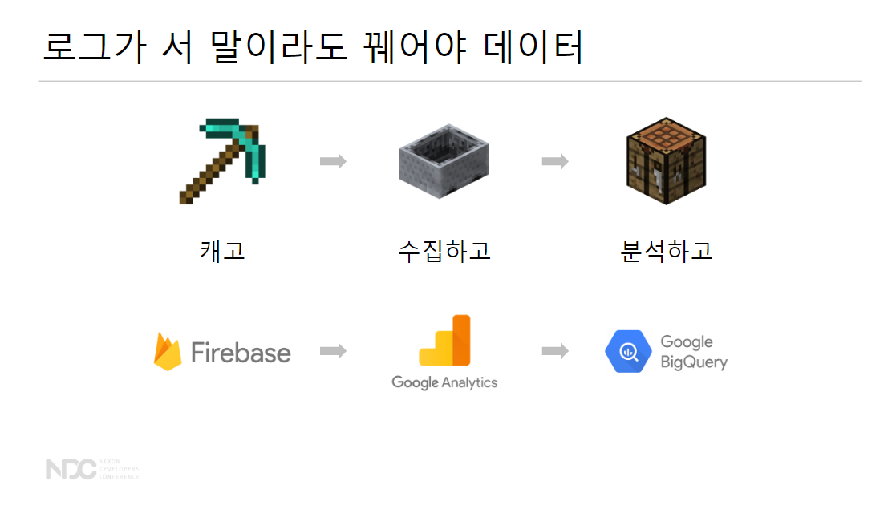

---

### **직접 만드는 데이터 파이프라인**

**Q. 데이터를 어떻게 수집할 것인가?**

1. 이용자 행동 변화에 **실시간** 대응할 수 있고
2. 트래픽에 대응해 **확장 가능**한
3. 운영 인력 없이 **24/7** 작동하는

데이터 파이프 라인이 필요

**1. 실시간성**

> "지난 일주일동안 총 노출 수를 알고 싶어요"
> " ARPU, ARPPU를 일별로 계산해주세요"

* 정해진 시간마다 배치 프로세싱을 하면 해결됨 
* 문제는 다음과 같은 요구 사항!

> "결제가 갑자기 줄어들면 **10분 안에** 알고 싶어요"
> " 이용자 클릭이 추천에 **즉시** 적용되게 해주세요"

* 이 경우는 배치 프로세싱을 돌릴 수 없음 

따라서 데이터 하나하나 들어오는 대로 처리할 수 있는 <mark style='background-color: #fff5b1'> 실시간 스트리밍 필요! </mark>

**2. 확장 가능성**

* 100만 동시 접속 $$\times$$ 매 초마다 로그 발생 $$\times$$ 평균 1kb 로그가 발생한다 가정했을 때 시간 당 **3.6TB**의 로그가 쌓임 
* 이를 위해 **Scale-up** = 서버를 키운다! BUT 1TB는 무리 

  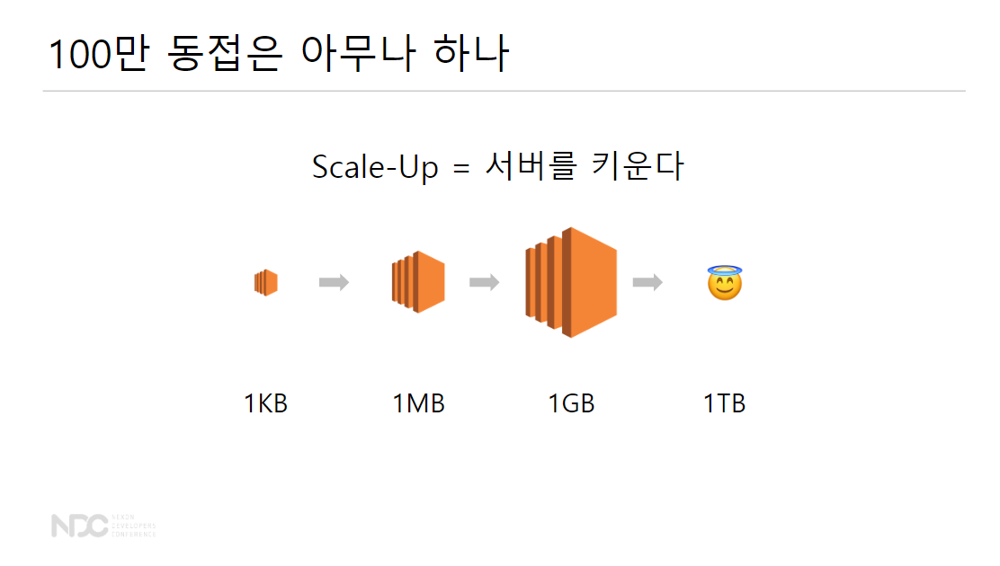

* 어쨌든 **Scale-Out** = 서버를 늘린다! 
  * 작은 시스템을 여러 개 그려서 데이터 부하를 분산하는 방법
  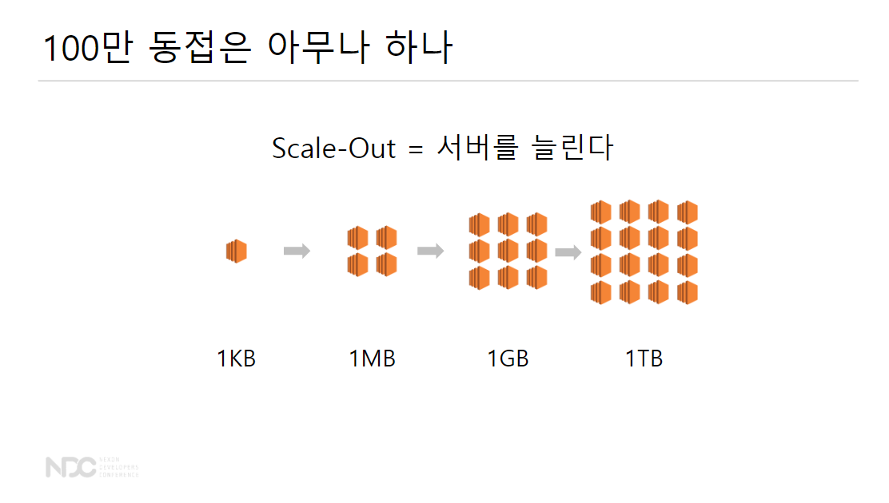

* 단순히 서버와 데이터 프로세싱을 Scale-out을 하는 건 다름: 데이터의 경우 어떤 부분에서 장애가 발생하고 장애가 발생한 부분에서 복구 과정을 해줘야함
* 따라서, 데이터 **분산 처리**는 더 난이도 있음

:deciduous_tree: **1과 2의 문제 해결하기: 실시간 스트리밍 + 분산 처리 = Apache Flink**

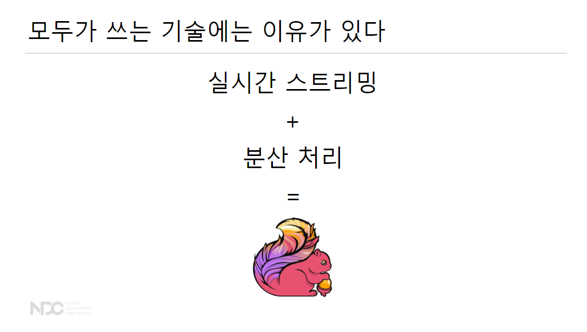

* Apache Flink를 한 마디로 요약하면, <mark style='background-color: #fff5b1'> 데이터 스트림을 위한 분산 처리 엔진 </mark>

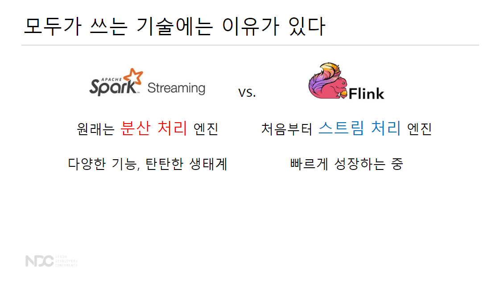

* Spark는 원래 분산 처리 엔진 / Flink는 처음부터 스트림 처리 엔진

**3. 운영 이슈: 24/7 작동하도록**

* 트래픽, 점검 해야할 게 많음 
* 해법: **아마존**
  * 장애 대응은 **관리형** 서비스가
    *  리소스를 띠우고, 초기화, 운영, 장애, 복구 등 라이프 사이클을 아마존이 책임지고 복구를 해줌!!
    * Amazon EMR, Amazon Kinesis, Amazon DynamoDB, Amazon RDS, Amazon SQS
  * 서버 관리는 **서버리스 서비스**가
    *  AWS Lambda, AWS Fargate, Amazon Dynamo DB, Amazon Aurora  
  * 모니터링은 **모니터링 서비스**가 
    * Amazon CloudWatch, Amazon ES Service, Datadog
해결해준다!
* 아마존이 하면 개발자는 뭘 하나? 돈을 낸다...!ㅋㅋㅋ

---

### **PUBG의 A/B 테스트**

* 아직 풀어야 하는 문제들: 비용 최적화, 배포 자동화
  
:deciduous_tree: **A/B 테스트의 미래**

* Multi-Armed Bandit: A/B 테스트와 항상 붙는 알고리즘, A안과 B안을 살펴봤을 때 A안의 선호도가 높아진다면 굳이 50%:50%의 비율로 A와 B를 나눌 필요가 없음 -> 이 비율을 최적화
* 추천 시스템
* 단순한 측정 플랫폼을 넘어서 가치있는 컨텐츠를 학습하고 제공

---

## **데브시스터즈: 어머님, A/B 테스트를 댁으로 들이십시오**

* 강연자: 오우택, 김민수
* 링크: [NDC Replay 오우택, 김민수님 발표](http://ndcreplay.nexon.com/NDC2019/sessions/NDC2019_0021.html#c=NDC2019&t%5B%5D=%ED%94%84%EB%A1%9C%EA%B7%B8%EB%9E%98%EB%B0%8D&p=2)

:deciduous_tree: **쿠키런: 오븐브레이크**

* 1억명 사랑해준 쿠키런의 2번째 런게임
* 16년에 런칭

---

### **초급 스타터 패키지**

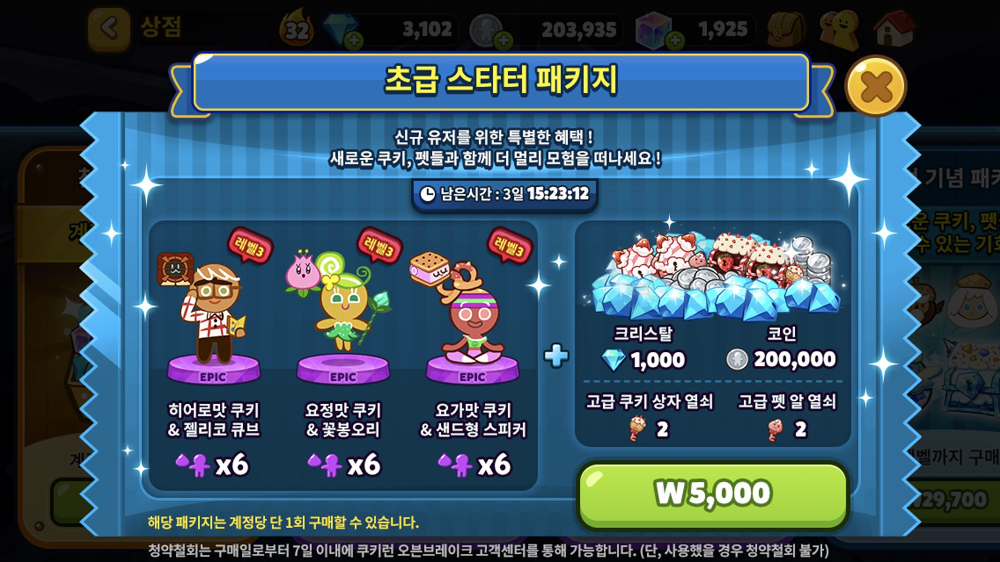

* 유저가 처음 사용하는 유료 상품
* 신규 유저를 위한 혜택은 **구매 시간 제한**이 있음
* 게임에 과금을 한 번 시작하면 계속 하는 경향이 있기 때문에 첫 구매가 중요!

<mark style='background-color: #fff5b1'> Q.시간 제한이 있는 상품의 판매 시간을 어떻게 설정해야 가장 많이 팔릴까?</mark>에 대한 대답이 이 발표의 목적!

---

### **상품 기획자의 고민**

* 1시간, 1일, 3일을 노출했을 때 어떤 판매 시간이 최적일까? 

  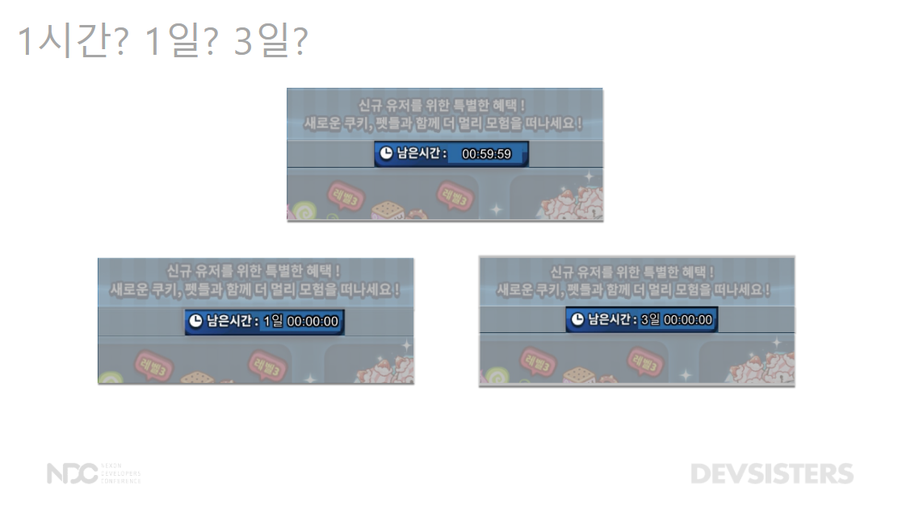

* 만약 각 아이디어를 날짜에 따라 개별적으로 실험할 경우 

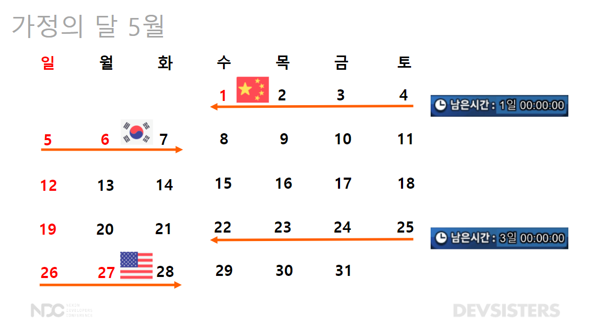

* 기획자 별로 타당한 이유로 시간 제한을 다르게 생각
* BUT, 날짜에 따라 어떻게 배치하느냐에 따라 공휴일 or 국가적 특성으로 인해 랜덤하게 선택되지 않음
* **외부 변인 통제**가 불가능!

:deciduous_tree: **그래서, A/B 테스트 방법론 도입!**

* 서로 다른 N가지 방법간의 효과의 차이를 밝히기 위한 통계적 디자인 패턴
* 외부 변인 통제의 문제를 극복

---

### **실험 기획**

* A/B 테스트는 다섯 가지를 정해야함: 최상위 의도, 유의미한 차이, 실험 대상, 그룹의 개수, 실험 기간 설정

**1. 최상위 의도: 실험을 해서 어떤 수치를 더 낫게 만드려 하는 지?**

* **판매량**
* ~~재방문률~~
* ~~전환률~~

**2. 유의미한 차이**

* ~~5% 증가?~~
* **10% 증가?**
* ~~50% 증가?~~

**3. 실험 대상**

* 판매 시간 제한 실험이 만국 공통의 문제라 생각해서 **전세계 유저**를 대상으로 함

**4. 그룹의 개수**

* 최소 2개 그룹 이상 설정 
* 이 경우 3개 그룹!

**5. 실험 기간 설정**

* 실험 기간을 설정할 때는 최소한의 **비즈니스 사이클**을 포함해야함
  * 따라서, 주말, 평일의 매출이 크기 때문에 주말을 포함하도록 함
  * 한 번은 우연일 수도 있으니 **2주**

판매량이 통계적으로 유의미한 차이를 보이는 그룹이 있는가?

---

### **실험군 나누기**

* 게임 유저가 6명이 있다고 가정했을 때, 실험군의 크기를 2명 씩 **균등**하게 분배하는 게 중요

**1. 로그인하는 순서대로?**

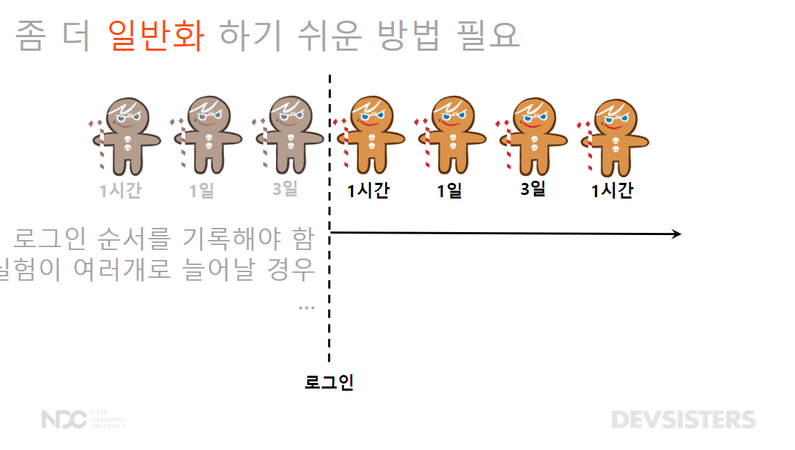

* 1시간 -> 1일 -> 3일 로그인 순서대로 균등하게 배정
  * BUT, 이런 방법은 로그인 순서를 기록해야하는 문제
  * 실험이 여러 개로 늘어나면 대처하기 어려움

**2. 유저를 숫자로 맵핑?**

* 유저 아이디 $$\Rightarrow$$ 해시값으로 변환
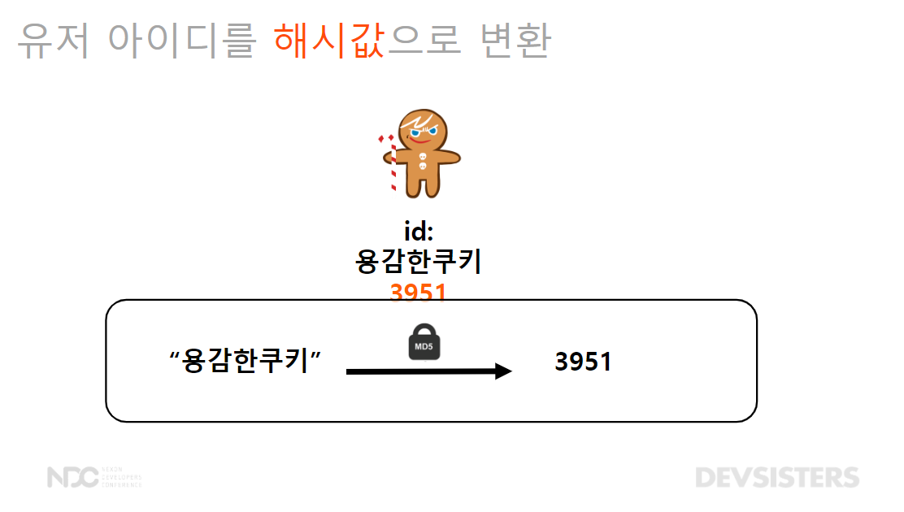

* 해시값을 기준으로 그룹 배정
  * 3333 미만 1시간 그룹
  * 6666 미만 1일 그룹
  * 6666 이상 3일 그룹

**Q. 만약 구매력이 좋은 유저가 한 그룹에 몰리는 문제가 생기면?**

* 실험군의 성질이 **동질**한 지 판단
  * 예를 들어, **레벨**의 경우 그룹 별로 레벨의 분포가 비슷해야 함 (저레벨 - 중간 레벨 - 고레벨)

* 그럼 동질해야 하는 성질은?
  * 국가 분포
  * 스테이지 도달률
  * 과금 비율
  * 레벨 분포

* 실험군이 통계적으로 동질한 지 검증: 카이제곱 분포

:deciduous_tree: **결론: 동질한 유저들에게 균등하게 판매 시간을 보여준다.**

* 각 그룹별로 국가 분포, 스테이지 도달률, 과금 비율, 레벨 분포가 동질한 지 검정

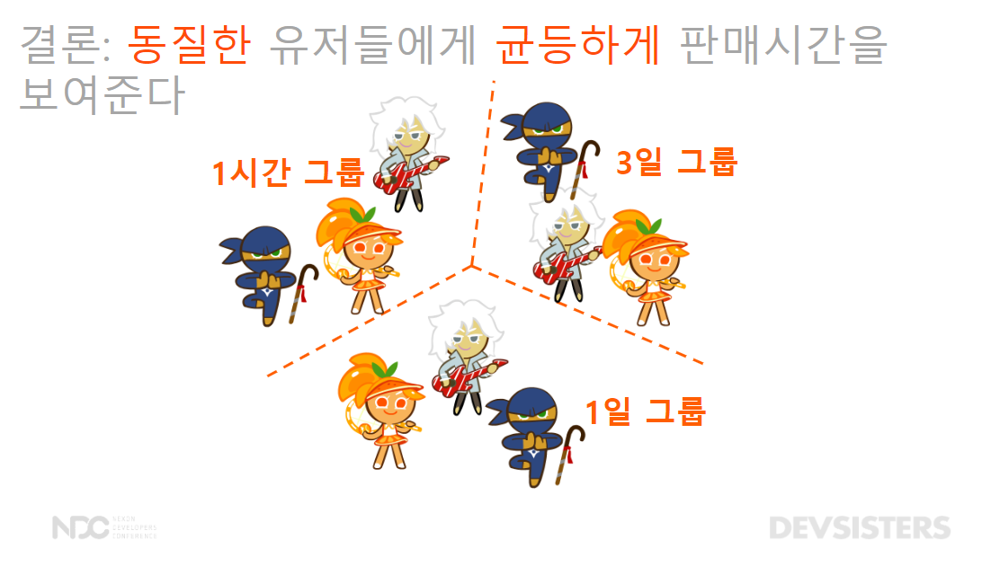

---

### **여러 실험 동시에 하기**

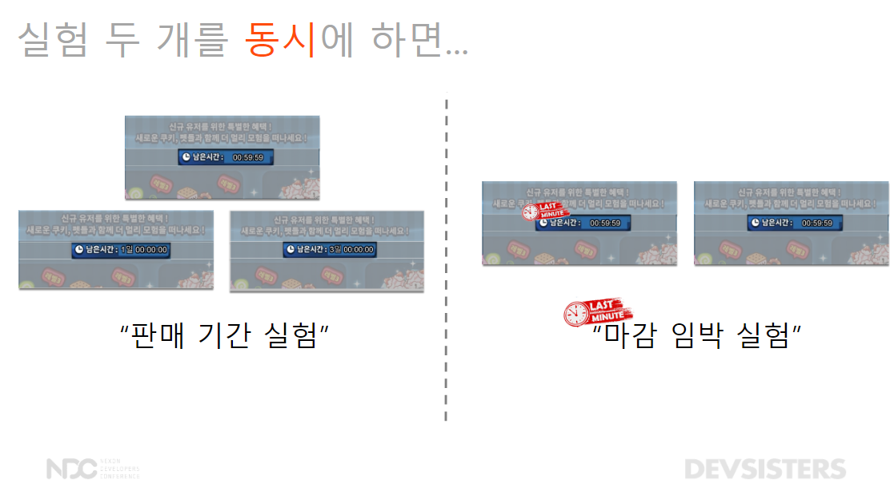

* 만약 A/B 테스트를 하는데 판매 시간이 거의 끝나갈 때 쯤 "마감 임박"을 한다면?
* 판매 기간 + 마감 임박 두 가지의 실험을 해야 하는 문제가 있음

:deciduous_tree: **실험의 적용 범위 설정** 

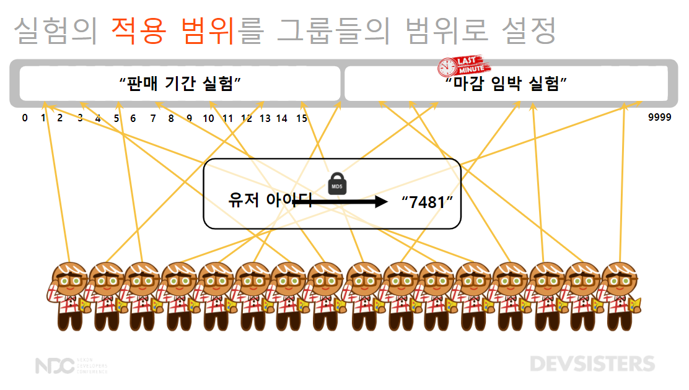

* 유저가 동시에 다른 실험에 노출되면 안된다.
* 유저를 10,000개의 작은 그룹으로 나눈다.
* 유저 해시값으로 바꾸고
* 실험의 적용 범위를 그룹들의 범위로 설정
  * 판매기간 실험은 0~4,999
  * 마감 임박 실험은 5,000~9,999
  * 이러면 실험이 절반의 유저에게 배정
  * 한 유저는 한 그룹만: 판매 기간 실험을 본 유저는 마감 임박 실험을 못 보도록, 마감 임박 실험을 본 유저는 판매 기간 실험을 못 보도록 **독립**적으로 배정

:deciduous_tree: **해시값의 문제**

* 판매기간 실험을 0~4,999의 해시값을 가진 유저만 배정하면 3일 그룹 전체와 1일 그룹 일부가 실험 적용 범위에 포함되지 않는 문제!

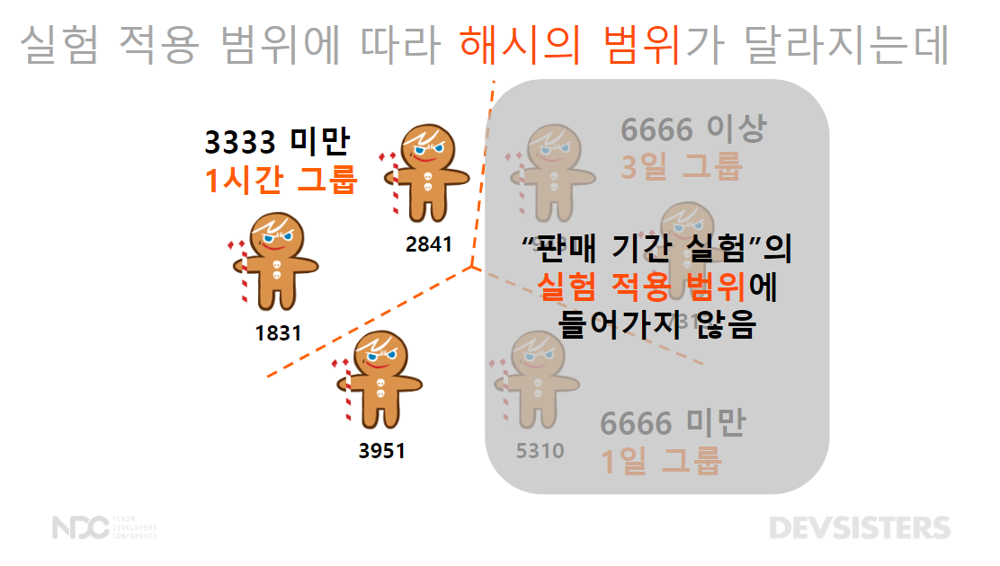

* 실험마다 실험군 기준이 달라지게 조정: 해시값을 변환하기 전에 테스트 이름을 유저아이디에 붙여서 해결

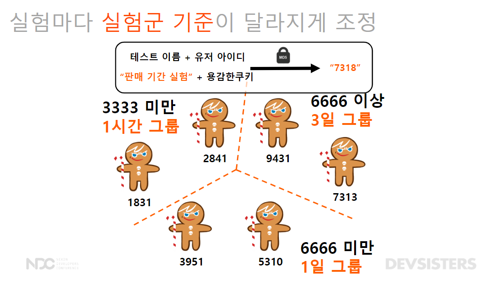

---

### **A/B 테스트 개발**

* 실제 게임 개발자가 손 쉽게 실험할 수 있도록 플랫폼 개발!

:deciduous_tree: **DevPlay 플랫폼 소개**

* 모바일 게임을 유저에게 서비스하기 위한 공통 기능을 제공하는 모바일 게임 플랫폼: 게임 푸시 등 운영에 필요한 플랫폼

:deciduous_tree: **A/B 테스트 플랫폼 플로우**

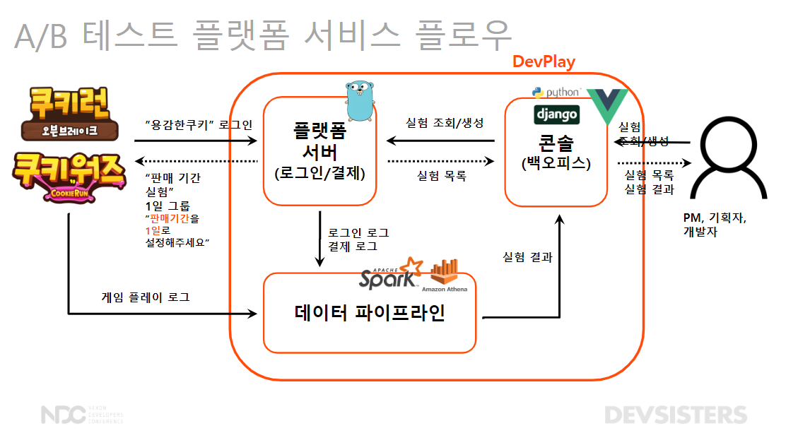

1. 게임 개발자는 콘솔을 통해 실험을 조회, 설정
2. 플랫폼 서버의 데이터 베이스에 해당 정보 저장: 게임 유저가 로그인할 때 마다 A/B 테스트 로직에 따라 배정됨
   * 용감한 쿠키가 로그인하면 1일 그룹에 설정해주세요
3. 데이터 파이프라인: 게임의 플레이 로그, 로그인, 결제 로그를 합침
  * 어떤 실험군에서 상품이 더 판매 되는 지
  * 어떤 실험군에서 더 게임을 오래 하는 지

---

### **실험 결과**

* 2주의 시간이 지나고 상품이 얼마나 팔렸을까?

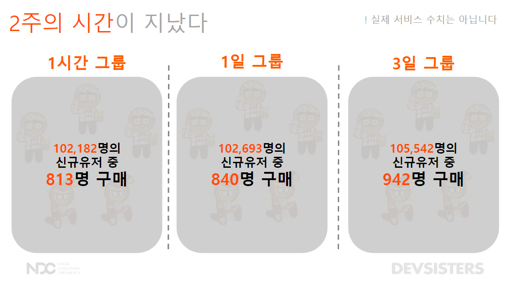

* 숫자만 봤을 때는 3일 그룹이 가장 좋다고 말하기가 어려움
* **직관적으로** 결과 측정을 할 수 있어야 한다.
* 통계적 모델링을 통한 **베이지안 확률** 계산: 3일 그룹이 가장 좋을 확률은 96%이다.

---

### **결론**

문제 상황 -> 실험 기획 (A/B 테스트) -> 균등, 균질한 집단 -> 플랫폼 개발 -> 유의미한 결과 전달

* A/B 테스트는 통계를 근거로 합리적인 의사결정을 할 수 있는 실험 방법론
* DevPlay 플랫폼에 적용시켜 다양한 게임에 실험 적용
* 슈퍼셀 - 브롤스타즈: A/B 테스트 진행

---

## **느낀 점** 

[이미지 링크](https://www.google.com/url?sa=i&source=images&cd=&ved=2ahUKEwikoKaS8v3nAhVUyIsBHSSoA6UQjRx6BAgBEAQ&url=https%3A%2F%2Fgongu-s2.tistory.com%2F1130&psig=AOvVaw2GjW5qn4n3zFf60ml1sxI9&ust=1583309872952036)
{:.figure}

1. A/B 테스트의 본질은 파이프라인의 개발
   * PUBG 발표에서 로그 데이터를 구축하는 것을 보면서 데이터 파이프라인의 구조를 이해하고 공부할 필요가 있음을 느꼈습니다.
   * 다만, 아직 어떻게 구조화되어 있는 지 감이 잘 안 와서 이를 정리하고 공부하는 걸 고르는 것도 좋지 않을까 싶습니다. (기존에는 NoSQL의 mongoDB를 배울까 했는데 흠... 고민이 되네요..!)
2. 베이지안 확률의 사용
   * 데브시스터즈 발표에서 베이지안 확률을 진짜 명확하게 써준 사례여서 흥미로웠습니다. 제가 정리한 [베이지안 A/B 테스트 글](2020-03-02-abtest.md)처럼 비슷한 확률 분포들을 사용해서 계산하지 않았을까 싶네요. 
3. A/B 테스트? MAB?
   * A/B 테스트보다 MAB가 배치 확률을 최적화해준다는 점에서 더 많이 쓰일 줄 알았는데 생각보다 현업에서 많이 A/B 테스트를 쓰고 있다는 점이 인상깊었습니다.