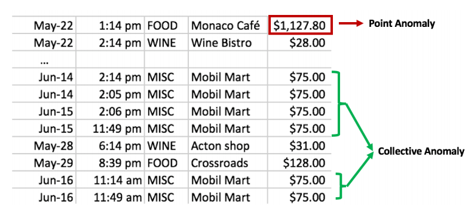

# Introduction to Deep Anomaly Detection
* 이 글은 Deep Anomaly Detection (이상치 탐지)의 개념, 분류, 산업 적용 분야를 소개하는 글로, [Raghavendra and Sanjay (2019)](https://arxiv.org/abs/1901.03407)를 요약한 글입니다.
* 이와 동시에 제가 공부하고 싶은 이상 탐지 세부 분야를 정하기 위해 쓰게 되었습니다. 
---

## **Contents**
{:.no_toc}
0. this unordered seed list will be replaced by toc as unordered list
{:toc}
---

---
## **Anomaly vs. Novelty**

Anomaly는 통계적 맥락에서 비정상치 (abnormalities), 이상치 (outliers)들을 일컫는 말입니다. 
이와 비슷한 개념인 Novelty는 데이터에서 새롭거나 발견되지 않은 패턴을 의미합니다. 그러나 novelty로 탐지된 데이터들은 anomaly로 간주되지 않고 후에 정상 데이터 범주에 들어가기 때문에 anomaly와 차이가 있습니다.

아래의 그림을 보면 왼쪽은 Anomaly를 설명한 그림입니다. $$N_1,N_2$$는 정상데이터이지만 이 범주에서 벗어난 $$O_1,\ldots,O_3$$은 anomaly로 간주됩니다.
또한 오른쪽에 보시면 Novel이라 표시된 백호 그림은 "호랑이"라는 정상 범주에 속하지만 기존에 발견되지 않은 새로운 패턴에 해당합니다. 이에 반해 말, 팬더, 사자, 치타와 같은 사진은 호랑이 사진이 아니기 때문에 anomaly로 간주됩니다.

이상치 탐지를 할 때 유의할 점은 다음과 같습니다.

* 고전적인 머신러닝 방법으로도 효과가 좋은 경우도 있음 (예시: [엄혜민님 발표자료](http://ndcreplay.nexon.com/NDC2018/sessions/NDC2018_0034.html#c=NDC2018&k%5B%5D=%EC%9D%B4%EC%83%81), [김정주님 발표자료](http://ndcreplay.nexon.com/NDC2016/sessions/NDC2016_0052.html#k%5B%5D=%EC%96%B4%EB%B7%B0))
* 이상치가 극단적으로 적고 정상 데이터가 대부분이기 때문에 class imbalance (클래스 불균형) 문제를 해결해야 함 
* 이상치의 특성과 산업 분야에 따라 달라지기 때문에 이를 유의해서 분석해야 함

고전적인 머신러닝 방법은 [KIHASA 기계학습 기반 이상 탐지 기법 연구](https://www.kihasa.re.kr/common/filedown.do?seq=41721)에 자세히 요약되어 있습니다.

---
## **Deep Learning based Anomaly Detection**

딥러닝 기반 이상치 탐지는 여러 측면에서 분류되고 그에 따른 분석 방법이 다르게 적용됩니다.

1. 데이터의 특성
2. 라벨의 유무
3. 훈련(training)의 목적
4. 이상치의 종류
5. 출력값의 종류

**1. 데이터의 특성**

데이터가 시간에 따라 측정되는 지 아닌 지에 따라 Sequential과 Non-sequential로 분류할 수 있습니다. 
영상, 스피치, 시계열, 텍스트의 경우 시간에 따라 기록되기 때문에 Sequential에, 이미지의 경우 Non-sequential에 해당합니다. 
(참고로 센서데이터는 sequential 같은데 여기는 non-sequential로 되어 있네요)

혹은 정상치가 한 그룹으로 묶이는 지의 여부에 따라 일집단 (One-class)와 (Multi-class)로 나뉩니다. 일집단의 경우 훈련 데이터가 모두 정상이라 가정하고 정상치를 두르는 boundary를 학습하고 이 경계 밖에 있느 테스트 데이터를 이상치로 분류합니다. 

다집단은 자료가 여러 클래스로 이루어져 있다 가정하고 분류기가 각 정상 클래스와 나머지를 구분하도록 학습시키고, 어느 클래스에도 포함되지 않는 개체를 이상치로 처리하는 방법입니다.

**2. 라벨의 유무**

라벨이란 각 관측치가 정상치인지 이상치인 지에 대한 정보를 의미합니다. 이러한 라벨의 유무에 따라 지도 (Supervised), 반지도 (Semi-supervised), 비지도 (Unsupervised) 학습 기반의 DAD가 발전했습니다.

:deciduous_tree: **지도 학습 기반: Supervised DAD**

지도학습 기반의 DAD는 정상치와 이상치 대한 라벨이 모두 있는 데이터를 훈련시키는 방법입니다. 그러나 
* 훈련 데이터에 라벨이 모두 있는 경우가 드물고
*  이상치가 극히 적어 클래스 블균형 (Class-imbalance) 문제로 분류기 성능이 최적이지 않기 때문에 (sub-optimal)
반지도 및 비지도 학습에 비해 잘 쓰이지 않는 방법론입니다. 이 논문에서도 이에 대한 리뷰를 생략했습니다.

:deciduous_tree: **반지도 학습 기반: Semi-supervised DAD**

정상치의 라벨을 얻는 것이 훨씬 쉽기 때문에 정상치 라벨만 가지고 모형을 학습시키는 방법입니다.
이 학습을 통해 정상치들의 경계를 만들어서 그 경계에 속하지 않으면 이상치로 탐지하는 방법입니다.

| 방법  |
|:---|
|Autoencoders|
|Restrict Bolztman Machine (RBM)|
|Deep Belief Networks (DBN)|
|Generative Adversarial Networks (GAN)|
|Corrupted Generative Adversarial Networks (CorGAN)|
|Adversarial Autoencoders (AAE)|
|Convolutional Neural Networks (CNN)|

이의 **장점**은
* 반지도 학습 기반의 GAN이 클래스 불균형이 심해도 좋은 결과를 내고
* One-class로 이루어진 라벨을 가진 (정상치 라벨) 데이터만 이용하면 비지도 학습 기반의 방법보다 훨씬 더 좋은 성능을 낸다는 점입니다.

**단점**은 은닉층의 계층적 구조가 이상치 데이터를 대표하지 못할 수도 있기 때문에 과적합 문제가 있을 수 있다는 점입니다. 이건 해석이 확실치가 않아 원문을 가져왔습니다.
> The hierarchical features extracted within hidden layers may not be representative of fewer anomalous instances hence are prone to the over-fitting problem.

:deciduous_tree: **비지도 학습 기반: Unsupervised DAD**

데이터 포인트들의 내재적인 특성만을 이용해 이상치를 탐지하는 방법입니다. 
비지도 학습 기반의 방법 중 **Autoencoder**는 이상 탐지에 기초적이고 자주 쓰이는 방법론입니다. 

비지도학습 기반의 방법론의 예시는 다음과 같습니다.

| 방법  |
|:---|
|Long Short Term Memory Networks (LSTM)|
|Autoencoders (AE)|
|Spatial Transformer Networks (STN)|
|Generative Adversarial Netowrk (GAN)|
|Recurrent Neural Networks (RNN)|
|Adversarial Autoencoders (AAE)|
|Variational Autoencoders (VAE)|

이의 **장점**은 
* 이상치로부터 정상치를 분리할 수 있는 데이터의 내재적인 특성을 학습하여 데이터 내의 유사성을 발견할 수 있고
* 알고리즘을 훈련을 할 필요가 없어 경제적인 방법
이라는 점입니다. 

이와 반대로 **단점**은 
* 고차원 데이터에서 유사성을 학습 하는 것이 어렵고
* Autoencoder를 사용할 때 압축의 정도 (degree of compression), 즉 차원 축소를 얼만큼 해야 하는 지에 대한 초모수 (hyperparameter)를 조정해줘야 한다는 점
입니다.

**3. 훈련의 목적**

:deciduous_tree: **Deep Hybrid Models (DHM)**

Deep hybrid model은 특성을 추출하기 위해 autoencoder, CNN, LSTM과 같은 딥러닝 방법을 사용하고 배운 특성들을 One Class SVM (OC-SVM)과 같은 전통적인 이상치 탐지 알고리즘의 **인풋**으로 넣는 모형을 의미합니다. 즉 모형이 2단계로 나뉘어 1단계에서는 특성들을 학습해 추출하고, 2단계에서는 학습한 특성들을 넣어 SVM을 통해 정상 범주의 boundary를 만들어 줍니다.

이의 **장점**은 
* 특성 추출기 (feature extractors)가 차원의 저주 (curse of dimensionality)를 방지하고,
* 선형 혹은 비선형 커널이 감소된 차원의 input을 통해 작동하기 때문에 확장가능성이 높고 연산이 효율적

이라는 점입니다.

이와 반대로 **단점**은

* 특성을 추출할 때 이상치 탐지를 위해 만들어진 목적 함수가 아니라 일반적인 손실 함수를 통해 학습하기 때문에 최적의 결과를 내지 못하고
* 더 깊은 hybrid model일수록 좋은 성능을 내기 때문에 어쨌든 간에 연산 비용이 있다

는 것입니다.

:deciduous_tree: **One-Class Neural Networks (OC-NN)**

OC-NN은 커널을 기반으로 하는 one-class 분류로, 데이터의 표현을 추출하는 딥 네트워크와 정규치들을 둘러싼 바운더리를 만드는 one-class 목표를 결합한 방식입니다. DHM과 달리 이상치 탐지를 위해 만들어진 목적함수를 최적화함으로써 데이터를 표현하는 방법에 대해 배우기 때문에 신박 (novel)한 방법입니다.

따라서 **장점**은 
* 정상치의 boundary를 찾는 초평면, 초구 (hypersphere)를 학습하는 것과 동시에 deep neural network를 훈련시킨다는 점
* 모수들의 학습을 하는 알고리즘이 잘 정의가 되어있다는 점

입니다.

이와 반대로 **단점**은 훈련과 모형 업데이트에 걸리는 시간이 오래 걸릴 수 있다는 점입니다.

**4. 이상치의 종류**

이상치는 크게 

* 점 이상치 (Point)
* 맥락 상의/ 조건적 이상치 (Contextual / Conditional)
* 그룹화된 이상치 (Collective / Group)

으로 나뉘고 이에 따른 방법론도 달라질 수 있습니다.

:deciduous_tree: **점 이상치**

대부분의 이상치 탐지에 대한 논문은 점 이상치를 다룹니다. 점 이상치는 임의로 일어나는 불규칙성, 혹은 특정한 이유없이 튀는 값들을 의미합니다.

:deciduous_tree: **맥락 상의 이상치**

특정한 맥락 상에서 이상치로 간주되는 데이터로, 맥락 상의 특징과 행동적인 특징 두 가지를 모두 포함합니다.
* 맥락 상은 시$$\cdot$$공간에서의 이상치
* 행동적 특징은 정상 행동으로 벗어난 로그 발생, 평소 패턴에 맞지 않는 소비
등을 포함합니다.

아래의 그림처럼 기상 데이터에서 6월에 확 기온이 떨어진 경우 (a), 로그 데이터에서 비정상 패턴이 감지된 경우 (b)가 맥락 상의 이상치에 해당합니다.

:deciduous_tree: **그룹화된 이상치**

개개인의 관측치는 정상범주로 보이지만 그룹으로 관측되어 비정상 행동으로 간주되는 이상치를 의미합니다. 

예를 들어 신용카드 거래 내역을 보면 $75라고 써있는 거래가 그룹화된 이상치의 후보가 될 수 있습니다.

**5. 출력값의 종류**

이상치 탐지를 통해 출력되는 출력값은 

* 이상치 점수 (anomaly score)
* 이항형 라벨 (binary label)

중 하나입니다.

:deciduous_tree: **이상치 점수**

이상치 점수는 각 관측치의 벗어난 정도 (outlierness)를 측정합니다. 이 이상치 점수들에 의해서 관측치들의 순서를 매길 수도 있습니다.

이러한 이상치 점수는 이항형 라벨보다 더 많은 정보를 제공합니다. 예를 들어 Deep SVDD의 경우 데이터가 구의 중심으로부터 얼마나 떨어져 있는 지의 거리를 출력해줍니다.

:deciduous_tree: **이항형 라벨**

점수를 매기는 방식 대신 관측치에 대해 정상치인 지 이상치인 지의 라벨을 제공하는 방식도 있습니다. 

---

## **Applications of Deep Anomaly Detection**

1. Intrusion Detection: 컴퓨터 상의 악의적 행동에 대한 탐지
2. Fraud Detection: 은행 거래, 모바일, 보험 분야의 사기 탐지 
3. Malware Detection: 맬웨어 탐지
4. Medical Anomaly Detection: 의학 이미지, 임상 뇌파 검사 기록 등에서 나타나는 희귀 현상 탐지
5. Anomaly Detection in Social Networks: 스팸, 성적인 사진, 온라인 사기, 가짜 사용자, 루머 생성자와 같이 불법 행동을 탐지
6. Log Anomaly Detection: 로그 파일 중 정규 표현식 등을 이용해 시스템 실패를 불러오는 문자열을 찾는 것이 목표
7. Internet of Things (IoT) Anomaly Detection: 날씨 정보, RFID 태그, 센서 등에서 발생하는 이상 탐지
8. Industrial Anomaly Detection: 터빈, 발전소, 저장소 등에서 나타나는 이상 징후 탐지
9. Anomaly Detection in Time Series: 시계열 자료는 단변량과 다변량으로 나눌 수 있음. 단변량의 경우 시간에 따라 한 특성만 변하는 것이고 다변량의 경우 여러 특성들이 동시에 변하는 것을 의미

---
## **What's Next?**

제가 이 글을 준비한 이유는 "이상 탐지"라는 넓은 주제에서 어떤 방법론을 공부하는 것이 좋을 지에 대해 알아보자는 취지였습니다. [Sualab Anomaly Detection 개요 글](https://research.sualab.com/introduction/review/2020/01/30/anomaly-detection-overview-1.html)에서도 제가 참조한 논문을 더 자세하고 잘 리뷰해놨지만 제 입장에서 어떤 걸 더 중점적으로 파볼까?를 고민해보며 쓰게 되었습니다.

제가 관심있는 주제는 게임 환경에서 이상치를 탐지하는 방법입니다. 
게임 환경에서의 이상 탐지는 주로 **게임 봇, 재화 이상치, 핵과 같은 cheating 행위를 탐지**하는 것입니다. 

SVM, K-NN, 유사도 계산을 통한 로지스틱 분석, GMM (Gaussian Mixture Model)과 같은 기계학습 위주의 분석이 있는 반면 DAD (딥러닝 기반 이상 탐지)로 넘어가면 LSTM, AE, RNN, CNN이 등장하네요! 이는 다음 주제에서 더 다뤄보겠습니다.

---
## **References**
 
* [Raghavendra and Sanjay (2019)](https://arxiv.org/abs/1901.03407)
* [엄혜민님 발표자료](http://ndcreplay.nexon.com/NDC2018/sessions/NDC2018_0034.html#c=NDC2018&k%5B%5D=%EC%9D%B4%EC%83%81)
* [김정주님 발표자료](http://ndcreplay.nexon.com/NDC2016/sessions/NDC2016_0052.html#k%5B%5D=%EC%96%B4%EB%B7%B0))
* [KIHASA 기계학습 기반 이상 탐지 기법 연구](https://www.kihasa.re.kr/common/filedown.do?seq=41721)
* [Sualab Anomaly Detection 개요 글](https://research.sualab.com/introduction/review/2020/01/30/anomaly-detection-overview-1.html)