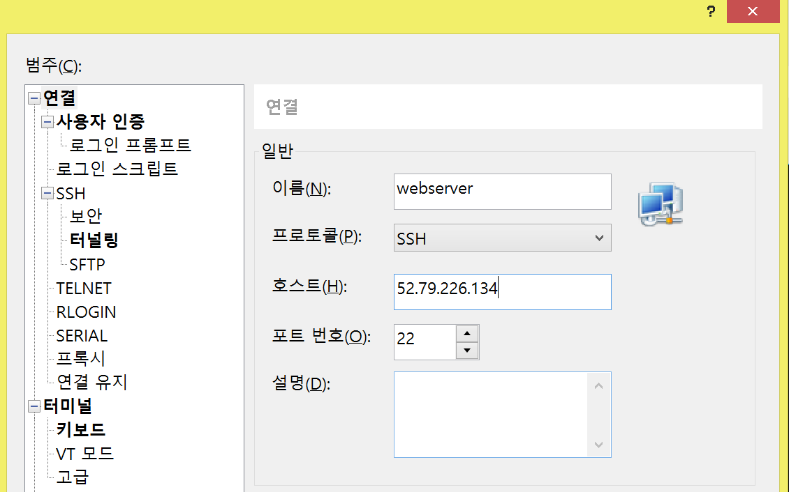
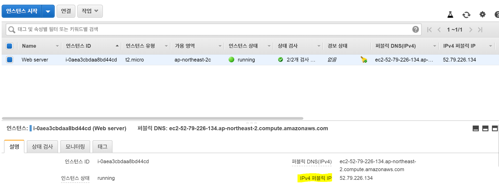

# AWS EC2 가상 서버 접속하기

* 이 글은 AWS에서 EC2 가상 서버에 접속하는 방법에 대한 글입니다.
* [생활코딩 AWS 강의](https://opentutorials.org/course/2717)를 보며 직접 실습해보았습니다.

---
## **Contents**
{:.no_toc}
0. this unordered seed list will be replaced by toc as unordered list
{:toc}

---
## **What is AWS (Amazon Web Service)?**

AWS는 아마존 회사에서 제공하는 클라우드 컴퓨팅 서비스입니다. **클라우드 컴퓨팅**이란 인터넷을 통해 **IT 리소스**(ex. 물리적 서버, 네트워크)와 **애플리케이션**(ex. 데이터분석)을 원할 때 언제든지 사용한 만큼만 요금을 내는 서비스입니다. 인터넷에 연결되어 있는 거대한 컴퓨터를 사용한다!고 생각하시면 됩니다. 

---
## **Why AWS?**

최근 가고 싶은 회사들을 알아보던 중 "Data Scientist"에 대한 공고 설명에 AWS (Amazon Web Service) 나 GCP (Google Cloud Platform)과 같은 클라우드 사용 경험, Spark 혹은 Hadoop, SQL 사용 경험에 대한 경력을 우대한다는 것을 느꼈습니다. 

저는 이러한 경험이 일절 없었고 실제로 데이터가 어떻게 수집되어서 tabular한 형태로 저장되는 지 몰랐기 때문에 이를 실제로 알아보는 게 중요하다 생각이 들었습니다.

---
## **AWS EC2**

EC2는 아마존에서 제공하는 인스턴스를 임대하는 서비스로 Elastic Compute Cloud의 준말입니다. 
가장 먼저 해야 하는 일은 "가용지역" (Available Zone)을 설정하는 것입니다. 
가용지역은 AWS 페이지의 우측 상단에서 지정할 수 있으며 이를 `Seoul (ap-northeast-2)`로 지정합니다.
---

### **Instances**

인스턴스는 쉽게 설명하자면 가상 컴퓨터 환경입니다. 인스턴스 하나 당 가상 컴퓨터 하나를 임대한 꼴과 같습니다. 
따라서 AWS의 EC2 서비스를 이용하기 위해서 인스턴스를 생성해야 합니다. 
인스턴스 생성을 통해 가상 서버를 만드는 방법을 알아봅시다.

**Step0. 인스턴스 시작**

먼저 인스턴스 생성을 위해 `EC2 대시보드` 화면에서 `인스턴스` 메뉴를 클릭하고 `인스턴스 시작` 버튼을 누릅니다.

**Step 1. AMI (Amazon Machine Image) 선택하기**

AMI는 서버를 저장한 형식이라 생각하시면 됩니다.
Amazon Linux는 아마존이 AWS에 최적화된 리눅스를 개발한 AMI입니다. 
Windows Server가 있는데 이는 SQL Server가 포함되어 있어서 Free tier에서는 무료가 아닙니다. 

저는 AMI 중 세 번째 `Ubuntu Server 18.04`를 선택했습니다.

**Step 2. 인스턴스 유형 선택**

가장 저렴하고 성능이 낮은 `유형`은 `nano`이지만 저희는 `t2.micro`를 사용합니다.

* vCPUs: CPU 개수, `v`는 `virtual` (가상) CPU라는 뜻
* 메모리: 몇 GB의 메모리를 가지고 있는 지!
* 네트워크 성능: 가격과 스펙에 따라 차등이 있음

>**NOTE** 
* AWS 프리티어 EC2의 가격정책은 EC2 t2.micro 750시간으로 되어 있음 -> 한 대의 인스턴스를 한 번도 끄지 않고 쭉 써도 1년 간 무료!  
* 임대하는 인스턴스에 SSD 30GB까지 + 200만건 이상이면 과금
* **온 디맨드 인스턴스**: 필요할 때는 컴퓨터를 키고, 없을 때는 꺼서 가격을 절감하도록 해야 함
* **예약 인스턴스**: 할인권을 구매하는 것, 서버를 운영할 때 1년 365일 

**Step 3. 인스턴스 세부 정보 구성**

프리티어에서 인스턴스는 1개까지 무료입니다. 
모든 설정을 Default값으로 하고 `다음: 스토리지 추가`를 클릭합니다.
종료 방식을 `중지`로 설정하면 저장 비용만 과금됩니다.

**Step 4: 스토리지 추가**

프리티어에서 30GB까지는 무료이지만 리눅스 형식 상 8GB를 사용합니다.

* 볼륨 유형: 장착하는 저장장치의 형식을 지정
* 종료시 삭제: 컴퓨터를 종료할 때 저장 장치가 같이 삭제되길 원하면 체크, 체크를 하지 않으면 과금될 수도 있음

**Step 5: 태그 추가**

인스턴스에 대한 설명을 붙이는 부분입니다.
저는 3개의 태그를 추가했습니다. 

**Step 6. 보안 그룹 구성**

보안 그룹은 인터넷을 접속할 수 있는 걸 허용하고 막는 역할을 합니다. 즉, 제한된 방법(유형)을 통해서 우리의 인스턴스에 접속할 수 있도록 보안 그룹을 구성하는 것입니다.
먼저 `새 보안 그룹을 생성`하고, `보안 그룹 이름`과 `설명`을 써줍니다.

이후 `유형`을 설정합니다. `유형`은 보안 그룹에 대한 정책들을 고르는 사항으로 만든 인스턴스에 접속하는 여러 가지 방법을 제시합니다. 예를 들어 원격제어를 위해서, ftp로 파일을 인스턴스로 업로드, 웹서버에 접속하기 위해 브라우저를 통해 접속하는 등 목적에 따라 `유형`을 다르게 설정합니다.
`유형` 중 `SSH`는 SecureShell을 의미하고, 리눅스/유닉스 계열의 원격 제어 방법이 SSH입니다! 
만약 인스턴스를 통해 웹서버를 구축하고자 한다면 `HTTP`를 사용합니다. 

마지막으로 `소스`를 정합니다. 저는 `소스`를 `내 IP`로 하면 고정 IP에서만 웹서버가 구동되는 것이기 때문에 `위치 무관`으로 선택했습니다.
    

**Step 7. 인스턴스 시작 검토**

인스턴스를 생성한 정보를 검토하는 화면입니다. 인스턴스를 생성하면 다음과 같이 키 페어를 선택하는 화면이 뜹니다.
`새 키 페어를 생성`해 키 페어 이름을 만들고 `키 페어 다운로드`를 클릭합니다. 
다운로드 받은 파일은 `.pem` 확장자로 되어있습니다. 이를 안전한 곳에 저장하는 것이 좋기 때문에 `C:\`드라이브 내의 폴더를 하나 만들어 그 안에 저장했습니다.

---
## **Windows에서 리눅스 인스턴스로 접속**

리눅스 인스턴스에 SSH 방식으로 원격제어를 하려면 Windows에서 SSH로 접속할 수 있는 "원격제어" 프로그램이 필요합니다.
이를 위해 SSH 클라이언트인 **Xshell**를 사용합니다.

[넷사랑](https://www.netsarang.com/ko/free-for-home-school/) 페이지에서 가정 및 학교 내 사용자는 무료로 Xshell을 다운받으실 수 있습니다.

이제 Xshell을 열어 `새로 만들기`버튼을 클릭합니다. 
`이름`에는 `webserver`를, `호스트`에는 AWS에서 `IPv4 퍼블릭 IP`를 입력합니다. 이 IP의 위치는 아래 사진에서 찾을 수 있습니다.

이제 메뉴 중 `사용자 인증`을 클릭합니다.
`사용자 이름`은 `ubuntu`로 지정합니다. 만약 접속하는 컴퓨터가 다른 리눅스 체제라면 `ubuntu` 대신 `ec2-user`라는 ID를 사용해야 합니다.
`방법`을 `Public key`로 바꿔준 후 `사용자 키`에서 `찾아보기`를 클릭한 후 `가져오기`를 클릭합니다. 
이후 Step 7에서 다운받은 `.pem`파일을 찾아 가져와 `확인`을 누릅니다.

마지막으로 `암호`는 없도록 설정한 후 `연결`을 누릅니다.
그럼 아래와 같은 경고 메세지가 뜨는데요. `수락 및 저장`을 클릭합니다.

그럼 `XShell`에서 다음과 같은 글을 보면 성공입니다!

~~~
Welcome to Ubuntu 18.04.3 LTS (GNU/Linux 4.15.0-1057-aws x86_64)
~~~

`exit`를 누르면 이 가상 서버에서 나올 수 있습니다.

