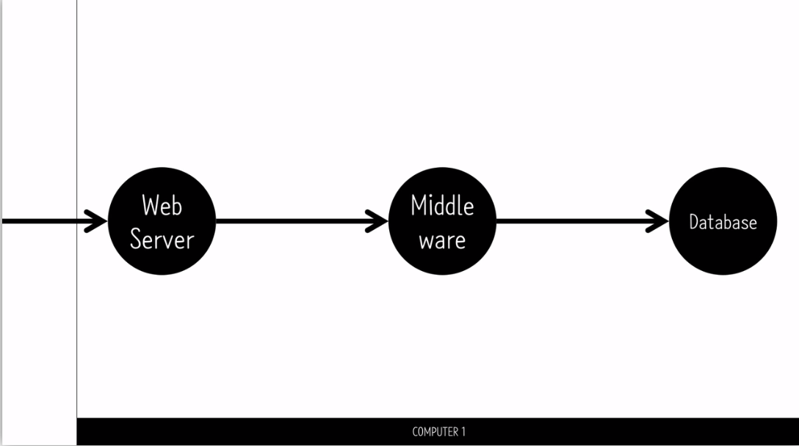
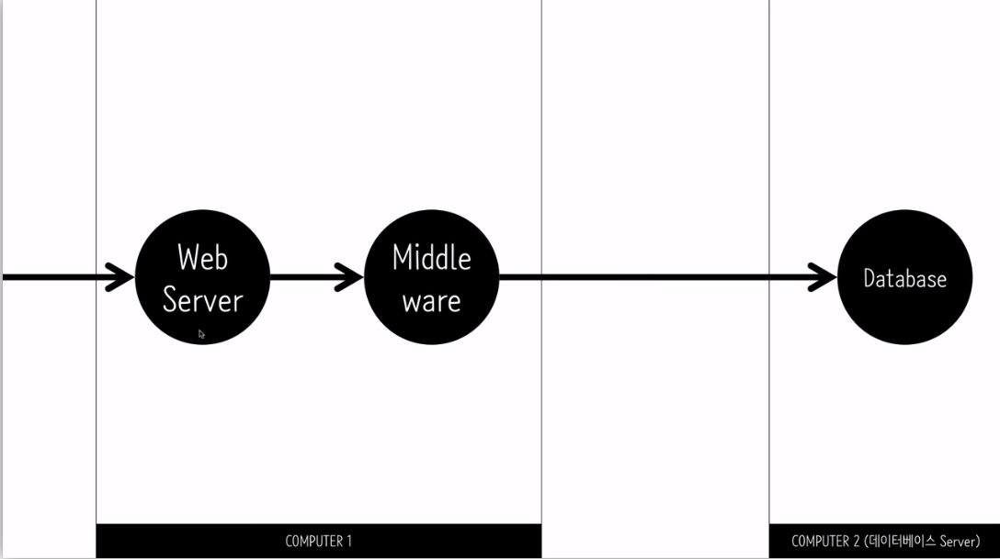
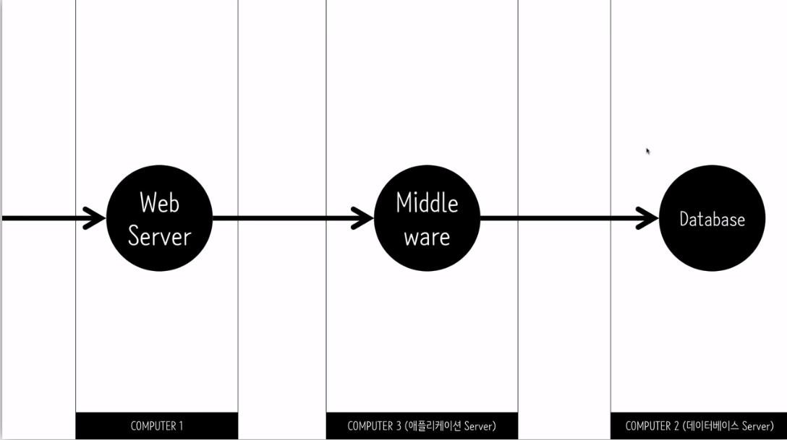
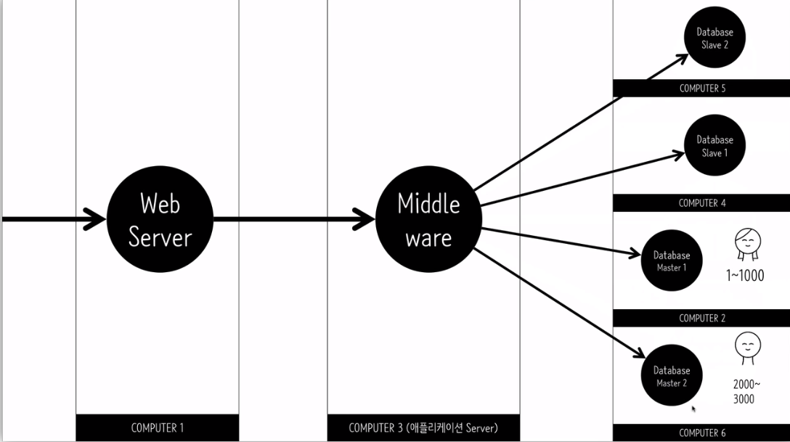
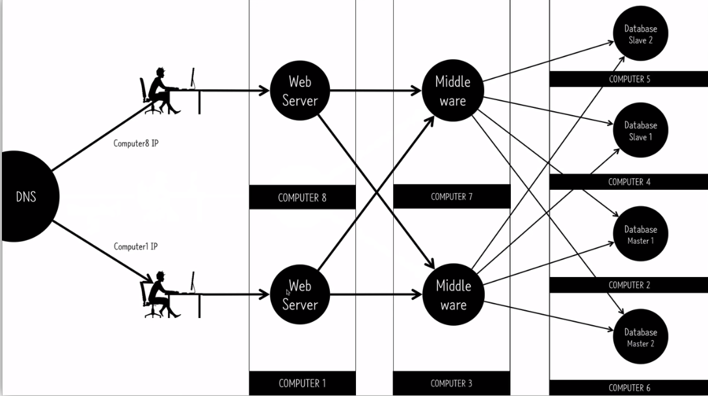
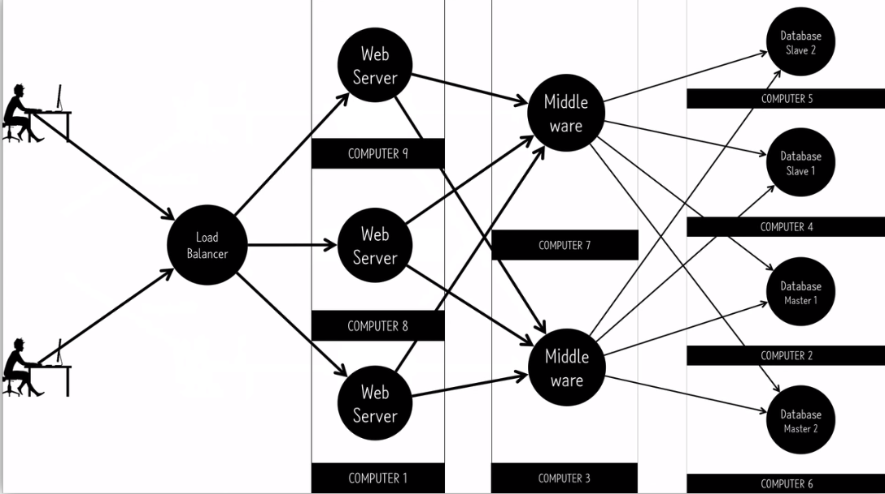

#  AWS Scalability & Elastic Load Balancer (ELB) 이해하기
* 이 글은 AWS에서 EC2 가상 서버에서 Scalability에 대한 개념과 ELB의 필요성을 정리한 글입니다.
* [생활코딩 AWS 강의](https://opentutorials.org/course/2717/11294)를 보며 정리하였습니다.

---
## **Contents**
{:.no_toc}
0. this unordered seed list will be replaced by toc as unordered list
{:toc}

---
## **Scalability**

Scalability는 서버에서 과부하가 일어났을 때 대처할 수 있는 방법으로 크게 

* Scale-up
* Scale-out

방법으로 나눌 수 있습니다.

이를 이해하기 위해서는 먼저 가상 머신 (Virtual Machine)에 대한 이해가 필요합니다.

---
## **Virtual Machine?**

가상화는 EC2에 국한된 단어는 아니지만 클라우드 컴퓨팅에서 필요한 핵심적인 아이디어입니다. 
가상머신은 물리적인 형태를 가지고 있지 않고 소프트웨어로 만든 가상의 컴퓨터를 의미합니다.

물리적 형태라 하면 이에 맞는 운영체제 (MacOS, Linux, Windows)를 설치하고 이에 맞는 소프트웨어를 설치할 수 있는 컴퓨터를 의미하는데요.
가상머신은 이러한 운영체제 위에 설치된 일개의 **소프트웨어 프로그램**에 불과하지만, 가상 컴퓨터 환경을 만들어서 여러 개의 운영체제를 운영하는 것을 가능하게 합니다. 이를 구조화하면 다음 그림과 같습니다.

개인용 가상머신은 VMWare, Virtual Box, Parallels 등이 있습니다. 
맥에서 인터넷 뱅킹에 필요한 Active X를 설치해야하는 경우 Parallels를 이용해서 윈도우를 가상머신으로 쓰는 경우가 종종 있죠.
이처럼 개인용 가상머신은 여러 운영체제를 쓸 필요가 있을 때 사용하게 됩니다.

클라우드 컴퓨팅은 **기업용** 가상머신입니다. 대규모의 컴퓨팅 파워가 필요하거나 자원을 절약해야 하는 경우 이러한 기업용 가상머신이 필요합니다.
아마존은 엄청나게 많은 고사양의 물리적인 컴퓨터를 구축해놓고, 기업들을 위해서 가상머신을 배포하는 AWS를 시작했습니다.
클라우딩 컴퓨팅은 수요에 따라서 컴퓨터의 사양이 잘 대응되기 때문에 비용 효율적인 측면이 있습니다.
즉, 컴퓨터 수요가 많으면 사이즈를 늘리고 적으면 사이즈를 줄이는 방식으로 유연하게 컴퓨팅 비용을 절약할 수 있습니다. 

**변화하는 수요에 얼마나 탄력적으로 컴퓨팅의 요구를 수용할 수 있는가?** 가 **Scalability**의 핵심입니다.

---
## **Strategies to Scalability**
### **Scale-up**

Scale-up은 컴퓨터 수요가 늘어나면 **더 좋은 컴퓨터로 업그레이드**하는 방식입니다. 
이를 위해서는 인스턴스의 유형을 `t2.micro`에서 더 좋은 성능을 가진 유형으로 바꿔주면 됩니다. 

**1. Elastic IP 생성**

EC2 인스턴스의 IP 주소는 IPv4 퍼블릭 IP로 확인할 수 있는데요. 
이 IP는 인스턴스를 `중지`했다가 `시작`하면 계속 바뀐다는 특징이 있습니다.
그 이유는 IP 주소는 `000.000.000.000` ~ `255.255.255.255`까지로 약 40억 대까지 **한정**되어있다는 특징 떄문입니다. 
즉, AWS에서 IP 주소의 자원의 활용을 위해 인스턴스를 중지하면 IP 주소를 회수해가기 때문에 IP 주소가 계속 바뀝니다. 

이를 방지하는 방법은 **Elastic IP**를 발급받는 것입니다. 이는 **아마존에서 제공하는 고정된 IP**를 일컫는 말입니다. 
인스턴스와 연결되지 않은 Elastic IP는 시간당 $0.005 (약 5원)이 과금됩니다. 한 달에 3,600원에 해당하는 가격이죠. 
따라서 Elastic IP를 발급받으면 어떤 인스턴스에는 꼭 연결이 되어야 과금이 되지 않습니다.
이를 발급받은 후에 기존의 인스턴스에 연결하면 고정된 IP로 인스턴스에 접속할 수 있습니다.

**2. 인스턴스 교체**

만약 기존의 인스턴스에 과부하가 오면 어떻게 할까요? 
더 좋은 성능을 가진 인스턴스를 생성하고 (`t2.macro`와 같은), 이에 기존의 Elastic IP를 부여하면 됩니다. 이 방법을 이용하면 사용자 입장에서는 인스턴스가 교체되어도 동일한 IP를 통해서 서비스를 접근할 수 있게 됩니다!

---
### **Scale-out**

Scale-out을 한 단어로 표현하면 **협력**입니다. 많은 인스턴스들이 협력해서 일을 처리하는 과정이 바로 Scale-out입니다.
이를 이해하기 위해 웹 애플리케이션 개발에서 Scale-out을 어떻게 하는 지에 대해 알아보겠습니다.

웹 서버를 위한 인스턴스는 세 가지로 구성되어 있습니다.

* Web Server: 사용자가 브라우저를 통해 접속한 것을 받아서 서버의 결과물을 사용자에게 다시 돌려보내는 **교환원**의 역할 (ex. Apache)
* Middleware: 실질적의 웹 애플리케이션이 동작하는 방법을 담당 (ex. Php, Python의 Django, Ruby의 Ruby on Rails)
* Database: 저장소 역할 (ex. MySQL, SQL Server, Oracle SQL

Scale-up만으로 과부하가 해결되지 않을 경우 Scale-out을 이용합니다.

과부하가 일어날 경우 위의 그림처럼 인스턴스 (Computer2)를 추가해 기존의 인스턴스 (Computer1)에 있던 Database server를 **이전**해서 Database만을 위한 서버로 만듭니다.

이를 통해
1. 웹서버가 사용자의 요청을 받으면 Middleware로 이동
2. Middleware는 원래 인스턴스 (Computer1)에 있던 Database에 접속했는데, 이제는 Computer2의 IP로 접속해 DB 정보를 요청
3. 이 정보를 다시 Middleware에, Web Server에 전달

의 과정을 통해 Scalability가 더 좋아질 수 있습니다. 

또 서비스가 느려져서 그 원인을 찾아보니 Middleware에서 많은 컴퓨팅 파워가 쓰인다는 것을 발견했다 가정해봅시다.

이 경우에 마찬가지로 Middleware를 새로운 인스턴스 (Computer3)에 이전하면 더 나은 Scalability를 구축할 수 있습니다.

Database의 성능이 자꾸 저하될 경우 더 많은 컴퓨터를 동원해서 Middleware와 Database에 인스턴스를 구축합니다.

또, **샤딩**을 통해서 Database Master를 분할하고, 이를 복제해서 Database Slave를 구축할 수 있습니다.
샤딩은 예를 들어 1~1000 고객은 Database Master 1에 저장하고, 2000~3000번의 고객 정보는 Database Master 2에 저장하는 등 
데이터 베이스를 나누어 저장하는 과정을 의미합니다.

그럼 추가로 설치되지 않은 인스턴스는 어디일까요? **Web Server**입니다.
사용자들이 하나의 도메인이나 IP를 통해 Web Server에 접속한다 가정했을 때 Web Server를 추가하기가 어렵습니다.

**Q. 이를 해결하기 위해서 어떻게 할까요?**

첫 번째 해결 방법은 DNS 서버의 설정을 바꾸는 것입니다. DNS 서버는 원래 IP를 하나만 할당하도록 되어있지만, 설정을 바꿔서 여러 개의 IP를 할당할 수 있도록 한다면 Web Server의 인스턴스를 추가할 수 있습니다.

두 번째 해결 방법은 **Load Balancer** 장치를 설치하는 것입니다. 
Load Balance란 부하의 균형을 잡아줘서 부하를 골고루 분산될 수 있도록 하는 장치입니다. Load Balancer는 인스턴스 사양에 맞게 사용자의 접속을 분산시켜주고 한 대의 Web Server가 다운되면 이를 감지해 다른 Web Server로 우회하는 역할을 통해 Web Server를 여러 대를 구축할 수 있도록 합니다. AWS에서는 이를 위해 **ELB** (Elastic Load Balancing) 서비스를 사용합니다.

ELB (Elastic Load Balancing)은 들어오는 트래픽을 Amazon EC2 인스턴스, 컨테이너, IP 주소, Lambda 함수와 같은 여러 대상에 자동으로 **분산**시킵니다. ELB는 단일 가용 영역 또는 여러 가용 영역에서 다양한 **애플리케이션 부하를 처리**할 수 있습니다. Elastic Load Balancing이 제공하는 세 가지 로드 밸런서는 모두 애플리케이션의 내결함성에 필요한 고가용성, 자동 확장/축소, 강력한 보안을 갖추고 있습니다.

