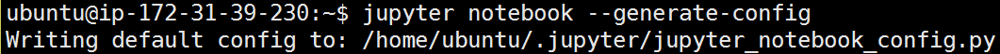
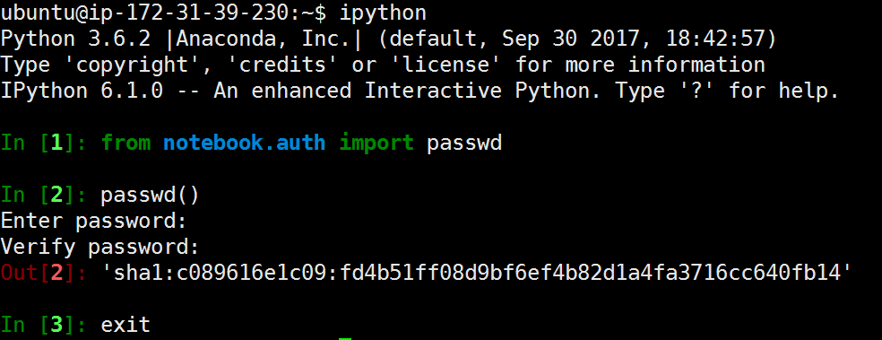
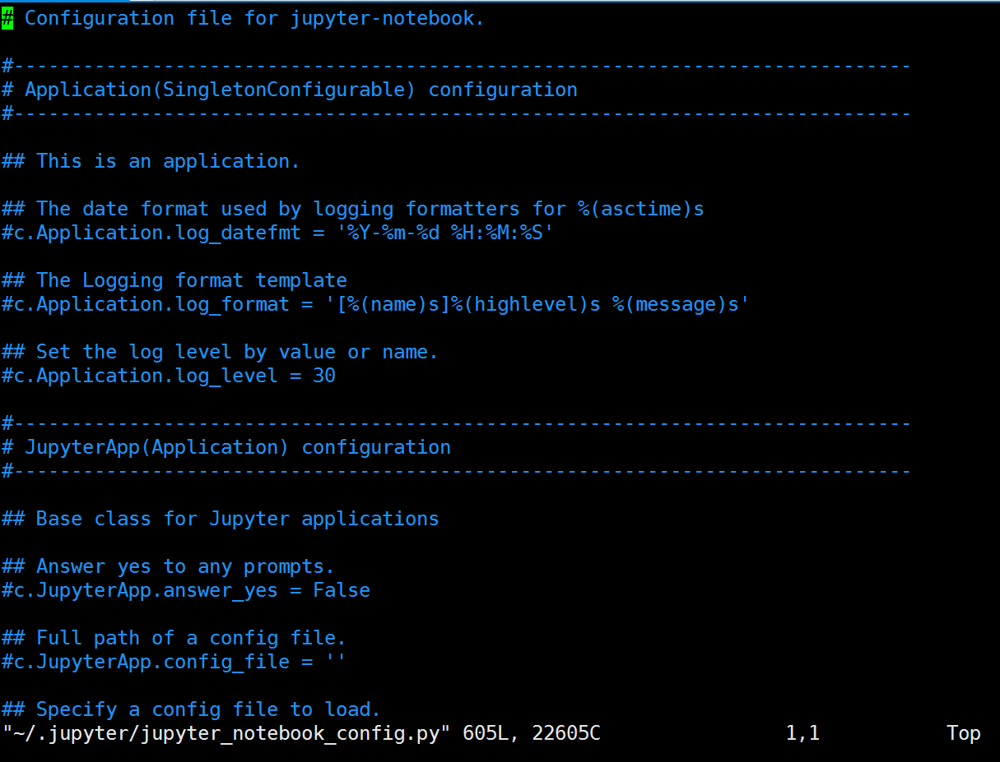
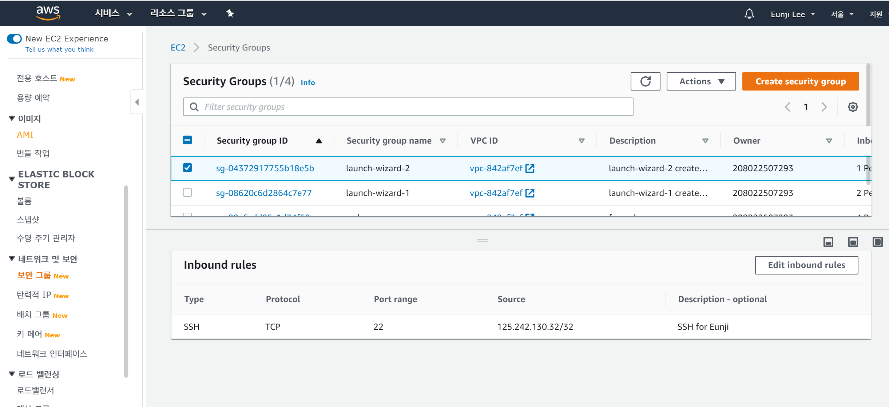
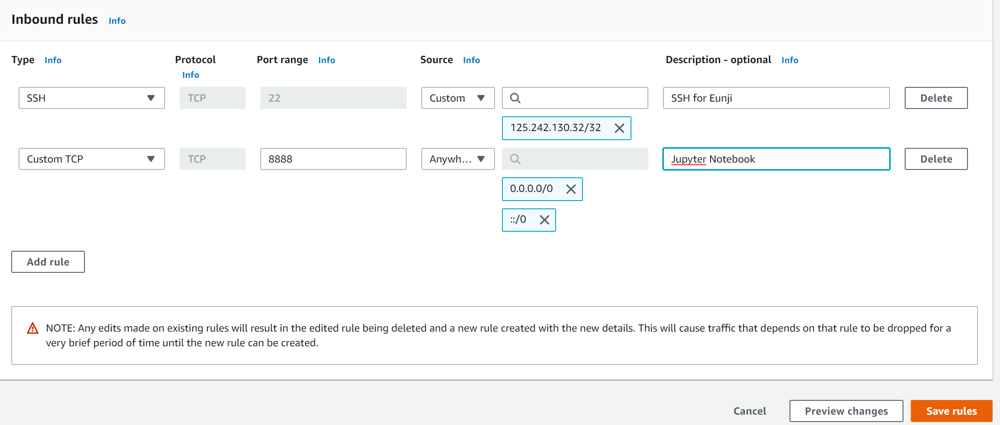
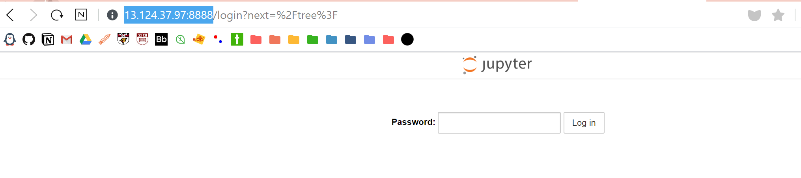

#  AWS EC2 인스턴스에서 Python, Jupyter Notebook 설치하기

* [이전 포스팅](2020-03-16-aws.md)에 이어 EC2 인스턴스에 Python과 Jupyter Notebook을 설치하고 
서버 주소를 통해 EC2 인스턴스에 생성한 주피터 노트북에 접속하는 방법에 대해 알아보겠습니다.
* 이 글은 [잔재미코딩](https://www.fun-coding.org/AWS5.html), [개발자지망생님의 vi 명령어 정리](https://blockdmask.tistory.com/25), [안경잡이 개발자님의 AWS EC2에서 Jupyter Notebook 개발환경 구축하는 방법](https://ndb796.tistory.com/250)을 참조하였습니다.
* 이 글은 Windows 기반 환경에서 설정되었습니다.

---
## **Contents**
{:.no_toc}
0. this unordered seed list will be replaced by toc as unordered list
{:toc}

---
## **Install Anaconda Python on EC2**

XShell을 통해 우분투 터미널에 접속합니다. 이후 다음의 코드를 통해 
Python 3.6.2 기반의 Anaconda를 설치합니다.

~~~
wget https://repo.continuum.io/archive/Anaconda3-5.0.0.1-Linux-x86_64.sh
sudo sh Anaconda3-5.0.0.1-Linux-x86_64.sh
source ~/.bashrc
~~~

두 번째 명령어인 `sudo sh Anaconda3-5.0.0.1-Linux-x86_64.sh`를 치면 `Enter`를 누르면 다음과 같이 라이센스 계약서가 나옵니다. 끝까지 `Enter`를 누르고 라이센스에 동의하냐는 질문이 나오면 `yes`를 타이핑해서 끝까지 설치해줍니다.

---
## **Install Jupyter Notebook Server on EC2**

다음은 주피터 노트북 서버를 EC2에 설치하는 과정입니다.
먼저 리눅스의 `sudo`명령어로 다음과 같이 `jupyter`를 설치해줍니다.
~~~
sudo /home/ubuntu/anaconda3/bin/pip install jupyter
~~~

이후 Jupyter notebook에 다음 명령어를 통해 `jupyter_notebook_config.py` 파일을 만들어 줍니다.

~~~
jupyter notebook --generate-config
~~~

그러면 XShell에 이러한 메세지가 뜹니다. 

자 이제 Jupyter Notebook을 EC2 서버에 탑재하기 위한 본격적인 과정입니다. 
먼저, Jupyter Notebook 서버에 접속할 때 필요한 **비밀번호**를 설정하기 위해 `ipython`에 접속합니다.

~~~
ipython
~~~

그러면 Python에서 봤던 익숙한 IPython Shell이 뜨는데요. 다음과 같이 입력합니다.

~~~python
from notebook.auth import passwd
passwd()
exit
~~~

`In [2]`에서 `passwd()`를 치면 Jupyter notebook을 서버로 접속하는 데 필요한 비밀번호를 설정합니다. 비밀번호를 터미널에 쳐도 보이지 않는 게 정상입니다 :smile:

그러면 `sha`로 시작하는 Output이 나오는데요. 이를 복사해서 아까 만든 `jupyter_notebook_config.py`에 넣어야 합니다.
`jupyter_notebook_config.py`를 수정하는 명령어는 다음과 같습니다.

~~~
vi ~/.jupyter/jupyter_notebook_config.py
~~~

`vi`명령어를 쓰면 이와 같이 `jupyter_notebook_config.py`파일이 뜹니다. 
모두 `#`으로 주석 처리가 되어있기 때문에 Configuration이 빈 파일입니다.

이를 수정하는 방법은 linux에서 사용하는 `vi 편집기`와 같은 명령으로 수정할 수 있고 정리하자면 다음과 같습니다. 참고로 `vi` 명령어들은 [개발자지망생님의 vi 명령어 정리](https://blockdmask.tistory.com/25) 글을 참조하였습니다.

이 순서로 키보드를 누릅니다.
1. `Shift+G`: `jupyter_notebook_config.py`의 파일의 끝 줄로 이동합니다.
2. `o` (알파벳 소문자 o): 파일의 마지막 줄의 다음 줄로 이동하고 **입력 모드**로 바뀝니다. (창에 `--INSERT--`라 뜹니다!)
3. 이 후 다음과 같이 입력합니다. 여기서 `c.NotebookApp.password`의 값은 `u'sha로 시작하는 Output 값'`을 써주셔야 합니다.

   ~~~
   c = get_config()
   c.NotebookApp.password = u'sha1:c089616e1c09:fd4b51ff08d9bf6ef4b82d1a4fa3716cc640fb14'
   c.NotebookApp.ip = '*'
   c.NotebookApp.open_browser = False
   c.NotebookApp.port_retries = 8888
   c.NotebookApp.notebook_dir = u'/home/ubuntu'
   ~~~
4. `Esc`: 입력모드에서 명령모드로 나오는 명령어입니다.
5. `:wq` + `Enter`: 저장 후 `vi`모드를 종료하는 명령어입니다.

수정 후 `vi`편집기에서 나오면 다시 XShell 창에 다음과 같이 입력해서 Jupyter Notebook을 실행합니다.

~~~
sudo jupyter-notebook allow-root&
~~~

---
## **Implement Jupyter Notebook Server**

이제 EC2 Server 안에 있는 Jupyter Notebook을 웹에서 보는 과정입니다.
그 전에 AWS의 EC2 대시보드에서 **네트워크 보안 > 보안 그룹**에 들어가 8888번 포트 방화벽을 여는 과정이 필요합니다.

그럼 이런 화면이 뜨는데 아래의 창에서 **Inbound Rules**를 클릭 후 `Edit Inbound Rules`를 클릭합니다.

이와 같이 `Type`은 `Custom TCP`, `Port range`는 `8888`, `Source`는 `Anywhere`로 해서 `Save Rules`를 클릭합니다.

이제 다시 `인스턴스`로 돌아가서 자신의 IPv4 퍼블릭 IP을 확인하시고 `http://IP주소:8888/`로 접속합니다. 제 경우 `http://13.124.37.97:8888/`로 접속했습니다.

그럼 이런 창이 뜨면 아까 `ipython`에서 `passwd()`명령어를 통해 설정한 비밀 번호를 쳐서 접속합니다!

그럼 이제 EC2 인스턴스에 구축한 Jupyter Notebook에 접속할 수 있습니다 :satisfied::satisfied:

