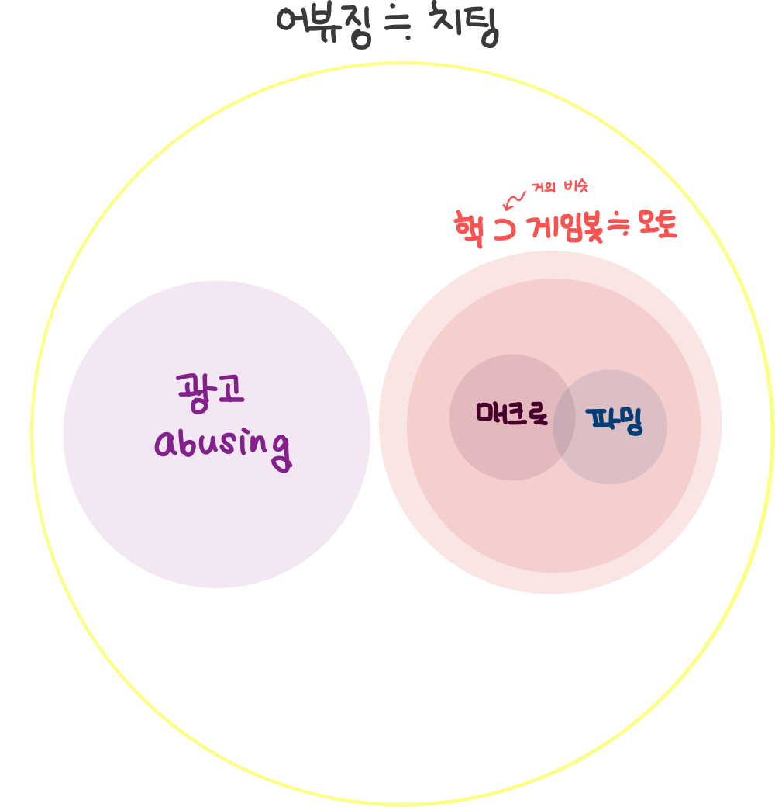
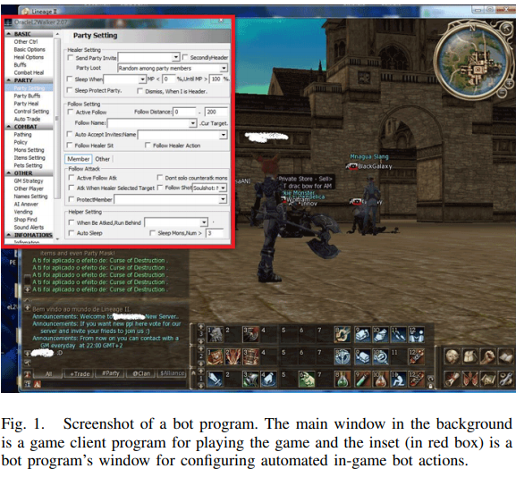

# Abusing Detection in Online Games [1] - Game Bot Detection with Machine Learning

* 이 글은 게임 상의 어뷰징 탐지 중 게임봇을 탐지하는 방법에 대해 다룬 글입니다.
* 게임봇 탐지 방법 중 피처를 개발하는 데 신경을 써서 지도학습 기반의 분류 방법 (Supervised machine learning)을 이용하는 사례에 대해 정리했습니다.

---
## **Contents**
{:.no_toc}
0. this unordered seed list will be replaced by toc as unordered list
{:toc}

---
## **What is Abusing?**

이 분야를 공부할 때 가장 궁금했던 것은 게임 내의 어뷰징 (Abusing)이 어느 범위까지의 부정 행위를 말하는 지였습니다.
**어뷰징 (Abusing)** 이란 남용, 오용을 뜻하는 "abuse"에서 파생된 단어로, 게임 시스템의 허점을 악용해 이득을 취하는 행위를 뜻합니다.

* 게임 기획 의도와는 다르게 게임 정보를 대량 획득하거나 도움을 주는 행위
* 게임 자체의 버그
* 허용되지 않은 외부 프로그램 (Hack)
* 복수 계정 
* 전체 채팅창에 도배로 광고하는 행위

등 서비스 구현 상의 헛점을 이용한 플레이, 고의로 져주는 승부 조작 모두 어뷰징에 속합니다.

저는 근 1년 간 모바일 게임인 브롤 스타즈 (Brawl Stars)를 참 열심히 해왔는데요. 여러 게임 모드 중 "젬그램"은 3 대 3으로 팀을 이루어 보석을 10개 모으면 이기는 모바일 슈팅 게임입니다. 혼자 플레이를 하면 랜덤으로 나머지 두 명과 팀을 이루기 때문에 이 두 명과 팀플레이가 좋아야 젬그램에서 우승할 수 있습니다.

그러나 위 사진을 보면 회색 곰 (저)을 제외하고 저희 팀인 보라색 머리와 빨간 머리 움직임이 매우 적음을 알 수 있습니다. 저는 화면 바깥에서 상대팀과 싸우고 있는데, 나머지 두 명은 바깥으로 나가지도 않죠... :cry: 브롤 스타즈에서 사용자가 일정 시간 움직이지 않으면 이를 감지하고 자동으로 플레이가 되는데요. 그러한 자동 플레이와는 또 다르게 일부로 기차에 다가가서 죽는 점, 움직임이 거의 없는 점을 고려했을 때 시스템 상의 자동 플레이는 아니라 생각이 들었습니다. 이들이 만약 "승부 조작"을 목적으로 상대편에게 일부러 져주는 고의성이 있었다면 이 또한 어뷰징에 해당합니다. 

어뷰징과 비슷한 의미로 **치팅 (Cheating)** 이라는 말을 쓰기도 합니다. [Dinh & Nguyen (2016)](https://www.researchgate.net/publication/309159777_An_Empirical_Study_of_Anomaly_Detection_in_Online_Games?_sg=7-Jt9zdR8-pI7GOAnPMFWoztGn_-KnP1g2gX0Fv_wyO6ELrdUbo8qYwSQ7fgNQQRN9r_O2aHiEtkKBo)에 따르면 온라인 게임에서의 치팅은 "다른 사용자에 비해 이득을 취하기 위해 게임 경험을 수정하는 일련의 행동"으로 정의되어 있습니다.  이 글에서는 "어뷰징"으로 단어를 통일하겠습니다.

제가 살펴볼 어뷰징 탐지 방법은 

1. 게임봇 탐지
2. 부적절한 도배 광고 등의 채팅 탐지

로, 먼저 이 글에서는 **게임봇을 탐지하는 방법**에 대해 알아보고자 합니다.

---
## **What is Game Bot?**

**그럼 게임봇은 무엇일까요?**

게임봇과 연관이 있는 단어로 **핵 (Hack), 오토프로그램 (Auto program), 게임봇(Game Bot), 매크로 (Macro), 파밍(Farming)** 등이 있는데, 제가 생각하기에 이들의 벤 다이어그램은 다음과 같습니다. 치팅과 어뷰징은 비슷하게 포괄적인 의미이고, 핵, 게임봇, 오토, 매크로, 파밍은 구체적인 불법 행위와 방법에 해당합니다.

{: width="250" height="250"}

**이들에 대한 자세한 설명**

먼저 **핵**은 게임 콘텐츠 내 중요 수치를 임의적으로 변경하여 게임 플레이를 사용자 자신에게 유리하게 이끄는 프로그램 종류를 일컫는 말로, 프로그램을 해킹해 수정하여 원래 동작과 다른 동작을 유도하는 용도로 사용합니다. 핵의 종류는 게임의 종류만큼 매우 다양합니다. 대표적인 핵의 예는 다음과 같습니다.

* 맵핵 (Map Hack): 아직 탐험하지 않아 볼 수 없는 영역이나 상대방 영역을 볼 수 있게 해주는 치팅 프로그램, 스타크래프트, 디아블로2와 같은 RTS (Real-Time Strategy) 게임에서 쓰임
* 에임핵 (Aim Hack): 적 출현 시 자동으로 타겟팅을 해주는 치팅 프로그램, 배틀그라운드나 오버워치와 같은 FPS (First Person Shooter) 게임에서 쓰임
* 월핵 (Wall Hack): 벽 너머에 있는 상대방을 벽을 통과해서 사격할 수 있도록 해주는 치팅 프로그램, 마찬가지로 FPS 게임에서 자주 쓰임
* 스피드핵 (Speed Hack): 서버와 클라이언트 간의 통신 속도를 조작해 빠른 속도로 이동하거나 같은 시간에 보다 많은 명령어를 수행할 수 있도록 하는 치팅 프로그램, 카트라이더와 같은 레이싱 게임이나 메이플스토리, 리니지와 같은 MMORPG (Massively Multi-Player Online Role-Playing Games)에서 쓰임

**오토 프로그램**은 게임 핵의 한 종류로서 온라인 게임을 하는 과정에서 게임 이용자가 직접 마우스를 움직이지 않더라도 자동으로 캐릭터를 조종해 줌으로써 아이템이나 경험치 등을 손쉽게 얻을 수 있도록 해주는 프로그램입니다. 대표적인 오토 프로그램의 예는 MMORPG에서의 **자동 사냥**으로, 마우스나 키보드를 조작하지 않고 자동으로 몬스터를 선택하거나 공격할 방법을 선택함으로써 하루 24시간 지속적으로 사냥할 수 있도록 조작합니다 (위 그림 참조).

**게임봇**은 유저 대신 게임을 하도록 만들어진 자동화 프로그램을 뜻하기 때문에 **오토 프로그램**과 비슷한 의미입니다. 위의 사진과 같이 주로 회사로부터 소스 코드를 해킹하거나 게임 클라이언트 프로그램과 게임 클라이언트와 서버 간의 네트워크 트래픽을 분석하는 소프트웨어를 개발해 게임봇으로 사용합니다. 

**매크로**는 오토 프로그램을 실행하는 하나의 방법으로, 이용자가 미리 정해진 키보드 입력과 마우스 동작을 반복적으로 수행하는 프로그램을 의미합니다.

이렇게 지속적으로 사냥해서 무엇을 얻을까요? **파밍**을 쉽게 할 수 있게 합니다. **파밍**이란 쉬운 말로 하면 노가다로, 농부처럼 몬스터를 잡으면서 돈, 경험치, 아이템을 모으는 반복적인 행동을 의미합니다. 

특히 **골드 파밍 집단** (GFG; Gold Farming Group) 유저들은 오토 프로그램을 이용해서 온라인 게임 내의 화폐를 손쉽게 모은 후 실제 돈으로 환전하는 
RMT (Real Money Trading) 시스템을 목적으로 활동합니다. 대량의 사이버 머니를 오토 프로그램으로 손쉽게 모아 현금으로 환전하고 탈세를 위한 목적으로 쓰기도 하기 때문에 명백한 위법 행위에 해당합니다. 대부분 GFG는 **작업장**을 기반으로 특정한 구역에서 활동하는 경우가 많기 때문에 
게임봇과 작업장을 탐지하는 방법들이 많이 연구가 되고 있습니다.

**그럼 어디서, 왜 게임봇이 문제가 될까요?**

게임 내 캐릭터를 육성하고, 고렙의 아이템이 중요한 **MMORPG 게임**에서 특히 게임봇이 문제가 됩니다.

왜냐하면 선량한 게임 유저 입장에서는 게임봇 유저들이 월등히 빠른 속도로 레벨업을 해서 게임 내 부를 축적하게 되므로, 일반적으로 게임을 플레이하는 유저들이 상대적인 박탈감을 느껴 게임을 이탈하게 되는 요인이 되기 때문입니다. 

또한, 게임 회사 입장에서는 게임봇 차단을 위해 많은 비용과 노력을 들여야 하고, 게임 내 컨텐츠 소모가 빨라져서 (만렙이 순식간에 속속 출현한다거나, 고렙용 레어 아이템이 지천에 넘쳐난다거나…) 게임 운영이 어려워지는 문제가 발생할 수 있습니다.

---
## **Studies on Game Bot Detection**

**자, 이제 게임봇을 잡아봅시다.**

그렇기 때문에 MMORPG 기반의 온라인 게임에서 게임봇을 탐지하는 방법들이 많이 연구되어왔습니다. 게임 봇을 탐지하는 방법은 **어떤 정보를 이용하느냐**에 따라 client-side, network-side, server-side로 나뉩니다. 

* client-side는 게임봇 프로그램명, 프로세스 정보, 메모리 상태 정보를 이용해 탐지하는 방법입니다. 그러나, 해커들에게 쉽게 우회될 수 있고 봇들을 잡기 위해 추가적인 anti-bot 프로그램을 운용해야하기 때문에 선호되지 않는 방법입니다.
* network-side는 네트워크 프로토콜의 변화나 네트워크 트래픽을 모니터링하는 방법입니다. 그러나, 네트워크 과부화나 lag 위험성이 있기 때문에 한계가 있습니다.
* server-side는 게임 서버로부터 로그 데이터를 얻어 분석하는 방법입니다. 로그를 통해서 데이터를 분석하고, 원하는 만큼 게임봇을 제재할 수 있기 때문에 게임 회사에서 가장 쉽게 사용되는 방법입니다.

따라서, 이 글에서는 **server-side**의 방법을 이용한 게임봇에 집중하겠습니다.

**그럼 어떤 방법으로 게임봇을 찾아낼까요?**

제가 리서치한 방법은 

1. 유저와 게임봇의 특징들을 분석해 피처를 추출하여 **지도학습 기반의 분류** 방법과
2. 게임봇을 쓴 유저를 이상치로 간주하여 **비지도학습 기반의 이상 탐지**를 이용

하는 방법이였는데요. 이 글은 **지도학습 기반의 분류**방법에 대해 먼저 리뷰합니다.

**그러나...(~~킹치만...~~)** 

분석의 전제는 **잘 정제된 데이터**가 존재해야 한다는 것입니다.
따라서 다음의 5단계를 거칩니다.

1. 게임 서버에서 실시간으로 게임 로그를 수집하고 저장 
2. 필요한 피처들을 추출
3. 피처 개발 
4. 위의 두 가지 방법 (분류 & 이상탐지)을 통해 분석
5. 모형 평가

1과 2에서는 [NDC 2016 김정주님 발표](http://ndcreplay.nexon.com/NDC2016/sessions/NDC2016_0052.html#k%5B%5D=%EC%96%B4%EB%B7%B0), [NDC 2017 장창완님 발표](http://ndcreplay.nexon.com/NDC2017/sessions/NDC2017_0034.html#k%5B%5D=%EC%96%B4%EB%B7%B0), [NDC 2018 김정주님 발표](http://ndcreplay.nexon.com/NDC2018/sessions/NDC2018_0093.html#k%5B%5D=%EC%96%B4%EB%B7%B0)를 참조하였고, 3 ~ 5에서는 [Jung et al. (2016)](https://link.springer.com/article/10.1186/s40064-016-2122-8), [NDC 2016 김정주님 발표](http://ndcreplay.nexon.com/NDC2016/sessions/NDC2016_0052.html#k%5B%5D=%EC%96%B4%EB%B7%B0), [Lee et al. (2016)](https://www.ndss-symposium.org/wp-content/uploads/2017/09/you-are-game-bot-uncovering-game-bots-mmorpgs-via-self-similarity-wild.pdf)의 논문을 참조하였습니다.

---
### **Collecting & Storing Game Logs**

가장 먼저 게임 로그를 수집하고 저장합니다.

[NDC 2016 김정주님 발표](http://ndcreplay.nexon.com/NDC2016/sessions/NDC2016_0052.html#k%5B%5D=%EC%96%B4%EB%B7%B0)에서는 게임 서버가 윈도우 기반이기 때문에 자체 개발한 윈도우 데이터 포워더 ([wdfwd](https://github.com/haje01/wdfwd))로 로그 파일을 정제해서 fluentd로 전송하는 방식을 택했습니다.

fluentd란 분산 로그 및 데이터 수집기로 분산된 게임 데이터 서버에서 로그를 수집해 중앙 로그 저장소에 저장하는 역할을 담당합니다.
fluentd에서 실시간 수집된 로그를 저장한 후, AWS의 저장소 S3를 이용했습니다.

이와 비슷하게 [NDC 2017 장창완님 발표](http://ndcreplay.nexon.com/NDC2017/sessions/NDC2017_0034.html#k%5B%5D=%EC%96%B4%EB%B7%B0)도 마비노기 영웅전의 봇 탐지를 위해 fluentd를 사용해 로그 데이터를 수집하고, AWS Kinesis로 실시간 스트리밍 데이터를 적재하였습니다. 이후 Spark Streaming을 통해 데이터 분석을 하도록 작업하였습니다.

---
### **Extracting Features**

이제 수집된 로그 데이터에서 데이터 분석에 필요한 피처들을 추출하는 과정입니다.

앞서 [NDC 2016 김정주님 발표](http://ndcreplay.nexon.com/NDC2016/sessions/NDC2016_0052.html#k%5B%5D=%EC%96%B4%EB%B7%B0)에서는 AWS S3에 저장된 로그에서 AWS의 EMR (Elastic Map Reduce)의 Apache Hadoop을 이용해 피처를 생성하였습니다. 다만 Hadoop은 작은 파일들이 많은 것에 취약하기 때문에 작은 로그 파일들을 병합, 소팅, 압축해 Amazon S3에 저장을 하고, Hadoop의 MapReduce 코딩을 위해 `mrjob`이라는 Python 패키지를 이용하였습니다.

[NDC 2018 김정주님 발표](http://ndcreplay.nexon.com/NDC2018/sessions/NDC2018_0093.html#k%5B%5D=%EC%96%B4%EB%B7%B0)에서는 이제 Hadoop 대신에 Spark로 바꿔서 데이터를 처리하고 있고, [NDC 2017 장창완님 발표](http://ndcreplay.nexon.com/NDC2017/sessions/NDC2017_0034.html#k%5B%5D=%EC%96%B4%EB%B7%B0)에서도 마찬가지로 AWS S3에 저장된 로그에서 AWS의 EMR의 Spark를 이용해 피처를 생성하였습니다.

**정리해보면...**

결국 로그를 수집하고 저장하고, 피처를 생성하는 과정은 대부분 
**fluentd를 사용해 실시간 로그를 수집하고, 수집된 로그를 AWS S3에 저장하고, Spark를 이용해 피처를 생성하는** 과정으로 
수렴되는 것 같네요.  

---
### **Feature Engineering**

피처들을 개발하는 기준은 **게임봇과 유저가 다른 특성이 잘 나타나는 지?** 입니다. 
주로 게임봇과 일반 유저의 다른 특징은

* 로그인 횟수가 비정상적으로 많고, 플레이 시간도 매우 길다
* IP 세션의 수가 많다
* 행동이 반복적이고 특정 행동의 빈도수가 비정상적으로 많거나 적다 (예를 들어 PK (Player Kill)을 거의 하지 않지만 체력 회복을 위해 매우 자주 앉는다) 
* 소셜 활동 (친구, 파티, 길드 맺기)이 적다
* 파밍을 하기 좋은 특정 직업을 선택한다

입니다.

[Jung et al. (2016)](https://link.springer.com/article/10.1186/s40064-016-2122-8)는 게임봇의 **행동적인 특성**에 주목해서 피처를 생성하였습니다. 피처를 개인적 피처 (Personal feature)와 소셜 피처 (Social feature)로 나눠서 게임봇과 유저들의 차이를 살펴봤는데요. 사용한 피처들은 다음과 같습니다.

* **Player information**는 로그인 횟수, 플레이 시간, 획득한 아이템 수 등을 포함합니다. 이들의 누적 확률 분포(cumulative distribution)를 그려보면 다음과 같습니다.

  

  일반 유저 (Human)에 비해 게임봇 (Bot)이 더 로그인을 자주하고, 플레이 시간도 매우 길고, 획득한 아이템 수도 훨씬 더 많음을 확인할 수 있습니다. 

* **Player actions**의 경우 앉기, 경험치 획득하기, 아이템 줍기 등으로 구성되어있는데요. 이들이 각각 전체 행동에서 차지하는 비율을 피처로 택했습니다.
* **Group activities**는 파티 플레이 시간, 길드 활동과 같은 피처인데요. 파티를 할 때 일반 유저는 대부분 2시간 이내에 끝나는 반면에 게임봇은 4시간 이상 파티를 한다고 합니다.
* **Social interaction diversity**는 파티, 친구맺기, 트레이딩, 귓속말, 메일, 샵, 길드와 같은 소셜 활동을 얼마나 다양하게 했는 지 평가하는 Shannon diversity entropy 계산해 피처로 이용합니다.
* 마지막으로 **Network measures**는 노드 중심성, 중개 중심성 등 네트워크 분석에서 쓰이는 척도들을 이용합니다. 

모든 피처들을 다 사용한 것은 아니고, feature selection을 통해 중요한 피처들만 선별해 분석해서 62개의 피처들만 추출했습니다.

[NDC 2016 김정주님 발표](http://ndcreplay.nexon.com/NDC2016/sessions/NDC2016_0052.html#k%5B%5D=%EC%96%B4%EB%B7%B0)에서도 비슷하게 게임 봇이 가진 특성을 피처로 반영해 개발했습니다. 로그인 횟수, 플레이 시간, 아이템/머니 습득 수, 퀘스트 종료수, NPC/ PC간 전투 수, 동시에 얻은 아이템/머니 수, 맵 반복 횟수, 특정 클래스만 선택, 캐릭터 이름의 랜덤 생성 여부, 제자리 머니 습득 수, IP의 최대 세션수를 피처로 두었습니다. 

플레이 시간의 경우 로그인~세션 아웃 시간 (활동 로그가 5분 간 기록이 남지 않았을 때)를 기준으로 구하였고, Boolean은 0, 1로 범주형은 OneHotEncoding을 이용했습니다. 또한 캐릭터의 이름의 랜덤성을 판단하는 것은 자/모음의 출현 패턴을 일일이 분석해 나오기 힘든 조합일 경우 랜덤 생성이라 간주했습니다.

마지막으로 [Lee et al. (2016)](https://www.ndss-symposium.org/wp-content/uploads/2017/09/you-are-game-bot-uncovering-game-bots-mmorpgs-via-self-similarity-wild.pdf)에서는 NC 소프트의 대표적인 MMORPG 게임인 리니지, 아이온, 블레이드 & 소울에서 나타나는 게임봇을 탐지하는 방법으로 **자기 유사도** (Self-similarity)를 메인 피처로 개발합니다. 

자기 유사도는 유저들의 행동의 반복성을 보여주는 척도로, 이를 계산하는 방법은 다음과 같습니다.

첫째, 게임 유저마다 로그 벡터를 만듭니다. 위의 그림처럼 유저마다 게임 로그를 모으고 (User A ~ User C), 시간에 따라 정렬합니다. 이후 가장 오른쪽에 있는 행렬처럼 시간 간격을 행에, Event id를 열로 두고 이들의 로그의 갯수를 세어 입력합니다. Event는 앉기, 아이템 줍기 등과 같이 특정 행동을 의미하는 것 같네요.  

논문에서 유저마다 로그 벡터들을 추출한다고 했으니 사실 저 위의 그림처럼 유저 A~C를 통째로 count하는 게 아니라 유저 A의 time x Event ID 행렬, 유저 B의 time x Event ID 행렬, 유저 C의 time x Event ID 행렬을 각각 만든 후에 이들을 벡터화하는 것 같습니다. 

둘째, 코사인 유사도 $$\cos(\theta) = \frac{AB}{\|A\| \|B\|}$$를 계산합니다. 여기서 A는 $$i$$번째 행의 로그 벡터 ($$i=1,...,n$$), B는 $$\mathbf{1}$$, 즉 단위 벡터 (모든 원소가 1로 채워져 있는 벡터)입니다. 

게임봇은 행동이 반복되니까 코사인 유사도가 큰 변동없이 비슷하게 유지되지만 일반 유저는 코사인 유사도의 변동이 큽니다.

마지막으로, 자기 유사도 $$H$$를 계산합니다. 코사인 유사도의 표준편차 $$\sigma$$를 구하면 자기 유사도를 계산할 수 있습니다.

$$
H = 1-\frac{1}{2}\sigma,\ \text{where}\ \sigma=sd(\text{cosine\ similarity\ by\ user}) 
$$

H가 1에 가까우면 $$\sigma \approx 0$$을 의미하기 때문에, 자기 유사도가 매우 높음을 의미합니다. 따라서 위의 그림처럼 게임 봇은 자기 유사도가 거의 1에 가깝고, 이에 비해 일반 유저는 자기 유사도가 더 낮음을 알 수 있습니다.

이후 게임봇과 일반 유저들의 다른 특성을 나타내는 피처들도 추가합니다.

**정리하자면...**

|논문/강연| 내용|
|:---:|:---:|
| Jung et al. (2016)|피처를 EDA로 개인, 소셜 특성으로 나누어 추출|
| NDC 2016 김정주님 발표 | Jung et al. (2016)과 비슷한 수준의 피처|
| Lee et al. (2016)| 자기유사도를 기반으로 한 피처 추출|

---
### **Game Bot Detection with Supervised Machine Learning**

드디어 정제된 데이터(!)를 얻었습니다. 이 로그데이터를 분석하는 방법은 오히려 simple합니다.

앞서 말씀드린대로 DT (Decision Tree), RF (Random Forest), LR (Logistic Regression), Naive Bayes와 같은 분류 방법을 통해 게임봇과 일반 유저를 분류합니다.

**그런데 왜 더 좋은 성능을 가지는 딥러닝 기반의 분류 방법을 쓰지 않을까요?**

그 이유는 **설명 가능성**과 연관이 있습니다. 게임봇을 탐지하고 제재를 가하면 마땅한 이유가 있어야 합니다. 
콜센터에 대응도 해야 하고, 다른 팀에게도 제재 근거에 대해 마땅히 설명할 수 있어야 합니다.
그렇기 때문에 피처들의 중요도를 보여주는 DT나 RF, 혹은 게임봇일 확률을 모델링하는 LR, Naive Bayes를 선호하게 됩니다.

다만 [GCP Jennifer Oh, Etsuji Nakai, Jason Baek '19 발표](https://www.youtube.com/watch?v=xrZ9BRK5WAg)에서는 LSTM이나 Autoencoder를 활용해 이상치 탐지를 하고, [Tao et al. (2018)](https://www.kdd.org/kdd2018/accepted-papers/view/nguard-a-game-bot-detection-framework-for-netease-mmorpgs)에서 SA-ABLSTM, TL-ABLSTM, ABLSTM를 사용하는 것을 보면 어쩔 수 없이 진화하는 게임 봇과 어뷰징 방법을 탐지하기 위해 딥러닝 방법을 사용하는 것 같습니다. 
이에 대한 내용은 다음 포스팅에서 다루겠습니다!

다시 본론으로 돌아와서 [Jung et al. (2016)](https://link.springer.com/article/10.1186/s40064-016-2122-8)은 62개의 피처를 가지고 DT (Decision Tree), RF (Random Forest), LR (Logistic Regression), Naive Bayes를 비교합니다. 이때 각 모형마다 10-fold 교차 검증 & Grid Search로 최적의 하이퍼 파라미터를 찾습니다. 이후 RF가 베스트다!는 결론을 냅니다. 

[NDC 2016 김정주님 발표](http://ndcreplay.nexon.com/NDC2016/sessions/NDC2016_0052.html#k%5B%5D=%EC%96%B4%EB%B7%B0)에서도 DT와 RF를 사용하고 RF를 채택했습니다.

 [Lee et al. (2016)](https://www.ndss-symposium.org/wp-content/uploads/2017/09/you-are-game-bot-uncovering-game-bots-mmorpgs-via-self-similarity-wild.pdf)에서는 LR만 사용합니다.

베스트다!라고 말할 수 있는 기준은 **Model Selection (모형 평가)** 파트에서 알아보겠습니다.

---
### **Model Selection**

모형 평가 기준은 분류 성능을 평가하는 지표인 **정확도 (Accuracy), 재현율 (Recall), 정밀도 (Precision)** 를 사용합니다.

Confusion matrix를 통해 결과를 나타내면 다음과 같이 4개의 경우가 나오는데 
* 초록색 셀의 **T**(True)는 실제 값에 맞게 예측한 경우 (정답)를, 
  
  빨간색 셀의 **F**(False)는 잘못 예측한 경우 (오답)을 의미합니다.
* **P**(Positive)는 1로 예측한 경우 (어뷰징으로 탐지)를, 

  **N** (Negative)은 0으로 예측한 경우 (어뷰징으로 탐지 X)를 의미합니다.

이 행렬에서 **정확도, 재현율, 정밀도**는 
모두 "맞게 예측했다"고 말할 수 있는 **초록색 셀의 비율이지만 이를 계산하는 집단이 다릅니다!** 

정확도의 집단은 **전체** 유저, 재현율의 집단은 **실제** 어뷰저의 집단, 정밀도의 집단은 **예측** 어뷰저의 집단이죠. 이를 파란색 테두리로 표시해보았습니다.

따라서 이 집단 내에서 초록색 비율을 계산하게 되면,

$$
\begin{aligned}
\text{정확도} &= \frac{TP+TN}{TP+FP+FN+TN}\\
\text{재현율} &= \frac{TP}{TP+FN}\\
\text{정밀도}&=\frac{TP}{TP+FP}
\end{aligned}
$$

입니다. 재현율과 정밀도가 좀 헷갈리는데 재현율은 얼마나 실제 어뷰저의 수를 "재현"했는 지 관심을 가지는 반면, 정밀도는 얼마나 예측을 "정밀"하게 했는가로 생각하면 될 것 같습니다.

**그럼 어떤 평가 기준이 제일 중요한가요?**

결론부터 말씀드리자면 다 중요하지만 그래도 **정밀도**입니다.

어뷰징 탐지에서 가장 주의해야 할 문제는 **오탐**문제이기 때문입니다. 오탐문제는 말 그대로 오=False, 탐=Positive이기 때문에 위의 Confusion matrix에서 **FP** (False Positive), 즉 실제로 정상 유저이지만 어뷰저로 탐지된 경우를 의미합니다. 이는 통계의 가설검정에서 Type I error라고도 부르기도 합니다! 

즉, **정상 유저가 억울하게 어뷰저로 탐지된 경우가 없어야 하기 때문에** FP는 0,  정밀도는 1인 것이 가장 좋습니다. 실제로  [NDC 2016 김정주님 발표](http://ndcreplay.nexon.com/NDC2016/sessions/NDC2016_0052.html#k%5B%5D=%EC%96%B4%EB%B7%B0)에서도 RF가 DT에 비해 재현율은 10%정도 하락했지만, 정밀도가 1, 오탐 (FP)이 0으로 나왔기 때문에 DT대신 RF를 택했습니다.

---
## **What's Next?** 

지금까지는 게임봇 탐지를 위해 게임봇과 일반 유저를 구분하는 피처를 개발하여 지도학습 기반의 분류 기계학습 방법을 사용한 사례들에 대해 알아보았습니다.
또한, PC 게임 중 MMORPG 장르의 게임에 한정되어서 살펴봤습니다.

그러나 게임봇인 지 아닌 지 나타내는 라벨이 없는 경우도 많고, 최근 모바일 게임이 등장하면서 게임봇 탐지 방법도 다른 패러다임을 맞이하고 있습니다. 

따라서 이후 포스팅에서는

* 비지도학습 기반의 이상치 탐지를 이용한 게임봇 탐지
* 모바일게임 환경에서의 게임봇 및 어뷰징
* 채팅 도배, 광고 어뷰징

에 대해 더 살펴보고자 합니다.

---
## **References**
* 블로그
  * NC Soft 블로그: 게임봇의 두 얼굴 [`[link]`](https://blog.ncsoft.com/%EA%B2%8C%EC%9E%84%EA%B3%BC-%EB%B3%B4%EC%95%88-1-%EA%B2%8C%EC%9E%84%EB%B4%87%EC%9D%98-%EB%91%90-%EC%96%BC%EA%B5%B4/)
  * 조대협님 블로그: 분산 로그 & 데이타 수집기 Fluentd [`[link]`](https://bcho.tistory.com/1115)
  * 숨니님 블로그: 분류성능평가지표 - Precision(정밀도), Recall(재현율) and Accuracy(정확도) [`[link]`](https://sumniya.tistory.com/26)
* 논문
  * 최연준, 장성준, 김용준, & 이현주. (2014). 멀티 플레이어를 위한 온라인게임에서의 게임봇 대응 기술동향.[`[pdf]`](https://ettrends.etri.re.kr/ettrends/145/0905001932/29-1_83-92.pdf)
  * 최호진 & 한다빈 (2016). 게임 내 오토프로그램 제작, 배포, 사용행위에 대한 가벌성 검토.[`[link]`](http://125.61.91.238:8080/SynapDocViewServer/viewer/doc.html?key=000000007061314801711b6ca3000e6f&convType=img&convLocale=ko_KR&contextPath=/SynapDocViewServer)
  * Lee, E., Woo, J., Kim, H., Mohaisen, A., & Kim, H. K. (2016). You are a Game Bot!: Uncovering Game Bots in MMORPGs via Self-similarity in the Wild. In *Ndss*.[`[pdf]`](https://www.ndss-symposium.org/wp-content/uploads/2017/09/you-are-game-bot-uncovering-game-bots-mmorpgs-via-self-similarity-wild.pdf)
  * Kang, A. R., Jeong, S. H., Mohaisen, A., & Kim, H. K. (2016). Multimodal game bot detection using user behavioral characteristics. *SpringerPlus*, 5(1), 523.[`[pdf]`](https://link.springer.com/article/10.1186/s40064-016-2122-8) 
* 발표
  * NDC 2016 김정주님 발표, 기계학습을 활용한 게임 어뷰징 검출[`[link]`](http://ndcreplay.nexon.com/NDC2016/sessions/NDC2016_0052.html#k%5B%5D=%EC%96%B4%EB%B7%B0)
  * NDC 2017 장창완님 발표, 마비노기 영웅전 - 애니메이션의 유사도 분석을 활용한 온라인 액션게임 어뷰징 탐지[`[link]`](http://ndcreplay.nexon.com/NDC2017/sessions/NDC2017_0034.html#k%5B%5D=%EC%96%B4%EB%B7%B0)
  * NDC 2018 김정주님 발표, 소프트웨어 2.0을 활용한 게임 어뷰징 검출[`[link]`](http://ndcreplay.nexon.com/NDC2017/sessions/NDC2017_0034.html#k%5B%5D=%EC%96%B4%EB%B7%B0)
* 그 외
  * 나무위키 [`[link]`](https://namu.wiki/w/%EA%B2%8C%EC%9E%84%20%ED%95%B4%ED%82%B9%20%ED%94%84%EB%A1%9C%EA%B7%B8%EB%9E%A8)