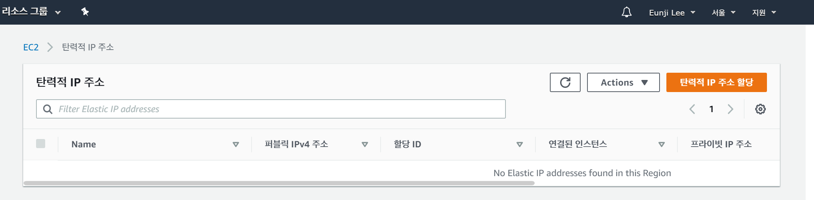
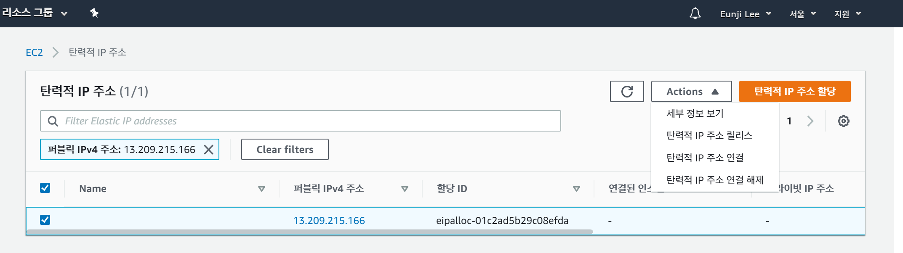
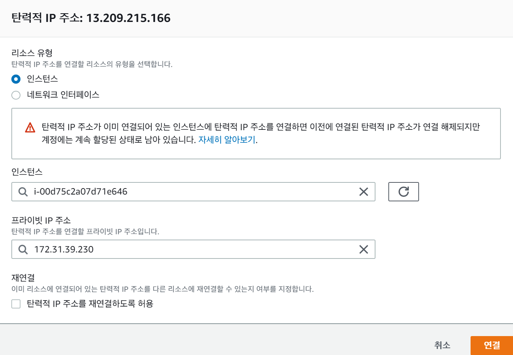
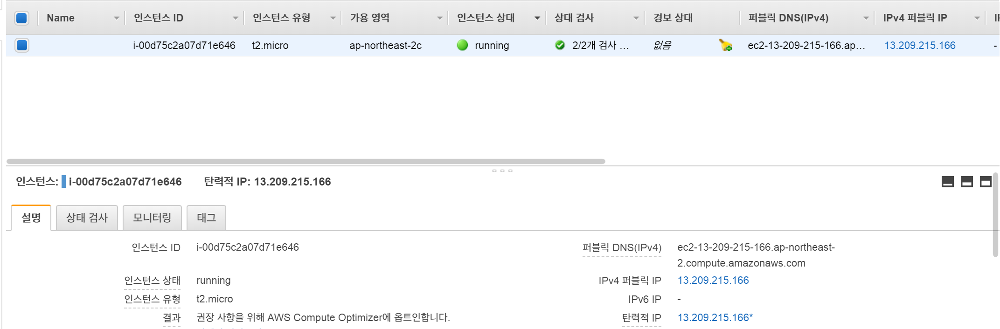

# AWS EC2 인스턴스에 고정 IP (Elastic IP) 연결하기  

* 고정 IP를 EC2 인스턴스에 연결하는 방법에 대해 알아봅니다.

---
## **Contents**
{:.no_toc}
0. this unordered seed list will be replaced by toc as unordered list
{:toc}
---

---
## **Elastic IP?**

EC2 인스턴스 (가상 서버)는 시작하거나 정지할 때마다 공인 IP 주소가 변경됩니다.
그 이유는 IP 주소는 `000.000.000.000` ~ `255.255.255.255`까지로 약 40억 대까지 **한정**되어있다는 특징 떄문입니다. 
즉, AWS에서 IP 주소의 자원의 활용을 위해 인스턴스를 중지하면 IP 주소를 회수해가기 때문에 IP 주소가 계속 바뀝니다. 

이를 방지하는 방법은 **고정 IP (Elastic IP)**를 할당하면 됩니다! 
고정 IP는 공인 IP와 달리 인스턴스를 시작하거나 정지해도 바뀌지 않기 때문에 서버 접속에 용이합니다.

**고정 IP, 무료인가요?**

Elastic IP를 발급 받고나서 주의할 점은 **고정 IP를 인스턴스에 연결을 해야 과금이 되지 않는다**는 것입니다. 인스턴스와 연결되지 않은 Elastic IP는 시간당 $0.005 (약 5원)이 과금됩니다. 한 달에 3,600원에 해당하는 가격이죠. 
따라서 Elastic IP를 **할당**받으면 기존의 생성된 인스턴스에 **연결**해서 고정된 IP로 인스턴스에 접속해야 합니다.

**고정 IP, 왜 필요한가요?**

인스턴스 (가상 서버)를 교체해야 할 때 유용합니다. 예를 들어 인스턴스 A가 고정 IP를 가진다고 가정하고, **서버 중단 없이** 새로운 인스턴스로 교체할 수 있습니다. 순서는 다음과 같습니다.

1. 먼저 실행 중인 인스턴스 A를 대체할 인스턴스 B를 시작
2. 인스턴스 B에 필요한 애플리케이션을 설치하고 시작
3. 인스턴스 A에서 고정 IP를 해제하고 그 IP를 인스턴스 B와 연결

**그럼 인스턴스를 교체할 일이 무엇이 있나요?**

[이전 포스팅](2020-03-19-aws-scalability.md)에서 Scalability에 대한 이슈를 알아봤었는데, "Scale-up"을 할 때 필요합니다. 즉, 이런 고정 IP를 통해 인스턴스를 더 큰 크기의 인스턴스로 교체하고 싶을 때 고정 IP를 통해 인스턴스만 바꾸는 전략을 사용합니다.

---
## **Procedures to Connect Elastic IP with Instance**

자, 그럼 이제 Elastic IP를 발급받고 인스턴스에 할당하는 법에 대해 알아봅시다.

**Step1. Elastic IP 할당**

1. EC2 관리 콘솔을 열고 왼쪽 메뉴판의 `네트워크 및 보안 > 탄력적 IP`를 클릭하면 다음과 같이 화면에 뜹니다.
2. 주황색 버튼 `탄력적 IP 주소 할당`을 클릭하고 다음 페이지에서도 `할당`을 클릭합니다.

**Step2. 인스턴스에 Elastic IP 연결**

  
1. 발급이 끝나면 위와 같이  화면이 뜨는데, 여기서 `Actions > 탄력적 IP 주소 연결`을 클릭합니다.
  
2. `인스턴스`항목에 기존에 생성한 인스턴스를 선택하고, `연결`을 클릭합니다. 
   
3. 위와 같이 `IPv4 퍼블릭 IP`와 `탄력적 IP`가 똑같이 나오면 성공입니다!

