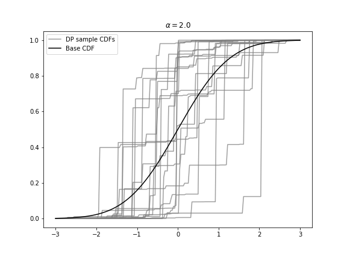

# Dirichlet process (1)

## **목차**
{:.no_toc}
0. this unordered seed list will be replaced by toc as unordered list
{:toc}

---

* 앞에서, 디리슐레 분포와 다항분포의 켤레관계에 대해서 살펴보았다. 디리슐레 분포는 **고정된** $$k$$개의 클러스터 (선택지)에 대한 확률을 모델링하는 분포로 사전분포로 쓰였다. 

* 디리슐레 과정 (DP; Dirichlet Process)은 디리슐레 분포의 무한대 확장판으로, **고정되지 않은** 클러스터에 대한 확률을 모델링하는 분포이다. 명확한 정의는 다음과 같다.

### Definition
$$\alpha>0$$, $$H$$를 $$S$$에서 정의된 probability measure라 하자. 이 두 모수 ($$\alpha, H$$)를 가지는 디리슐레 과정은 $$S$$에서 정의된 random probability measure $$G$$이다. Random probability measure라는 뜻은 $$G$$가 유한한 집합 $$\mathbf{A} = (A_1,\ldots, A_r)$$에 확률 $$G(\mathbf{A})= (G(A_1),\ldots, G(A_r))$$을 정해줌을 의미한다.

$$
\begin{aligned}
G|\alpha, H &\sim \text{DP}(\alpha,H)\\
\Leftrightarrow (G(A_1),\cdots, G(A_r))|\alpha, H &\sim \text{Dirichlet}(\alpha H(A_1),\cdots ,\alpha H(A_r))
\end{aligned}
$$

cf. 참고로 $$\text{DP}(\alpha,H)$$대신에 $$\text{DP}(\alpha H)$$로 표기하기도 한다.

이를 설명하자면 다음과 같다.

1. $$H$$는 $$S$$에 정의된 base probability measure로, 연속인 확률분포를 가진다.
2. $$\alpha>0$$는 concentration 모수라 불린다. 이는 디리슐레 과정에서 나온 표본들이 얼마나 base 함수 $$H$$와 얼마나 가까운지를 조절하는 모수이다.

---

## **Properties of Dirichlet Process**

* 유한 집합 $$\mathbf{A}=(A_1,\ldots,A_r)$$는 exclusive & exhaustive한 성질을 가진 파티션이다. exclusive하고 exhaustive하다는 말은 아래의 사진처럼, $$A_1,\ldots, A_6$$은 겹치지 않고 ($$A_1\cap A_2\cap \cdots \cap A_r=\varnothing$$), 전체의 합집합이 전체집합 ($$A_1\cup A_2 \cup \cdots \cup A_r = \mathbf{A}$$))임을 의미한다.

* DP에서는 무한대 확률 벡터를 $$r$$개로 나누어 무한개의 이산형의 분포를 가진다. 따라서, DP를 다음과 같이 정의할 수 있다.

$$
\begin{aligned}
G(\cdot) &= \sum^\infty_{r=1} \pi_r \delta_{\theta_r}(\cdot)\\
\delta_{\theta_r}(S)&= \begin{cases} 1, & \theta_r \in S\\
0, & \theta_r \not\in S \end{cases}
\end{aligned}
$$

여기서 $$\pi_r$$는 $$r$$번째 클러스터로 분류된 확률 질량 (probability mass)이고 $$\theta_r$$는 $$r$$번째 클러스터의 평균, $$\delta$$는 디랙 델타 함수이다. 또한 $$\sum^\infty_{r=1} \pi_r = 1$$이다.

* DP의 평균과 분산은 다음과 같다.

* $$E[G(A)] = H(A)$$
* $$V[G(A)] = \frac{H(A)(1-H(A))}{\alpha+1}$$

---

## **Stick-breaking Process**

DP와 짝꿍으로 나오는 설명은 항상 Stick-breaking process이다. 필자는 처음에 왜 이게 갑자기 나오나 하는 생각이 들었지만, [KAIST Youtube 강의](https://www.youtube.com/channel/UC9caTTXVw19PtY07es58NDg/videos)
에서 그 해답을 찾을 수 있었다.

DP는 무한대에서 정의되는 과정이기 때문에 이 과정에서 표본을 추출하기 위한 알고리즘 (sampling schemes/construction scheme)이 필요하다. 즉, 위의 DP의 정의에서 $$\theta_r$$과 $$\pi_r$$을 construct하기 위한 방법론이 필요하다. 우리가 살펴볼 방법은 세 가지이다.

1. Chinese restaurant process
2. Polya-Urn Scheme
3. Stick-breaking process

그 중 Stick-breaking process를 먼저 쓰는 이유는 이해하기 가장 직관적이였기 때문이다.

### Stick-Breaking Process
$$\beta_1,\beta_2,\ldots|\alpha \sim \text{Beta}(1,\alpha)$$를 따르는 무한 개의 $$\beta$$가 있을 때, Stick-breaking process를 통해 $$\pi_r = \beta_r \prod^{r-1}_{i=1} (1-\beta_i) = \beta_r (1-\beta_1) (1-\beta_2)\cdots (1-\beta_{r-1})$$를 만든다. $$\beta_i$$는 베타분포를 따르기 때문에 0과 1사이의 값는 비율로 해석할 수 있다.

방법을 설명하면 다음과 같다.

1. $$1$$의 길이를 가진 막대가 있다.
2. 이 막대를 $$\pi_1=\beta_1$$의 비율로 두 개로 자르면, 두 개는 각각 $$\pi_1=\beta_1$$과 $$1-\beta_1$$의 길이를 갖는다. 
3. $$\beta_1$$길이의 막대는 냅두고, $$1-\beta_1$$의 길이의 막대만 $$\beta_2$$의 비율로 나누면, $$\pi_2 = \beta_2(1-\beta_1)$$ 길이의 막대와 $$(1-\beta_1)(1-\beta_2)$$ 길이의 막대로 나눌 수 있다.
4. 이를 $$\infty$$번 반복하면 다음의 식을 얻는다.
{:.message}

$$
\begin{aligned}
\pi_1 &= \beta_1 \\ 
\pi_2 &= \beta_2 (1-\beta_1)\\
\pi_3 &= \beta_3 (1-\beta_1) (1-\beta_2)\\
&\vdots
\end{aligned}
$$

만약 $$\pi_1,\pi_2,\ldots \sim H$$라면, 

$$
G = \sum^\infty_{r=1} \pi_r \delta_{\theta_r} \sim \text{DP}(\alpha,H)
$$

를 따른다.

### Example

그렇다면, stick breaking process를 파이썬으로 구현해보자. 이는 [Austin Rochford Blog](https://austinrochford.com/posts/2016-02-25-density-estimation-dpm.html)을 참조하였다.

**Step1. 필요한 모듈 정의**

~~~python
%matplotlib inline
from matplotlib import pyplot as plt
import numpy as np
import pymc3 as pm
import scipy
import seaborn as sns
from statsmodels.datasets import get_rdataset
from theano import tensor as T
~~~

* 파이썬의 모듈이란 `R` 상의 패키지의 개념이다.
* `%matplotlib inline`은 Jupyter notebook 내에서 그림을 출력하기 위한 magic command이다.
* `seaborn` 모듈은 Matplotlib을 기반으로 다양한 색상 테마와 통계용 차트 등의 기능을 추가한 시각화 패키지이다.
* `get_rdataset` 모듈은 `R`패키지에 내장되어 있는 데이터셋을 불러올 수 있는 모듈이다.

**Step2. Stick-breaking process를 통해 $$\beta$$, $$\omega$$, $$\pi$$ 표본추출**

~~~python
np.random.seed(433)
N=20            # n_obs
K=30            # n_sticks
alpha=2.        # parameter in Beta dist 
H = ss.norm     # base dist
beta = ss.beta.rvs(1,alpha, size=(N,K)) # Beta(1,alpha) dist
pi = np.empty_like(beta)
pi[:, 0] = beta[:,0]                    # pi1 = beta1
pi[:, 1:] = beta[:, 1:] * (1-beta[:, :-1]).cumprod(axis=1)
omega = H.rvs(size=(N,K))
~~~

이 과정이 Stick-breaking process를 구현하는 핵심 과정이다. 
* `beta.rvs`: 앞에서 봤듯이 $$\beta_1,\beta_2,\ldots \sim \text{Beta}(1,\alpha)$$를 따른다. 이때 무한개의 $$\beta$$를 생성할 수는 없으므로 $$N$$개의 관측치를 가진 $$K$$개의 $$\beta$$를 생성한다.
* `np.empty_like`로 0으로 채워진 $$N\times K$$의 배열을 생성해 $$\pi$$의 초기값으로 저장한다.
* 이후, `cumprod` 메쏘드를 이용해 누적곱을 계산해준다. 이때 `axis=1`은 행의 축을 기준으로 곱해준다는 의미로, $$r-1$$개의 $$\beta$$를 곱해주는 역할을 한다.

$$
\begin{aligned}
\pi_1 &= \beta_1\\
\pi_r &= \beta_r \cdot \prod^{r-1}_{i=1}(1-\beta_i),\ r=2,\cdots,K
\end{aligned}
$$

* `omega`는 base 분포인 $$H$$에서 생성한 난수이다. 

**Step3. 플랏 그리기**

~~~python
x_plot = np.linspace(-3,3,200)            
sample_cdfs = (pi[..., np.newaxis]* np.less.outer(omega, x_plot)).sum(axis=1)

fig, ax = plt.subplots(figsize=(8,6))

ax.plot (x_plot, sample_cdfs[0],c="gray", alpha=0.75, label = "DP sample CDFs")
ax.plot(x_plot, sample_cdfs[1:].T, c="gray", alpha=0.75) #.T: transpose (20,200) => (200,20)
ax.plot(x_plot, H.cdf(x_plot), c= "k", label = "Base CDF")

ax.set_title(r'$\alpha = {}$'.format(alpha))
ax.legend(loc=2)
~~~

파이썬으로 그래프를 그릴 때는 `matplotlib.pyplot`을 자주 사용한다. 이를 위한 과정은 다음과 같다.
* `x_plot`: 그래프를 그릴 때 필요한 $$x$$의 grid를 그려준다.
* `pi[...,np.newaxis]`: $$\pi$$는 $$\beta$$와 같은 차원인 (20,30)의 배열이었다. 이에 `np.newaxis`를 사용하면 2차원의 배열이 3차원 (20,30,1)로 차원이 하나 늘어난다. 이런 과정을 거친 이유는 `np.less.outer(omega,x_plot)`의 3차원의 배열과 곱해주기 위해서이다.
* `np.less.outer(omega,x_plot)`: 이 부분이 이해하기 가장 어려웠다. 기존의 `np.outer(x,y)`는 $$x=(x_1, \ldots, x_n)$$와 $$y = (y_1,\ldots,y_m)$$의 외적인 (n,m)행렬을 반환한다. 

$$
\mathtt{outer(x,y)} = \left(\begin{array}{cccc}
x_1y_1 & x_1y_2 & \cdots & x_1 y_m\\
x_2y_1 & x_2y_2 & \cdots & x_2 y_m\\
\vdots & \vdots & \ldots & \vdots \\
x_ny_1 & x_ny_2 & \cdots & x_n y_m
\end{array}\right)
$$

그러나 `np.less.outer(x,y)`는 더이상 외적에 대한 내용이 아니다. 이는 $$x$$와 $$y$$의 원소들끼리 비교했을 때 $$x_i < y_j$$이면 TRUE (1)를 반환하고, $$x_i \ge y_j$$이면 FALSE(0)을 반환한다. 여기서 `omega`는 (20,30)의 배열이고, `x_plot`은 (200,)의 배열이었기 때문에, `omega`의 원소 값이 `x_plot`의 원소 값보다 작으면 1을 반환하는 (20,30,200)의 차원을 계산해준다. 

$$
\mathtt{outer(x,y)} = \left(\begin{array}{cccc}
\bold{1}_{x_1< y_1} & \bold{1}_{x_1 < y_2} & \cdots & \bold{1}_{x_1< y_m}\\
\bold{1}_{x_2< y_1} & \bold{1}_{x_2 < y_2} & \cdots & \bold{1}_{x_2< y_m}\\
\vdots & \vdots & \ldots & \vdots \\
\bold{1}_{x_n< y_1} & \bold{1}_{x_n< y_2} & \cdots & \bold{1}_{x_n< y_m}
\end{array}\right)
$$

즉, 이는 디랙 델타 함수 $$\delta_{\theta_r}$$를 계산한 것이다. `x_plot`의 범위 내에 있으면 1이고, 범위 밖에 없으면 0의 값을 계산해준다.

* `sample_cdfs`: 마지막으로 이를 `axis=1` (행의 축)으로 더해줌으로써 $$G = \sum_{r=1}^K\pi_r \delta_{\theta_r}$$를 계산해준다.

이를 $$\alpha$$값에 따라 플랏을 그려주면,

과 같다. 즉, $$\alpha$$가 커질수록  표본 분포들이 base 분포 $$H$$로 **집중**된다. 이것이 $$\alpha$$를 concentration 모수로 부르는 이유이다. 

$$\alpha \rightarrow \infty$$, $$G \rightarrow H$$
{:.message}

---

## **References** 
* Müller, P., & Quintana, F. A. (2004). Nonparametric Bayesian data analysis. Statistical science, 95-110. 
* [Mad for Simplicity](http://enginius.tistory.com/513)
* [KAIST YouTube 강의](https://www.youtube.com/channel/UC9caTTXVw19PtY07es58NDg/videos)
* [Austin Rochford Blog](https://austinrochford.com/posts/2016-02-25-density-estimation-dpm.html)