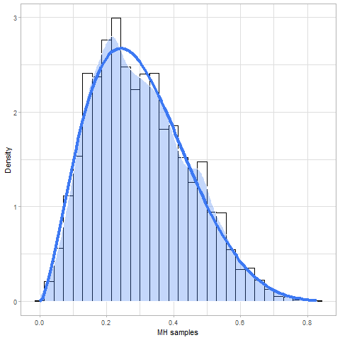
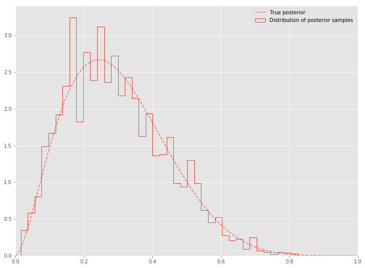

## **[MCMC알고리즘] 메트로폴리스-헤이스팅스 알고리즘 (Metropolis-Hastings Algorithm)**

메트로폴리스-헤이스팅스 알고리즘 (MH 알고리즘)은 사후분포를 analytic하게 구하기 어려울 때 사용하는 방법이다. 이 알고리즘의 기본 아이디어는 마코프 체인의 정상분포가 사후분포인 $$f(x)$$가 되도록 마코프 체인을 생성하는 것이다. 그렇다면 마코프 체인과 정상분포란 무엇일까?

*** 

### **마코프 체인 (Markov Chain)**

* 마코프 성질 (Markov Property): 마코프 체인 $$\{X^{(t)}\}$$는 **독립이 아닌** 확률 표본의 sequence이며, 바로 직전의 값에만 의존한다.

$$
\begin{aligned}
X^{(0)}, X^{(1)}, X^{(2)},\ldots, X{(t)},\ldots\\
\text{such\ that}\
X^{(t+1)}|X^{(t)},\ldots,X^{(0)} \overset{\mathcal{D}}{=} X^{(t+1)}|X^{(t)}
\end{aligned}
$$
* 마코프 커널 (Markov Kernel): $$X^{(t+1)}\vert X^{(t)}$$의 조건부확률

$$
X^{(t+1)}|X^{(t)},\ldots, X^{(0)} \sim K(X^{(t)},X^{(t+1)})
$$

  + 예시: $$X^{(t+1)} = X^{(t)} + e_t$$, $$e_t \sim N(0,1)$$을 만족하는 임의 보행 마코프체인을 고려해보자. 이때 마코프 커널은 $$K(X^{(t)},X^{(t+1)}) = N(X^{(t)},1)$$이다.

마코프 체인은 세가지 성질을 만족해야 한다.
1. Irreducible: 어떤 초기값 $$X^{(0)}$$을 갖던 간에 다른 상태로 가는 확률이 항상 양수여야 한다. 즉, 모든 상태들이 연결이 되어야 한다.
2. Aperiodic: 모든 상태들이 주기를 가지고 있지 않아야 한다.
3. Recurrent: 수열이 어떤 상태이든 무한하게 도달할 수 있다. 즉, 특정한 상태에 재방문이 가능해야 한다.

이러한 세가지 성질을 만족하면 마코프 체인이 ergodic하다 정의한다. ergodic한 마코프체인은 정상 분포를 
지닌다. 그렇다면 정상성은 무엇일까?

### 정상성 (Stationarity)

* 정상성을 지닌 분포는 다음의 성질을 만족한다:

$$
\text{If}\ X^{(t)}\sim f \Rightarrow X^{(t+1)} \sim f
$$

* 즉, $$\{X^{(t)}\}$$의 분포가 어떤 확률분포 $$f(x)$$f로 수렴하는 성질을 일컫는다.

### Ergodic Theorem

* 개인적으로 MCMC에서 나오는 영단어를 이해하기가 어렵다고 생각한다. 앞서 말했듯이 "ergodic"하다는 것은 마코프 체인의 성질이고, 정상분포가 되기 위한 조건이다. 
* 커널 $$K$$가 정상분포 $$f$$를 가진 ergodic한 마코프 체인 $$\{X^{(t)}, t=1,\ldots, T\}$$을 생성했다 가정하자. 이 때 마코프 체인 $$\{X^{(t)}, t=1,\ldots, T\}$$는 $$f$$에서 난수를 생성한 것과 같다는 것이 Ergodic theorem의 핵심이다.
* 이를 수식으로 표현하면 SLLN (Strong Law of Large Number)으로 불린다.

$$
\frac{1}{T}\sum_{t=1}^T h(X^{(t)}) \to \mathbb{E}_f(h(X))
$$

***

### **MH 알고리즘**
* 이제 정상성을 지닌 마코프체인을 생성하는 방법인 MH 알고리즘에 대해 알아보자. 
* MH 알고리즘은 다음과 같은 거절법으로 마코프 체인 $$\{X_0, X_1,\ldots,\}$$을 생성한다.
  1. 제안 분포 (proposal density) $$g(\cdot\vert X^{(t)})$$ 선택: 보통 제안 분포는 목표 분포 (target density)와 범위가 같은 것을 선택한다.
  2. $$g(\cdot\vert   X^{(t)})$$로부터 $$Y$$ 생성
  3. $$\text{Unif}(0,1)$$로부터 $$U$$ 생성
  4. 만약 $$U \le \alpha(X^{(t)},Y)$$이면 $$Y$$를 채택해 $$X^{(t+1)} = Y$$로, 그렇지 않으면 $$X^{(t+1)} = X^{(t)}$$로 설정.

  마코프 체인이 정상분포로 수렴할 때까지 2 ~ 4를 반복한다.

* 여기서 채택 확률인 $$\alpha(X^{(t)},Y)$$는 다음과 같이 정의된다:
$$
\alpha(X^{(t)},Y)=\text{min}\left(\frac{f(Y)|g(X^{(t)}|Y)}{f(X^{(t)}) g(Y|X^{(t)})}\right)
$$
* 이를 통한 마코프 체인은 정상분포 $$f(x)$$를 갖는다.

* MH 알고리즘은 크게 2가지로 나뉜다.

  1. 독립 표집기 (Independent sampler): $$g(Y \vert X^{(t)}) = g(Y)$$
     * 제안분포 $$g(\cdot \vert X^{(t)})$$가 $$X^{(t)}$$에 의존하지 않는 형태
     * $$Y \sim g(y)$$ 생성
     * 다음의 기준으로 $$Y$$ 채택:
     $$
     X^{(t+1)} = \begin{cases} Y_t, &\text{with\ probability}\ \alpha(X^{(t)},Y)\\
     X^{(t)}, & \text{otherwise}.
       \end{cases}
     $$
     * 채택확률은 다음과 같이 정의된다.
     $$
     \alpha(X^{(t)},Y) = \text{min}\left(1,\frac{f(Y)/g(Y)}{f(X^{(t)})/g(X^{(t)})} \right) = \text{min}\left(1,\frac{f(Y)g(X^{(t)})}{f(X^{(t)})g(Y)} \right)
     $$

  2. 무작위보행 표집기(Random Walk sampler): 제안분포로 $$g(Y\vert X^{(t)}) = g(X^{(t)} \vert Y)$$를 만족하는 대칭 분포 사용
     * 대표적으로 $$Y\vert X^{(t)} \sim (X^{(t)},b^2),\ b>0$$을 이용할 수 있다:
     $$
     Y=X^{(t)}+\varepsilon, \varepsilon \sim \mathcal{N}(0, b^2)
     $$
     * 이 때의 채택확률은 다음과 같다:
     $$
     \alpha(X^{(t)},Y) = \text{min}\left(1, \frac{f(Y)}{f(X^{(t)})}\cdot \frac{g(X^{(t)}\vert Y)}{g(Y\vert X^{(t)})}\right) = \text{min} \left(1,\frac{f(Y)}{f(X^{(t)})}\right)
     $$

***

### **예시**: Beta - Binomial 독립 표집기
* 목표분포: $$f(x) = \text{Beta}(2.7,6.3)$$
* 제안분포: $$g(y) = \text{Unif}(0,1)$$, $$X$$에 의존하지 않는 독립 분포
* 채택확률: $$\alpha(X^{(t)},Y) = \text{min}\left(1,\frac{f(Y)g(X^{(t)})}{f(X^{(t)})g(Y)} \right) = \text{min}\left(1, \frac{y^{2.7-1}(1-y)^{6.3-1}}{X^{(t) 2.7-1}(1-X^{(t)})^{6.3-1}}\right)$$

~~~r
a=2.7; b=6.3; niters=5000
X = numeric(niters)
for (i in 2:niters){
    Y = runif(1)
    rho = min(1, dbeta(Y,a,b)/dbeta(X[i-1],a,b))
    if (runif(1) < rho){
        X[i] = Y
    } else {
        X[i] = X[i-1]
    }
}
nmcmc=niters/2

library(ggplot2)

ggplot(data=as.data.frame(X),aes(X))+theme_light()+
    geom_histogram(aes(y=..density..),color='black',fill='white')+
    geom_density(fill=yarrr::piratepal('google')['blue'], color='white',alpha=0.3)+
        stat_function(fun=dbeta,args=list(shape1=a,shape2=b),
                  color=yarrr::piratepal('google')['blue'],lwd=1.5)+
    labs(x='MH samples',y='Density')
~~~

이를 그림으로 나타내면 다음과 같다.

같은 코드를 `Python`으로 구현한 결과는 다음과 같다.

~~~python
np.random.seed(1)
naccept=0
niters=10000
samples=np.zeros(niters+1)
samples[0]=st.uniform.rvs()

for i in range(niters):
  xt=samples[i]
#   y=st.gamma.rvs(a=xt,scale=1)
  y=st.uniform.rvs()
  rho = min(1, st.beta(a,b).pdf(y)/st.beta(a,b).pdf(xt))
  u=st.uniform.rvs()
  if u <rho:
    naccept+=1
    samples[i+1] = y
  else:
    samples[i+1] =xt
nmcmc = len(samples)//2

print ("Efficiency=", naccept/niters)
~~~

이를 그림으로 그리면 다음과 같다.
~~~python
post = st.beta(a,b)
x=np.linspace(0,1,200)
plt.figure (figsize=(12,9))
plt.hist(samples[nmcmc:],40, histtype='step', normed=True, linewidth=1, label = "Distribution of posterior samples")
plt.plot(x, post.pdf(x), c='red',linestyle='--',alpha=0.5,label='True posterior')
plt.xlim([0,1]);
plt.legend(loc='best');
~~~

***

### **예시**: Logistic Regression 무작위 보행 표집기
* 목표분포: 사전분포가 정규분포이고, 가능도가 베르누이 분포일 때의 사후 분포, 즉,
$$
\begin{aligned}
\boldsymbol{\beta} &\sim \mathcal{N}_p (\boldsymbol{\mu}_\beta, \boldsymbol{\Sigma}_\beta)\\
y_i &\sim \text{Bernoulli}(p_i)\ \text{where}\ p_i = \frac{1}{1+\exp(-\boldsymbol{\beta}^\top \mathbf{x}_i)}\\
P(\boldsymbol{\beta}&|\mathbf{y}=(y_1,\ldots, y_n)) \propto \prod^n_{i=1} p(y_i|\boldsymbol{\beta}) p(\boldsymbol{\beta})
\end{aligned}
$$
* 제안분포: $$g(\boldsymbol{\beta}^{\text{new}}\vert \boldsymbol{\beta}^{(t)}) = g(\boldsymbol{\beta}^{(t)}\vert \boldsymbol{\beta}^{\text{new}})= \boldsymbol{\beta}^{(t)} + \varepsilon,\ \varepsilon \sim N(0,b^2)$$
* 채택확률:  $$\alpha(\boldsymbol{\beta}^{(t)},\boldsymbol{\beta}^{\text{new}})  = \text{min} \left(1,\frac{f(\boldsymbol{\beta}^{\text{new}})}{f(\boldsymbol{\beta}^{(t)})}\right)$$

~~~r
logit_mh = function(x,y,init,niters=10000,sigma=0.3){
    n=nrow(x); p=ncol(x)
    naccept=0
    post_beta=matrix(0, niters, p)
    
    post_beta[1,] = beta = init
    eta = x%*%beta
    pi = 1/(1+exp(-eta))
    mean_b=10; sd_b=1000
    log_prior = sum(dnorm(beta, mean_b, sd_b,log=T))
    log_like = sum(y*log(pi)+(1-y)*log(1-pi))
    
    for (i in 2:niters){
        new_beta = beta + rnorm(p,0,sigma)
        new_eta  = x%*%as.matrix(new_beta,nr=p)
        new_pi    = 1/(1+exp(-new_eta))
        
        new_log_prior=sum(dnorm(new_beta,mean_b,sd_b,log=T))
        new_log_like =sum(y*log(new_pi) + (1-y)*log(1-new_pi))
        
        rho = min(1, exp(new_log_prior+new_log_like - log_prior - log_like))
        
        if(runif(1)<rho){
            naccept = naccept+1
            beta = new_beta
            log_prior = new_log_prior
            log_like = new_log_like
            pi=1/(1+exp(x%*%as.matrix(beta,nr=p)))
        }
        post_beta[i,] = beta
    }
    return(list(post=post_beta, accept_ratio = naccept/niters))
}

x=matrix(rnorm(300),nc=3)
beta = c(2,3,4)
eta=x%*%beta
y=rbinom(100,1,p=1/(1+exp(-eta)))

result=logit_mh(x,y,init=rep(0,3))

apply(result$post[5001:10000,],2,mean)
~~~
이 때 반환값은  `1.684613, 2.916371, 3.475478`으로 실제 $\boldsymbol{\beta}$값인 
`2,3,4`와 비슷한 결과를 낳는다.

이를 python으로 구현하면 다음과 같다.
