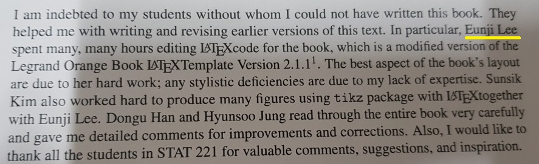
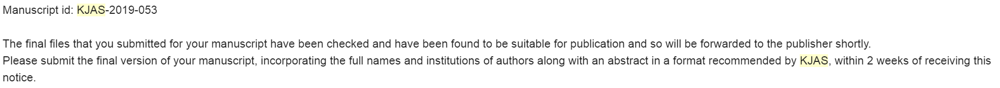
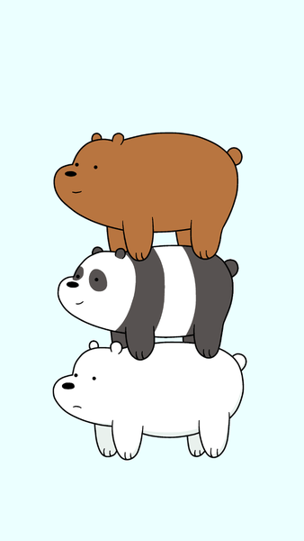

* 이 글은 글쓰는 개발자 모임 "글또"에 대한 다짐글로,   

---

## **2019년 회고**
### 대학원 생활
* 대학원에 와서 "2년 간 최대한 많이 배우자"는 생각에 가장 많이 배울 수 있는 곳 (a.k.a.가장 많이 일하는 곳)으로 연구실을 정했습니다. 이 선택을 후회한 적도 많았지만 결과적으로 보면 이것저것 많이 배웠다 생각합니다.
* 후회를 했던 건 공부 외의 일도 많았기 때문입니다. 행정 조교, 베이지안 및 수리통계학 조교, 책 집필 보조, 논문 투고 등 학기가 가면 갈수록 더 바빠져만 가서 우울한 적도 있었습니다. 
그러나, 지나고 나서 보니 이걸 다 해냈다는 사실이 뿌듯하고 정신적으로도 큰 도움이 되었습니다. 사회에 나가서도 제가 원하는 일만 할 수 있는 게 아니기 때문에 미리 경험했다 생각하니 마음이 편했습니다. 또 시간을 쪼개서 제가 잘 집중할 수 있는 시간에 더 어려운 일을, 집중하기 어려운 시간엔 쉬운 일을 주로 맡는 방식으로 여러가지 일을 해낼 수 있었습니다.

확률론 책 초록
{:.figure}

응용통계연구 논문 투고 승인 이메일
{:.figure}

* 대학원 생활을 하며 가장 뿌듯한 점은 "최대한 많이 배우자"는 목표를 잘 달성했다는 점입니다. 
  * 대학원 선수 과목인 수리통계를 듣지 않아서 1학기 추론통계 수업을 매우 힘겹게 들었습니다. 그러나 부족한 수학적 지식은 학부 과목 (수리 통계, 베이지안 통계)을 수강하며 많이 채웠고, 그 과목들을 다시 조교를 하면서 많이 이해할 수 있었습니다. 
  * 논문 독해 실력이 늘었습니다. 연구실 특성 상 다양한 주제를 접할 수 있어서 깊게 본 논문은 10개 정도, 가볍게는 50개 정도의 논문을 읽은 것 같습니다. 첫 논문은 한 달을 잡고 읽었었지만 나중엔 모형이 **어디에 쓰이는 지, 어떤 원리인 지, 어떤 데이터를 분석할 수 있는 지**를 중심으로 요약하는 능력을 배웠습니다.
  * 코딩도 마찬가지입니다. 베이지안 연구실에 있으면서 Gibbs / Metropolis-Hastings Algorithm을 통한 사후분포 추론을 코딩하고, Dynamic Beta Regression에 관한 논문을 읽고 구현했습니다. 
  * 데이터 분석할 기회도 많았습니다. 19년 2월 "랜덤포레스트 방법을 이용한 태양광 현재전력 예측"을 주제로 공모전에 나가면서 `dplyr, lubridate`을 통한 데이터 전처리와 랜덤포레스트, SVM, 신경망 모형을 적용하는 방법에 대해 배웠습니다. 또, 졸업 논문을 쓸 때도 국민건강영양조사 자료를 분석하면서 주제에 맞는 필요한 변수들을 선정하고 변환하며 베이지안 준모수 순서형, 베타, 이항형 모형을 적합시켰습니다.  

* 결과적으로 대학원을 결코 헛되이 보내지 않았다는 생각이 듭니다. 아쉬운 건 제가 공부하고 싶은 분야를 많이 못했다는 점이고, 가끔 번아웃으로 시간을 낭비할 때가 있었다는 점이 아닌가 싶습니다. 
* 대학원 때 했던 공부들을 블로그에 정리하면 좋을 것 같다는 생각이 듭니다. ㅎㅎㅎ 

### 취업
* 지금 와서 보면 부족한 게 많은데 운 좋게도 두 곳에서 합격을 했었습니다. 하나는 제조사 산학장학생, 다른 하나는 통신사. 이 때의 저는 조금 거만했던 것 같네요...ㅋㅋㅋㅋ 대학원 때 고생을 모두 보상받는다 생각했고 (여기까진 괜찮으나) 그만큼 실력이 있다 생각했습니다....(여기부터 거만하죠..!)
* 통신사에 가야겠다 생각하고 산학장학생을 포기했는데, "최종 후 프로세스"(인사 담당자 인터뷰)에서 불합격 통보를 받았습니다. 처음엔 세 번의 면접을 붙고 그 후에 떨어지니 너무 허탈하고 억울했습니다. 
* 그러나 한 달 간 곰곰이 생각해보니 인터뷰 상에서 제가 솔직하지 못했던 대답들이 있었습니다. 예를 들어, 

    > Q. 스트레스를 받으면 어떻게 관리하세요?
    A. 고민이 있어도 잘 까먹는 편입니다.

    라 대답했는 데 스트레스가 많은 최근, 잠을 통 못자고 고민하는 걸 봤을 때 전혀 까먹지 않는다는 걸 깨달았습니다. 그보단 스트레스 근원을 살피고 해결책을 찾으려 노력하는 게 제 방법임을 깨달았습니다. 또, 이러한 해결책을 찾을 때 혼자 동굴에 들어가 생각하는 것보단 주위 사람들의 도움과 조언을 진심으로 받아들이는 게 중요함을 깨닫는 중입니다. 

* 그 외에도 발전가능성이 있으면 무조건 시도하는 성격이라 생각했는데 발전가능성을 제대로 따지지 않았던 걸 반성하고 있습니다. 취업도 "어디든 가서 적응하면 되겠지"라는 마음으로 진지하게 생각하지 않았습니다. 
* 나중에 시간이 지나면 이 시점이 **터닝포인트**가 되길 진심으로 바랍니다. 그러기 위해선 제 의지가 필요하기에 이 글로 단단히 다져놓을 생각입니다.

### 지금의 나

* 아직 방황 중입니다. 구체적으로 어떤 일을 제가 좋아하고 어떤 공부를 더 해야 하는 지 계속 찾고 있습니다. 그래도 글또의 회장님 덕분에 진로 고민도 꾸준히 공유하며 제 진로를 구체화하고 있습니다.  
* 조바심도 납니다. "다른 친구들은 다 잘 되는데 난 왜 이럴까?"라 생각하면 우울한 적이 많았습니다. 그러나 이게 제 삶이고, 그렇기 때문에 잘 이끌어가는 게 제 의무니까 꾸준히 노력하며 살고자 합니다. 조바심이 날 땐 생각을 멈추고 5초 내에 실행하라는 말을 본 적이 있는데 걱정만 하지 말고 실행 하는 삶을 살고자 합니다. 헿   
* 저는 위베어베어스를 좋아하는데 이 그림이 제 삶과 비슷하다 생각합니다. 위로 올라갈수록 버전이 업그레이드된다 가정했을 때, 지금의 저는 팬더와 그리즐리 (갈색 곰) 사이인 ver 2.1. 정도 되는 것 같습니다. 각 곰에 대한 설명은 다음과 같습니다.
  * 아이스 베어 (ver 1): 통계학이 좋아 통계학과를, 코딩이 좋아 데이터 분석 분야를 택했던 제 대학 시절입니다. 이것 저것 경험해보고 머신러닝에 대해 많이 공부했다 생각했지만 취업 준비 중 데이터 분석 면접에서 아무것도 적용하지 못했던 절 보며 충격을 먹습니다..!
  * 팬더 (ver 2): 앞에서 설명드린 대학원 시절이 팬더에 가깝습니다. 이번엔 데이터 분석 면접도 무사 통과해서 자신감이 넘친 모습입니다. 그러나 결국 또 취업의 고비를 넘지 못합니다.
  * 방황도, 걱정도 많은 지금 글또라는 좋은 모임을 만나 그리즐리 (ver 3)로 진화!하는 그 날을 기원해봅니다.

---

## **2020년 계획**
* 최근 글쓰는 개발자의 모임인 "글또"에 4기로 활동하게 되었습니다. 예전부터 배운 것에 대해 글쓰는 것에 대한 선망은 있었으나 막상 실천을 못했었는데 마침 변성윤님의 모집 공고를 보고 가입하게 되었습니다.
* 실제로 들어와 보니 현직에 계시는 개발자분들도 많고 끊임없이 공부하고자 하는 자세를 가지신 분들로 구성돼있어 제게 "성장할 수 있는" 큰 동기를 심어주셨기 때문에 매우 만족입니다.
* <mark style='background-color: #fff5b1'> 초심을 잃지 않고 끝까지 모임 활동을 잘 해내는 게 목표입니다 :smile: </mark> 
