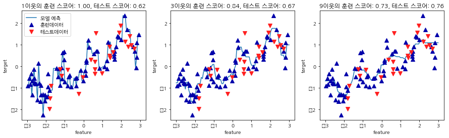

## **[지도 학습] k-NN (k-Nearest Neighborhood, k-최근접 이웃) 알고리즘**
{:.no_toc}

* 이 글은 [파이썬 라이브러리를 활용한 머신러닝](http://book.interpark.com/product/BookDisplay.do?_method=detail&sc.prdNo=303260973&gclid=CjwKCAiAyeTxBRBvEiwAuM8dnUQHS6gpLMB6tn0m3cKl_rO7hHyhwCzPtk23EvcW40nL99b1kC2ejBoCJKcQAvD_BwE)의 내용을 요약한 글입니다.

***

## **목차**
{:.no_toc}
0. this unordered seed list will be replaced by toc as unordered list
{:toc}

***

## **용어 정리**
* 지도학습: 입력과 출력 샘플 데이터가 있고 주어진 입력으로부터 출력을 예측하고자 할 때 사용하는 학습 방법
* 분류 / 회귀
  * 분류: 미리 정의된 여러 범주 (class label) 중 하나를 예측하는 것
  * 회귀: 연속적인 숫자를 예측하는 것 
  * 분류와 회귀 문제는 **출력값에 연속성이 있는 지** 질문해보면 그 답을 알 수 있음: 회귀의 경우 출력값이 연속성이 있음

### 필요한 라이브러리
~~~python
%matplotlib inline
import matplotlib.pyplot as plt
import numpy as np
from sklearn.model_selection import train_test_split
from sklearn.neighbors import KNeighborsClassifier
from sklearn.datasets import load_breast_cancer
~~~

***
## **한 눈에 알아보는 k-NN**
* 원리: 새로운 데이터를 예측할 때 훈련 데이터에서 가장 가까운 $$k$$개의 데이터 포인트 (최근접 이웃)을 찾아 테스트 데이터의 값을 예측하는 방법으로 **분류와 회귀** 모두 사용 가능한 방법
* 언제 쓸까?
k-NN은 이해하기 쉽고 모수 조정이 별로 없기 때문에 preliminary 형태의 분석방법입니다. 즉, 더 복잡한 알고리즘을 적용하기 전 시도해볼 수 있는 모형이죠.
* 필요한 매개 변수: 이웃의 수 $$k$$, 데이터 포인트 사이의 거리를 재는 방법 (유클리디안, 민코프스키거리)
* 단점
  * 훈련 데이터가 너무 클 경우 (특성의 수가 많거나 샘플의 수가 클 경우) 예측이 느려짐 $$\rightarrow$$ 데이터 전처리 중요!
  * 특성값이 대부분 0인 sparse 한 데이터에는 잘 작용하지 않음
  
***

## **k-NN 분류**
*  최근접 $$k$$개의 이웃을 찾고, 최근접 이웃 중 다수의 클래스가 예측 레이블이 됩니다. 
*  예를 들어 클래스가 $$\{0,1\}$$로 두 개(binary case)일 때, 테스트 점 하나에 클래스 0에 속한 이웃이 몇 개인지, 1에 이웃이 몇 개이니를 세고 이웃이 더 많은 클래스를 레이블로 지정합니다. 이를 **투표**라 일컫습니다.
* 유방암 데이터로 k-NN 실습을 해보았습니다.
유방암 데이터는 `from sklearn.datasets import load_breast_cancer`에 저장되어 있고 `cancer.DESCR`를 통해 본 데이터 정보는 
[이 곳](https://archive.ics.uci.edu/ml/datasets/Breast+Cancer+Wisconsin+Diagnostic)에서 살필 수 있습니다.
* 훈련 데이터와 테스트 데이터를 나누기 위해 `train_test_split`함수를 사용합니다. 여기서 `stratify`옵션은 반응변수 (response)의 구성 비율에 맞게 층화 추출함을 의미합니다. 
~~~python
cancer = load_breast_cancer()
X_train,X_test,y_train,y_test = train_test_split(cancer.data,cancer.target,stratify=cancer.target, random_state=66)
~~~
* $$k$$의 후보군으로 1~10까지를 두었습니다. 
~~~python
neighbors=range(1,11)
~~~
* 이를 `for`loop을 이용해서 각각의 정확도를 기록하고 그림에 그립니다. 그림을 볼 때, 테스트 정확도가 높은 것은 $$k=6$$일 때입니다. $$k<6$$이면, 훈련정확도는 좋지만 테스트 정확도는 낮기 때문에 훈련 데이터에 과적합된 케이스입니다. 이와 반대로, $$k>6$$일 때는 과소적합의 특징을 알 수 있습니다.

~~~python
for n in neighbors:
    #모델 생성
    clf = KNeighborsClassifier(n_neighbors=n)
    clf.fit(X_train,y_train)
    training_accuracy.append(clf.score(X_train,y_train))
    test_accuracy.append(clf.score(X_test,y_test))

plt.plot(neighbors, training_accuracy, label="훈련정확도")
plt.plot(neighbors, test_accuracy, label="테스트정확도")
plt.ylabel("정확도")
plt.xlabel("n_neighbors")
plt.legend()
~~~

***

## **k-NN 회귀** 
* k-NN이 회귀분석에 쓰일 때는 최근접 이웃들의 값의 단순 평균/ 혹은 데이터 간 거리에 비례한 가중 평균이 예측값이 됩니다. `kNeighborsRegressor`함수의 `weights` 옵션이 `uniform`일 경우 단순 평균이 계산되고, `distance`일 때는 거리를 고려한 가중 평균을 계산할 수 있습니다.
* 이를 가상의 데이터 `mglearn::wave`에 적용시켜보았습니다. 
먼저, 가상의 데이터에서 훈련과 테스트 데이터를 나누고, 훈련 데이터로 $$k$$가 1, 3, 9일 때의 각각의 k-NN 회귀를 돌립니다. 

~~~python
# kNN 회귀
from sklearn.neighbors import KNeighborsRegressor
X,y = mglearn.datasets.make_wave(n_samples=100)
X_train,X_test,y_train,y_test = train_test_split(X,y,random_state=0)

fig,axes = plt.subplots(1,3,figsize=(15,4))
line     = np.linspace(-3,3,100).reshape(-1,1) # reshape(-1,1): (100,) -> (100,1)

for n,ax in zip([1,3,9],axes):
    reg = KNeighborsRegressor(n_neighbors=n)
    # train
    reg.fit(X_train,y_train)
    ax.plot(line,reg.predict(line))
    ax.plot(X_train,y_train,'^',c=mglearn.cm2(0),markersize=8)
    # test points
    ax.plot(X_test,y_test,'v',c=mglearn.cm2(1),markersize=8) # c: color
   
    ax.set_title("{}이웃의 훈련 스코어: {:.2f}, 테스트 스코어: {:.2f}".format(
    n, reg.score(X_train,y_train),
    reg.score(X_test,y_test)))
    ax.set_xlabel("feature")
    ax.set_ylabel("target")

axes[0].legend(["모델 예측","훈련데이터","테스트데이터"],loc="best")
~~~

*** 

## *개인적인 궁금증*
* `train_test_split`의 default: 테스트 데이터의 기본 비율은 0.25! 
* 회귀에서 k-NN `score`의 의미: $$R^2 = \frac{SSR}{SST} = \frac{\sum (y-\hat{y})^2}{\sum (y-\bar{y})^2}$$(결정 계수) 

***

## *참고*
* [scikit learn 매뉴얼](https://scikit-learn.org/stable/modules/generated/sklearn.neighbors.KNeighborsClassifier.html)