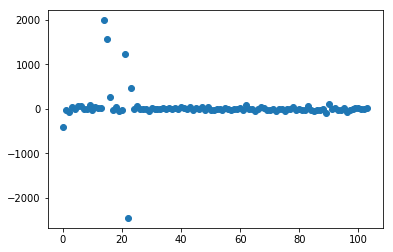
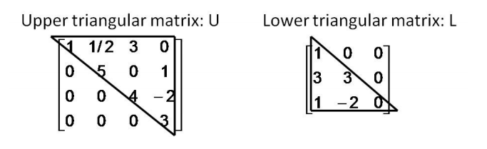

## **[지도 학습] 선형 회귀, 촐레스키 분해**
{:.no_toc}

* 이 글은 [파이썬 라이브러리를 활용한 머신러닝](http://book.interpark.com/product/BookDisplay.do?_method=detail&sc.prdNo=303260973&gclid=CjwKCAiAyeTxBRBvEiwAuM8dnUQHS6gpLMB6tn0m3cKl_rO7hHyhwCzPtk23EvcW40nL99b1kC2ejBoCJKcQAvD_BwE)의 내용을 요약한 글입니다.
* 더불어 대학원 수업 "통계계산 방법론" 내용도 일부 포함하였습니다.

***

## **목차**
{:.no_toc}
0. this unordered seed list will be replaced by toc as unordered list
{:toc}

***

### 필요한 라이브러리
~~~python
%matplotlib inline
import matplotlib.pyplot as plt
import numpy as np
from sklearn.model_selection import train_test_split
from sklearn.linear_model import LinearRegression
from sklearn.datasets import load_boston
~~~

***
## **한 눈에 알아보는 선형 회귀**
* 원리: 반응변수 $$y$$에 영향을 주는 $$p$$개의 설명변수 $$\mathbf{X}$$와의 선형 관계로 표현해 $$y$$의 값을 예측하는 방법, 
이를 위해 최소제곱법 (OLS)로 선형 관계의 계수 (coefficients)를 찾음 
* 촐레스키 분해 / QR 분해를 하는 이유? 
선형 회귀의 해를 구할 때 **역행렬** 계산을 피하기 위함

***
## **선형 회귀 (Linear Regression)**
### 선형 회귀 식 
반응변수 $$\mathbf{y}$$와 $$p$$개의 설명변수 $$\mathbf{X}$$로 이루어진 $$n$$개의 데이터에 관한 선형 회귀 식은 다음과 같습니다. 
$$
\mathbf{y}_{n \times 1}=\mathbf{X}_{n \times p} \boldsymbol{\beta}_{p \times 1}+\boldsymbol{e}_{n \times 1}, \quad \text{cov}(\boldsymbol{e}) =\sigma^2 \mathbf{I}
$$
여기서 $$\mathbf{X}$$는 $$n \times p$$행렬로 design matrix라 불립니다.
### 선형회귀의 목표 
* 제곱합오차 (SSE; Sum of Squared Error)를 $$\boldsymbol{\beta}$$에 대하여 최소화하는 것입니다. SSE인 $$S(\boldsymbol{\beta})$$는 다음과 같이 정의됩니다.

$$
S(\boldsymbol{\beta}) = (\mathbf{y} - \mathbf{X}\boldsymbol{\beta})^\top (\mathbf{y} - \mathbf{X}\boldsymbol{\beta})
$$
* SSE의 최소화했을 때의 $$\boldsymbol{\beta}$$의 해는 다음식의 해 $$\widehat{\boldsymbol{\beta}}$$와 같습니다.
$$
\begin{aligned}
\mathbf{X}^\top\mathbf{X} \boldsymbol{\beta} &= \mathbf{X}^\top \mathbf{y}\\
\Leftrightarrow \widehat{\boldsymbol{\beta}} &= (\mathbf{X}^\top \mathbf{X})^{-1}\mathbf{X}^\top \mathbf{y}
\end{aligned}
$$

### 선형회귀의 성질
* 적합값 (fitted values): 
$$\widehat{\mathbf{y}}=\mathbf{X}\widehat{\boldsymbol{\beta}} = \mathbf{Hy},\ \mathbf{H} = \mathbf{X}(\mathbf{X}^\top \mathbf{X})^{-1}\mathbf{X}^\top
$$
여기서 $$\mathbf{H}$$는 투영 행렬(projection matrix)이라 부릅니다. projection라 부르는 이유는 $$\mathbf{y}$$를 $$\mathbf{X}$$의 column space에 투영하기 때문입니다. 이 행렬은 항상 대칭이고 idempotent의 성질을 가지고 있습니다.
* 잔차 벡터 (residual vector): 
$$\widehat{\boldsymbol{e}} = \mathbf{y}-\mathbf{\widehat{y}} = (\mathbf{I} - \mathbf{H})\mathbf{y}$$
* 적합값 $$\widehat{\mathbf{y}}$$와 잔차 $$\widehat{\boldsymbol{e}}$$는 직교 (orthogonal): $$\widehat{\mathbf{y}}^\top\widehat{\boldsymbol{e}} = \mathbf{0}$$

### 예제: 보스턴 데이터
* 보스턴의 집값에 영향을 주는 변수들을 선별해 선형 회귀를 실행해보았습니다. 보스턴 데이터에 관한 설명은 `print(boston.DESCR)`를 통해 볼 수 있고, [여기](http://archive.ics.uci.edu/ml/datasets/Housing
)에서도 확인하실 수 있습니다. 
* 설명변수의 $$\mathbf{X}$$는 총 13개로,
    * `CRIM`: 범죄율
    * `INDUS`: 비소매상업지역 면적 비율
    * `NOX`: 일산화질소 농도
    * `RM`: 주택당 방 수
    * `LSTAT`: 인구 중 하위 계층 비율
    * `B`: 인구 중 흑인 비율
    * `PTRATIO`: 학생/교사 비율
    * `ZN`: 25,000 평방피트를 초과 거주지역 비율
    * `CHAS`: 찰스강의 경계에 위치한 경우는 1, 아니면 0
    * `AGE`: 1940년 이전에 건축된 주택의 비율
    * `RAD`: 방사형 고속도로까지의 거리
    * `DIS`: 보스톤 직업 센터 5곳까지의 가중평균거리
    * `TAX`: 재산세율
* 여기서 `.format`을 이용해 숫자를 소수점 둘째 자리까지 프린트하도록 설정하는데, `ndarray`객체인 `lr.coef_`는 바로 `.format`함수에 넣을 수가 없어 따로 옵션을 성정했습니다.

~~~python
boston = load_boston()
X = boston.data
y = boston.target
X_train,X_test,y_train,y_test=train_test_split(X,y,random_state=433)
lr=LinearRegression().fit(X_train,y_train)

# lr.coef_, lr.intercept_
#절편
print("intercept: {:.2f}".format(lr.intercept_))
#회귀계수
float_formatter = "{:.2f}".format
np.set_printoptions(formatter={'float_kind':float_formatter})
print("coefficients: ",lr.coef_)

plt.plot(lr.coef_,"o",label="선형회귀")

# score : R^2
print("훈련데이터:{:.2f}".format(lr.score(X_train,y_train)))
print("테스트데이터:{:.2f}".format(lr.score(X_test,y_test)))
~~~

~~~
intercept: 35.41
coefficients: [-0.13 0.05 0.05 3.88 -17.96 3.89 0.00 e-1.40 0.34 -0.01 -0.97 0.01 -0.53]
훈련데이터:0.94
테스트데이터:0.75
~~~

* 훈련 데이터의 $$R^2$$에 비해 테스트 데이터의 $$R^2$$가 떨어지는 것을 보아 훈련 데이터에 치중해 적합 (과대적합)됨을 알 수있습니다.
* 또한, 회귀 계수 $$\widehat{\boldsymbol{\beta}}$$를 보면 0에 가까운 추정치들이 많습니다. 예를 들어, `lr.coef_`의 7, 10, 12번 째 값은 0에 가깝습니다. 이는 이에 해당하는 설명 변수인 `PTRATIO,AGE,DIS`의 설명력이 약함 (weak signal)을 시사합니다. 

사실 보스턴 데이터는 이렇게 signal은 약하고 noise는 큰 자료이기 때문에 Ridge, Lasso 회귀에 적합한 자료입니다. 이는 다음 섹션에서 더 살펴보겠습니다.

***

## **촐레스키 분해 (Cholesky Decomposition)**
행렬을 계산할 때 특히 컴퓨터 상 문제가 되는 부분은 **역행렬**입니다. 원칙상 선형 회귀에서 계수의 해를 구하기 위해서는 $$(X^\top X)^{-1}$$을 구해줘야 합니다. 그러나 촐레스키 분해를 이용하게 되면 역행렬 계산을 피할 수 있기 때문에 컴퓨터 상 더 stable하다 알려져 있습니다.

어떤 양정치 행렬(positive definite matrix) $$\mathbf{A}$$가  $$\mathbf{A}$$를 촐레스키 분해하면 다음의 식을 만족하는 하삼각행렬 (lower triangular matrix)가 항상 존재합니다.
$$
\mathbf{A} = \mathbf{L}\mathbf{L}^\top
$$

여기서 하삼각 행렬인 $$\mathbf{L}$$을 구하는 방법은 `R`에서는 `chol`함수를, `Python`에서는 `np.linalg.cholesky`를 사용합니다.

### 예제 
행렬 $$\mathbf{A} = \begin{pmatrix}4 &2 & 2 & 4\\ 2 & 5 & 7 & 0 \\2 &7 & 19 &11 \\ 4 & 0 &11 &25 \end{pmatrix}$$를 촐레스키 분해하여 $$\mathbf{L}$$을 구해보자.

* R:
~~~r
A=matrix(c(4,2,2,4,2,5,7,0,2,7,19,11,4,0,11,25),nr=4)
#R의 default는 상삼각행렬이므로 transpose로 하삼각행렬을 만들어줍니다.
L=t(chol(A)) 
A==L%*%t(L)
~~~
* Python:
~~~python
# Cholesky decomposition
A=np.array([4,2,2,4,2,5,7,0,2,7,19,11,4,0,11,25]).reshape(4,4)
L=np.linalg.cholesky(A)
A==L @ L.T
~~~

`R`과 `Python`모두 $$\mathbf{A}=\mathbf{L}\mathbf{L}^\top$$로 나오고 출력된 $$\mathbf{L}$$값은 다음과 같습니다.
$$
\mathbf{L} = \begin{pmatrix} 2 &0 & 0 & 0\\ 1 & 2 & 0 & 0 \\1 &3 & 3 &0 \\ 2 & -1 &4 &2 \end{pmatrix}
$$

**NOTE**: 
* 양정치 행렬 $$\mathbf{A}$$은 모든 벡터 $$x$$에 대해 $$x^\top \mathbf{A} x>0$$을 만족함을 의미합니다.
* 하삼각 행렬 $$\mathbf{L}$$은 정방 행렬의 대각성분을 기준으로 윗부분은 $$0$$인 행렬을 의미합니다. 하삼각 행렬을 transpose하면 상삼각 행렬이 되는 특징을 가집니다.

{:.message}

### 촐레스키 분해로 선형 방정식의 해 구하기
$$\mathbf{X}$$가 full rank라 가정할 때 촐레스키 분해를 이용해 선형 방정식의 해를 구하는 과정은 다음과 같습니다.
1. $$\mathbf{X}^\top \mathbf{X}$$와 $$\mathbf{X}^\top \mathbf{y}$$를 구한다
2. $$\mathbf{X}^\top \mathbf{X}$$를 $$\mathbf{X}^\top \mathbf{X}=\mathbf{L}\mathbf{L}^\top$$로 촐레스키 분해한다.
3. 다음의 식에서 $$\mathbf{w}$$의 해를 구한다.
$$
\begin{aligned}
(\mathbf{X}^\top\mathbf{X})\boldsymbol{\beta} &= \mathbf{X}^\top \mathbf{y}\\
(\mathbf{L}\mathbf{L})^\top \boldsymbol{\beta} &= \mathbf{Lw} = \mathbf{X}^\top\mathbf{y} \\
\mathbf{w} &= \mathbf{L}
\end{aligned}
$$
4. $$\mathbf{L}^\top \boldsymbol{\beta} = \mathbf{w}$$에서 $$ \boldsymbol{\beta}$$의 해를 구한다.
$$
\therefore \widehat{\boldsymbol{\beta}} = \mathbf{L}^{-\top} \mathbf{w}
$$

여기서 결국 $$\widehat{\boldsymbol{\beta}}$$를 구할 때 $$\mathbf{L}^{\top}$$의 역행렬인 $$\mathbf{L}^{-\top}$$을 구하게 됩니다. 

## **참고**
* [isaactoast님의 블로그](https://issactoast.com/129)
