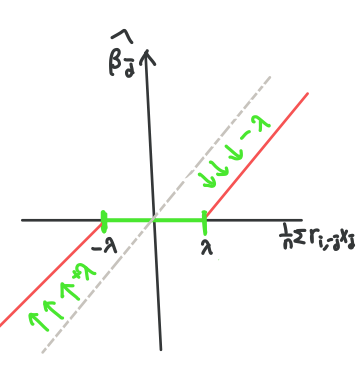

## **Ridge/ Lasso Regression**
{:.no_toc}

* 이 글은 대학원 수업 "통계계산 방법론" 내용을 주로 포함하였습니다.

***

## **목차**
{:.no_toc}
0. this unordered seed list will be replaced by toc as unordered list
{:toc}

***
## **Terminology**
* <mark style='background-color: #fff5b1'> 과적합 (Overfitting) </mark>: 훈련 데이터의 특성에 너무 가깝게 맞춰져서 새로운 데이터에 일반화되기 어려운 경우 일어나는 현상, 주로 모형이 복잡해질수록 훈련 데이터에만 과적합되는 경향을 보임
* <mark style='background-color: #fff5b1'> 다중공선성 (Multicollinearity) </mark>: 회귀 분석 시 설명 변수 중 두 개 이상의 변수들의 상관관계가 높아 회귀 계수 추정 결과를 신뢰할 수 없는 경우 "다중 공선성"이 존재한다고 말함 
* <mark style='background-color: #fff5b1'> 정규화 (Regularization) </mark>: 모수들의 크기를 제약해 모형을 단순화하여 과적합을 방지하는 한 방법  

***
## **Trade-off Between Variance and Bias**
* Ridge/ Lasso 회귀를 본격적으로 배우기 전 이해해야 할 개념은 분산과 편차의 Trade-off입니다. 왜냐하면 Ridge/ Lasso 추정치는 OLS (Ordinary Least Squares) 추정치 (선형 회귀 추정치)에 비해 더 편향되어 있지만 (biased), **분산이 낮아지기 때문에** 예측 측면에서 더 좋은 결과를 내기 때문입니다.
* 분산과 편차를 도식으로 표현하면 아래과 같습니다. 빨간색 원이 true 값의 영역이고 파란색 점이 예측값들이라 할 때 
  * 분산이 낮으면 예측값들이 응집되어 있고, 분산이 크면 예측값들이 퍼져 있습니다. 
  * 편차가 낮으면 예측값들이 빨간색 원을 중심으로 모여 있고, 높으면 빨간색 원에서 조금 벗어난 모습을 확인할 수 있습니다. 즉, 편차는 실제 값과 예측값들의 기댓값이 얼마나 차이가 나는 지를 나타냅니다.

* 고전적인 통계학의 관심사는 데이터에 맞는 모형을 만들고, 이 모형을 **해석 (Interpretation)** 하는 것이었다면, 최근 기계 학습에서 중시하는 관심사는 **예측 (Prediction)** 입니다. 즉, 새로운 $$\mathbf{X}_0$$ 데이터가 들어왔을 때 이 모형이 얼마나 새로운 값 $$\mathbf{y}_0$$ 정확하게 예측하는 지가 중요합니다. (여기서 $$\mathbf{X}$$를 대문자로 쓰는 이유는 $$p$$개의 설명 변수가 있을 때 $$n\times p$$형태의 행렬 $$\mathbf{X}$$로 설명변수를 표현하기 때문입니다) 이를 위해 여러 평가 척도 (RMSE, Accuracy, Sensitivity 등)이 개발되어 있습니다. 
* 만약 $$n$$개의 훈련 데이터를 $$\mathbf{T} = (\mathbf{X}_i, \mathbf{y}_i, i=1,\ldots,n)$$, 새로운 데이터셋을 (테스트 데이터)를 $$(\mathbf{X}_0, \mathbf{y}_0)$$라 할 때, 

$$
\mathbf{y} = f(\mathbf{X})+\varepsilon
$$

$$\mathbf{y}$$는 $$\mathbf{X}$$의 어떤 모르는 함수꼴로 표현된다 가정합시다 (단순 회귀라면 $$f(\mathbf{X}) = \mathbf{X} \boldsymbol{\beta}$$라 놓을 수 있습니다). 
여기서 우리가 최소화하고자 하는 손실 함수 (Loss function)는 예측 오차의 제곱 (Squared Prediction Error)을 최소화하는 것임으로 다음과 같이 정의됩니다.

$$
\begin{aligned}
&E\{(\mathbf{y}_0 - \widehat{f} (\mathbf{X}_0)\}^2\\
&= E\{ (\mathbf{y}_0 - f(\mathbf{X}_0)+f(\mathbf{X}_0) - \widehat{f}(\mathbf{X}_0))^2  \}\\
&= E\{ (\mathbf{y}_0 - f(\mathbf{X}_0))^2 + (f(\mathbf{X}_0) - \widehat{f}(\mathbf{X}_0))^2  \}\\
&= \underbrace{E\{(\mathbf{y}_0 - f(\mathbf{X}_0))^2\}}_{\text{Var}(\mathbf{y}_0)} + \underbrace{E\{(f(\mathbf{X}_0) - \widehat{f} (\mathbf{X}_0))^2\}}_{\text{Model Error}}
\end{aligned}
$$

  * 여기서 $$\text{Var}(\mathbf{y}_0)$$는 새로운 데이터 자체의 분산으로, 직접 통제할 수 없기 때문에 임의성 (Randomness)을 가진다 말합니다.
  * 따라서 우리는 그 나머지 부분인 Model Error를 최소화하는 것을 목표로 합니다. Model Error를 분해해보면, $$\widehat{f}(\mathbf{X}_0)$$의 분산 + 편차의 제곱 꼴로 나옴을 확인할 수 있습니다.

  $$
  \begin{aligned}
  &E\{(f(\mathbf{X}_0) - \widehat{f} (\mathbf{X}_0))^2\} \\
  &= E \left\{ \left(\widehat{f}(\mathbf{X}_0) -E(\widehat{f}(\mathbf{X}_0))+ E(\widehat{f}(\mathbf{X}_0))- f(\mathbf{X}_0)\right)^2\right\}\\
  &= \underbrace{E \left\{ \left(\widehat{f}(\mathbf{X}_0) -E(\widehat{f}(\mathbf{X}_0))\right)^2 \right\}}_{\text{Var}(\widehat{f}(\mathbf{X}_0))} +\underbrace{\left( E(\widehat{f}(\mathbf{X}_0)) - f(\mathbf{X}_0)\right)^2}_{\text{Bias}^2(\widehat{f}(\mathbf{X}_0))}
  \end{aligned}
  $$

  * 따라서 예측 오차의 제곱을 최소화하기 위해선 분산인 $$\text{Var}(\widehat{f}(\mathbf{X}_0))$$와  편차 $$\text{Bias}(f(\mathbf{X}_0))$$를 동시에 낮출수록 좋습니다.
  * 그러나, 분산과 편차를 동시에 낮추는 것은 불가능합니다. 모형이 복잡할수록 새로운 데이터의 적합 값에 대한 분산($$\text{Var}(\widehat{f}(\mathbf{X}_0))$$)은 커지고, 편차는 작아지는 성질을 가지고 있습니다. 이를 **분산과 편차의 Trade-off**라 부릅니다. 이를 표현하자면 다음과 같습니다. 
   
  * 모형이 복잡할수록 분산이 커지는 이유는 **과적합**(Overfitting) 때문입니다. 모형이 복잡하다는 뜻은 **훈련 데이터**의 특성에 딱 맞게 wiggly하게 적합되었음을 시사합니다. 아래의 그림과 같이 오른쪽으로 갈수록 훈련데이터에 딱 맞게 적합되어 복잡성이 높습니다.
  
  * 훈련 데이터에는 딱 맞지만, 새로운 $$\mathbf{X}_0$$가 들어오면 이 값에 따라 예측값 $$\mathbf{y}_0$$이 민감하게 바뀌고, 일반화가 되어있지 않기 때문에 예측값들의 분산이 큽니다. 
  * 모형이 복잡해질수록 편차는 작아집니다. 모형이 복잡해지면 모형의 space가 커져  예측값들의 평균과 실제값의 차이가 줄어듭니다.

***
## **Summary**
### 어떤 데이터에 Ridge/ Lasso 회귀를 사용할까?
1. <mark style="background-color: #fff5b1">고차원 데이터</mark>
   * 관측치의 개수 ($$n$$)와 설명변수의 개수(차원) $$p$$이 거의 같을 경우 모형이 복잡해져 분산이 커지고 편차는 작아집니다. 
   * 모형이 '복잡하다'는 것의 기준은 모수 공간 (parameter space)입니다. 설명 변수가 $$p$$개일 경우, 추정해야 하는 모수 $$\boldsymbol{\beta}$$의 공간은 $$\mathbb{R}^p$$차원이 됩니다. 심지어, $$n<p$$의 경우 선형 회귀를 통해 추정치를 내는 것이 불가능합니다. 
   * 이에 비해 Ridge/ Lasso 회귀는 모수에 제약을 주어 모형을 더 간단하게 만들어 예측치들의 분산을 낮춰 과적합을 방지합니다! 이렇게 복잡한 모형을 특정한 제약을 통해 더 간단하게 만드는 과정을 **정규화 (Regularization)** 라 부릅니다. 모형을 더 간단하게 한다는 말은 추정치 $$\boldsymbol{\beta}$$들을 0에 가깝게 만들어 (혹은 0으로 만들어) 설명 변수 $$\mathbf{X}$$가 반응 변수 $$\mathbf{y}$$에 주는 영향을 최소한으로 주는 것을 의미합니다.
 1. <mark style="background-color: #fff5b1">다중공선성이 있는 데이터</mark> 
    * 1번과도 연관이 있는 말인데, 보통 고차원 데이터면 다중공선성이 있는 경우가 많습니다. **다중공선성**은 통계학에서도 매우 중요한 개념이고 기계 학습을 다룰 때에도 조심해야하는 부분인데요. 
    * 설명 변수들끼리 상관관계가 높으면 $$\mathbf{X}$$의 rank가 감소해 (=linearly independent, almost singular) OLS 추정치인 $$\widehat{\boldsymbol{\beta}} = (\mathbf{X}^\top\mathbf{X})^{-1}\mathbf{X}^\top \mathbf{Y}$$에서 역행렬 $$(\mathbf{X}^\top\mathbf{X})^{-1}$$를 구하기 불가능한 경우 다중공선성이 존재한다고 말합니다. 다중공선성 예시, 진단과 해결 방법은 [이 곳](https://datascienceschool.net/view-notebook/36176e580d124612a376cf29872cd2f0/)에서 자세히 볼 수 있습니다. 
    * 이 포스트에서 중요한 점은 Ridge/ Lasso 회귀가 다중공선성의 해결책이 될 수 있다는 점입니다. penalty term을 줌으로써 역행렬이 존재하도록 만들기 때문입니다.

### 선형 회귀에 비해 무엇이 나아졌을까?
 1. 더 간단한 모형으로 과적합 방지
 2. 분산 감소로 인한 더 좋은 예측력
 3. 고차원 데이터 적합 가능

***
## **Ridge Regression (L2 penalty)**
### Ridge regression의 원리
* Ridge regression은 모수 공간 $$\mathbb{R}^p$$를 
$$
\{\boldsymbol{\beta} \in \mathbb{R}^p : \|\boldsymbol{\beta}\|^2_2 \leq t\}
$$
로 제한합니다.
* Ridge Regression의 estimator $$\widehat{\boldsymbol{\beta}}_{\text{ridge}}$$는 선형 회귀 estimator $$\widehat{\boldsymbol{\beta}}_{\text{OLS}}$$보다 분산이 더 작고 편차는 큽니다. 

### Ridge regression의 추정
* Ridge regression의 해는 OLS estimator에 L2 penalty를 준 방식입니다. OLS estimator는 다음과 같습니다. 

$$
\begin{aligned}
 \widehat{\boldsymbol{\beta}}_{\text{OLS}} 
 &= \underset{\beta}{\text{argmin}} (\mathbf{y-X}\boldsymbol{\beta})^\top (\mathbf{y-X}\boldsymbol{\beta}) \\
 &= (\mathbf{X}^\top \mathbf{X})^{-1} \mathbf{X}^\top \mathbf{y}
\end{aligned}
$$

* OLS estimator는 Bias가 없는 비편향 추정치 (Unbiased estimator)로 "BLUE (Best Linear Unbiased Estimator)"라 부릅니다.
* 그러나 설명변수들 간에 상관관계가 높으면 $$\mathbf{X}$$의 rank가 감소하여 $$(\mathbf{X}^{\top}\mathbf{X})$$가 거의 singular해져 역행렬인 $$(\mathbf{X}^{\top}\mathbf{X})^{-1}$$을 구하는 것이 거의 불가능합니다. 이 뿐 아니라, 상관관계가 높으면 $$\widehat{\boldsymbol{\beta}}$$의 분산인 $$(\mathbf{X}^{\top}\mathbf{X})^{-1}\sigma^2$$도 매우 커지게 됩니다. 따라서 다중공선성이 있을 경우 OLS estimator의 추정치는 신뢰하기 어렵습니다.
* 이 대신에 Ridge regression은 OLS estimator에 $$\lambda$$를 더해 역행렬을 계산하기 쉽도록 만듭니다. 즉, Ridge regression estimator는 다음과 같습니다.
$$
\begin{aligned}
 &\widehat{\boldsymbol{\beta}}_{\text{ridge}}\\ 
 &= 
  \underset{\beta}{\text{argmin}} (\mathbf{y-X}\boldsymbol{\beta})^\top (\mathbf{y-X}\boldsymbol{\beta}), \text{such \ that}\ \|\boldsymbol{\beta}\|^2_2 \leq t \\
 &= 
  \underset{\beta}{\text{argmin}} (\mathbf{y-X}\boldsymbol{\beta})^\top (\mathbf{y-X}\boldsymbol{\beta}) + \lambda \|\boldsymbol{\beta}\|^2_2\\
 &= (\mathbf{X}^\top \mathbf{X} + \textcolor{red}{\lambda\mathbf{I}})^{-1} \mathbf{X}^\top \mathbf{y}
\end{aligned}
$$

where $$\| \boldsymbol{\beta} \|^2_2 = \boldsymbol{\beta}^\top \boldsymbol{\beta}$$.

유도 과정은 [여기](https://www.quora.com/What-is-the-difference-between-L1-and-L2-regularization-How-does-it-solve-the-problem-of-overfitting-Which-regularizer-to-use-and-when
)를 참조하세요.
* $$t$$가 작을수록, $$\lambda$$가 클수록 모수공간에 대한 제약이 세짐을 의미하고 $$\lambda \|\boldsymbol{\beta}\|^2_2$$를 L2 penalty라 부릅니다.  

* 이 제약 조건을 그림으로 이해하면, 

  * 빨간색 타원은 $$\boldsymbol{\beta} = (\beta_1, \beta_2)$$의 값에 따른 RSS (Residual Sum of Squares)인 $$(\mathbf{y-X}\boldsymbol{\beta})^\top (\mathbf{y-X}\boldsymbol{\beta})$$를 의미합니다. 
  * 즉, $$\boldsymbol{\beta} = \widehat{\boldsymbol{\beta}}$$일 때 RSS가 가장 작은 "Least Squares" estimator입니다. 
  * 파란색 원은 Ridge의 제약조건인 $$\|\boldsymbol{\beta}\|_2^2 \leq t$$를 $$\beta_1^2+\beta_2^2 \leq t$$로 표현한 것입니다. 
  * 따라서 RSS를 최소화하는 데 제약조건을 만족해야하므로, Ridge regression의 해는 빨간색 타원과 파란색 원의 접점이 됩니다. 

### Ridge regression의 특징
* <mark style='background-color: #fff5b1'> Shrinkage method </mark>: 회귀계수를 $$0$$으로 끌어 당기지만 아예 $$0$$으로 만들지 않습니다. 따라서, Ridge regression은 설명변수들의 영향력을 감소시킨다는 점에서 shrinkage method라 부릅니다.
* <mark style='background-color: #fff5b1'> 과적합 방지 </mark>: 
약간의 Bias를 높이고 Variance를 대폭 감소시켜 모형을 단순화해 과적합을 방지합니다. 

***

## **Lasso Regression (L1 penalty)**
### Lasso regression의 원리
* Tibshirani (1996)가 제안한 Lasso는 Ridge와 비슷하게 정규화의 효과를 주지만, L2 penalty대신 L1 penalty를 준다는 점에서 차이가 있습니다. 모수 공간을 
$$
\{\boldsymbol{\beta} \in \mathbb{R}^p : \|\boldsymbol{\beta}\|_1 \leq t\}
$$
로 제한합니다. 
* 마찬가지로 Lasso regression의 estimator $$\widehat{\boldsymbol{\beta}}_{\text{lasso}}$$는 선형 회귀 estimator $$\widehat{\boldsymbol{\beta}}_{\text{OLS}}$$보다 분산이 더 작고 편차는 큽니다. 

### Lasso regression의 추정

* Lasso regression의 해는 OLS estimator에 L1 penalty를 준 방식입니다. 즉, 
$$
\begin{aligned}
 &\widehat{\boldsymbol{\beta}}_{\text{lasso}}\\ 
 &= 
  \underset{\beta}{\text{argmin}} (\mathbf{y-X}\boldsymbol{\beta})^\top (\mathbf{y-X}\boldsymbol{\beta}), \text{such \ that}\ \|\boldsymbol{\beta}\|_1 \leq t \\
 &= 
  \underset{\beta}{\text{argmin}} (\mathbf{y-X}\boldsymbol{\beta})^\top (\mathbf{y-X}\boldsymbol{\beta}) + \lambda \|\boldsymbol{\beta}\|_1\\
 \end{aligned}
$$

where $$\Vert \boldsymbol{\beta} \Vert_1 = \sum_{j=1}^p |\beta_j|$$.

* 마찬가지로 $$t$$가 작을수록, $$\lambda$$가 클수록 모수공간에 대한 제약이 세짐을 의미하고 $$\lambda \|\boldsymbol{\beta}\|_1$$를 L1 penalty라 부릅니다.  

* 이 제약 조건을 그림으로 이해하면, 

  * Ridge 그림과 마찬가지로 빨간색 타원은 RSS를 의미합니다.
  * 파란색 사각형은 Lasso의 제약조건인 $$\Vert\boldsymbol{\beta}\Vert_1 \leq t$$를 $$\vert\beta_1\vert+\vert\beta_2\vert \le t$$로 표현한 것입니다. 
  * 따라서 RSS를 최소화하는 데 제약조건을 만족해야하므로, Ridge regression의 해는 빨간색 타원과 파란색 원의 접점이 됩니다. 
  * 여기서 주목할 점은 접점이 $$\beta_1$$이 0인 지점 (파란색 원)이라는 것입니다. 즉, Lasso는 Ridge와 달리 몇 개의 모수는 0으로 추정하여 sparse solution을 내는 특징을 가집니다. sparse하다는 말은 해가 "드문드문"있고 나머지는 0인 경우를 의미합니다.

### Stochastic Coordinate Descent Algorithm
* Stochastic Coordinate Descent algorithm은 $$j$$번째 특성을 랜덤하게 고르고, 이를 좌표축을 따라 최적화하는 방법으로, Lasso의 해를 구하기 위해 쓰이는 방법입니다. 
* Lasso의 목적함수 $$Q(\boldsymbol{\beta}) = Q(\beta_1,\ldots,\beta_p)$$를 벡터형식으로 쓰면 다음과 같습니다. 여기서 $$1/n$$대신 $$1/2n$$으로 쓰는 이유는 단순히 미분했을 때 쉽게하기 위함입니다. 우리는 $$Q(\beta)$$를 최소화할 $$\widehat{\beta}_j, j=1,\ldots,p$$를 찾는 것이 목표입니다.

$$
Q(\beta_1,\ldots,\beta_p)=\frac{1}{2n} \sum_{i=1}^n \left(y_i - \sum_{j=1}^p \beta_j x_{ij}\right)^2 + \lambda\sum_{j=1}^p |\beta_j|
$$

참고로 이렇게 목적함수(target function)가 이차식(convex quadratic)이고, 제약함수(constraint functions)가 affine한 볼록 함수(convex function)을 최적화하는 문제를 **Quadratic Programming (QP)**라 칭합니다.
* $$j$$번째 변수를 뺀 잔차를 $$r_{i,-j} = y_i - \sum_{k \neq j}\beta_k x_{ik} $$라 정의하고 $$Q(\boldsymbol{\beta})$$를 $$j$$번째 변수와 관련있는 부분과 없는 부분으로 나누면
$$
\begin{aligned}
Q(\beta_1,\ldots,\beta_p) &= \frac{1}{2n}\left( y_i - \sum^{n}_{k\neq j} \beta_k x_{ik} - \beta_j x_{ij}\right)^2 + \sum_{k\neq j}\lambda |\beta_k| + \lambda |\beta_j|\\
&=\frac{1}{2n}\left(r_{i,-j}-\beta_jx_{ij}\right)^2 +  \sum_{k\neq j}\lambda |\beta_k| + \lambda |\beta_j|
\end{aligned}
$$
* 마지막으로 이의 해를 구하기 위해 $$Q(\boldsymbol{\beta})$$를 $$\beta_j$$에 대해 편미분하여 0이되는 해 $$\widehat{\beta}_j$$를 찾습니다.
$$
\begin{aligned}
\frac{\partial Q(\beta_1,\ldots,\beta_p)}{\partial \beta_j} 
&= \frac{1}{n} \sum_{i=1}^n (r_{i,-j} - \beta_jx_{ij})(-x_{ij}) + \lambda \text{sign}(\beta_j) =0\\
\widehat{\beta}_j &= \frac{1}{\sum x_{ij}^2} \left( \frac{1}{n} \sum_{i=1}^{n} r_{i,-j} x_{ij} - \lambda \text{sign}(\widehat{\beta}_j)\right) 
\end{aligned}
$$
* 만약, $$\sum x_{ij}^2=n$$인 경우 ($$x_{ij}$$들이 표준화된 경우), $$\widehat{\beta}_j$$의 해는 다음과 같습니다.

$$
\begin{aligned}
\widehat{\beta}_j &= \begin{cases}
   \displaystyle\frac{1}{n}\sum r_{i,-j} x_{ij}-\lambda & \text{if}\ \displaystyle \frac{1}{n}\sum r_{i,-j} x_{ij}>\lambda\\
  \quad 0 & \text{if}\ \left| \displaystyle\frac{1}{n}\sum r_{i,-j} x_{ij} \right|<\lambda\\
   \displaystyle\frac{1}{n}\sum r_{i,-j} x_{ij}+\lambda & \text{if}\ \displaystyle \frac{1}{n}\sum r_{i,-j} x_{ij}<-\lambda
\end{cases}\\
&= S_{\lambda} \left( \displaystyle\frac{1}{n}\sum r_{i,-j} x_{ij}\right)
\end{aligned}
$$

이를 하나의 operator로 표현하면 **Soft-thresholding operator** $$S_{\lambda} (x)$$로 표현할 수 있고,그림은 다음과 같이 그려집니다:
$$
S_{\lambda}(x) = \text{sign}(x) (|x| - \lambda)_+
$$

* 따라서, Coordinate descent 알고리즘을 요약하면 다음과 같습니다.
1. $$i$$번째 관측치 설명변수 $$\mathbf{x}_i$$를 표준화, $$y_i$$의 중심이 0이 되도록 centering, $$\bar{x}_{j}, s_{j}, \bar{y}$$ 계산

$$
\sum_{i=1}^{n} x
_{i j}=0, \sum_{i=1}^{n} x_{i j}^{2}=n,\ \text { and } \ \sum_{i=1}^{n} y_{i}=0
$$ 

$$
\bar{x}_{j}=\frac{\sum_{i=1}^{n} x_{i j}}{n}, s_{j}=\sqrt{\frac{\sum_{i=1}^{n}\left(x_{i j}-\bar{x}_{j}\right)^{2}}{n}}, \bar{y}=\frac{\sum_{i=1}^{n} y_{i}}{n}
$$

2. $$\widehat{\boldsymbol{\beta}} = \boldsymbol{\beta}_0$$로 초기화하고 잔차인 $$\mathbf{r} = \mathbf{y-X}\widehat{\boldsymbol{\beta}}$$계산
3. $$j=1,\ldots, p$$에 대해 반복 
   * 계수 업데이트
   * 잔차 업데이트 
4. Step3.1-2를 수렴할 때까지 반복 $$t=1,\ldots,T$$
5. 원래의 scale로 다시 변환
$$
\begin{aligned}
\widehat{\beta}_0 &\leftarrow \overline{y} - \sum_{j=1}^{p} \widehat{\beta}_j\overline{x}_j/s_j\\
\widehat{\beta}_j &\leftarrow \widehat{\beta}_j/s_j
\end{aligned}
$$

### Lasso regression의 특징
* <mark style='background-color: #fff5b1'> Feature selection </mark>: 그림에서 설명했듯이 Lasso는 sparse solution을 내서 어떤 추정치는 $$0$$이 되도록 합니다. 따라서, 중요한 변수들을 선택해주는 feature selection (변수 선택)을 합니다.
* <mark style='background-color: #fff5b1'> 과적합 방지 </mark>: 변수선택을 통해 다중공선성을 해소하고 과적합을 방지합니다. 

***

## **Tuning parameter $$\lambda$$**
* $$\lambda$$는 추정해야하는 모수라기 보단 사용자가 직접 지정하는 tuning parameter입니다. $$\lambda$$가 클 수록 제약이 강해져 모형은 간단해지고, 작으면 OLS와 비슷한 결과를 냅니다.
* 이 모수의 최적값을 찾기 위해 Cross-validation을 통한 Grid Search를 합니다. 그러나 grid의 구간을 어디에 두느냐에 따라 모수의 최적화 과정이 달라질 수 있고, computationally heavy하다는 단점이 있습니다.
* `python`에서 사용할 때는 `sklearn.linear_model`모듈의 `Ridge`와 `Lasso`함수의 옵션 중 `alpha`값이 $$\lambda$$에 해당합니다.
* `R`에서는 `glmnet`에서 `cv.glmnet`함수로 `alpha=1`이면 Lasso, `alpha=0`이면 Ridge를 시행할 수 있고, Cross-validation을 통해 $$\lambda$$값을 도출합니다. 

## **Reference**
* [Scott Fortmann-Roe의 블로그](http://scott.fortmann-roe.com/docs/BiasVariance.html#fn:4)
* [Columbia University Mailman School of Public Health](https://www.mailman.columbia.edu/research/population-health-methods/ridge-regression)